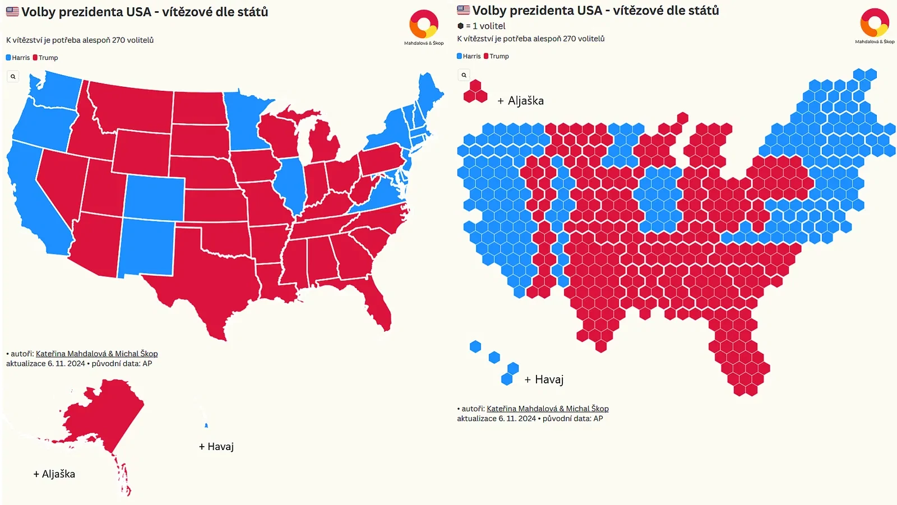

## Brief Update: Recognition and Praise are Always Welcome 😊

Our cartograms have been selected as exemplary by the top statisticians in Austria!

In this particular cartogram, the results of the Austrian autumn elections are visualized, and the map is now featured in Austria's national catalog: [data.gv.at](https://www.data.gv.at/katalog/application/6897edfa-2c70-4d7f-9d5a-b7f61b7e87f1#views).

---

## What is a Cartogram?

A [cartogram](/a/elections-maps-of-results) is a type of map where geographical areas are resized to represent a specific variable rather than their actual physical size.

In this specific cartogram:
- Each hexagon represents **10,000 inhabitants**.
- The map is divided into districts, with the **size and number of hexagons** in each district indicating population density.  
This approach makes it easy to grasp the distribution of the population across regions at a glance, focusing on the variable rather than geographic space.

---

## U.S. Election Visualization

We used the same method to visualize [election results in the United States](/a/elections-maps-of-results). Yes, it’s the famous AZ quiz format some of you mentioned 😄.  

The screenshot showcases both types of U.S. maps:
1. A **classic map** based on geographic size.
2. A **cartogram**, where population density plays a central role.

The cartogram highlights areas with high vote counts in densely populated but geographically smaller regions, such as the **East and West Coasts**.

---

We hope this provides a fresh perspective on how data can be visualized to reveal meaningful patterns! 😊
