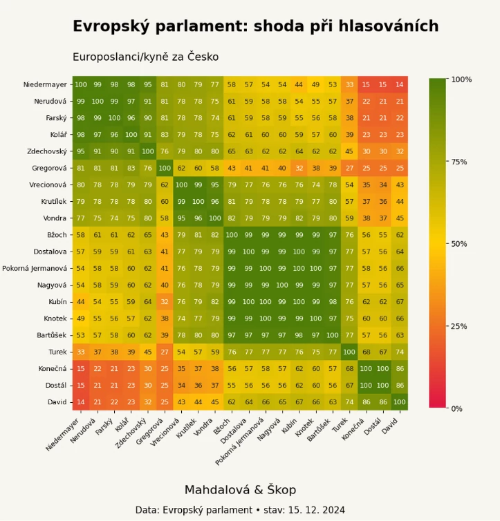
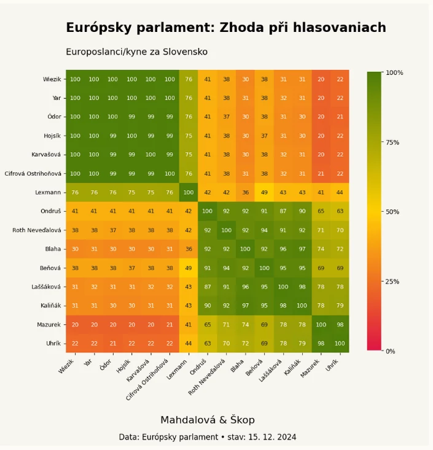
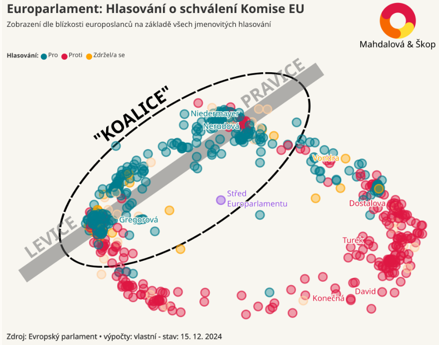
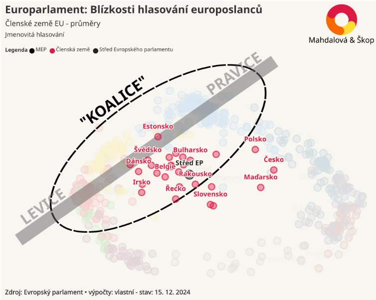
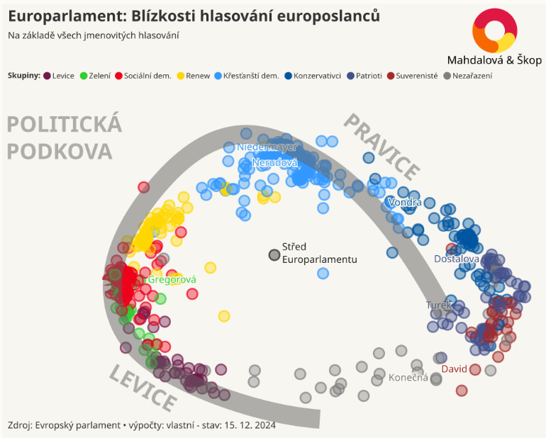

## Introduction
A unique analysis of voting patterns in the European Parliament for the year 2024. Discover who aligns closely, who has a real chance to influence decisions, and who lives under the illusion of defiance but remains entirely sidelined. Being isolated in the European Parliament means abandoning decision-making. So, who hasn't betrayed you?

---

## Czech Republic 🇨🇿
The situation among Czech MEPs is rather fragmented. On one side are MEPs in the **largest People's Party group in the European Parliament** (5 representatives from TOP 09, STAN, and KDU-ČSL). The second major Czech group comprises 6 representatives from ANO and Nikola Bartůšek from Přísaha, who align with the **"oppositional" Patriots**.

Between these two groups are 3 MEPs from ODS (part of the Conservative group), balancing between the influence of the main coalition and the opposition. Markéta Gregorová from the Pirate Party is in the Green group and votes closely with European social democrats. On the **extreme ends of the Parliament** are Kateřina Konečná and Ondřej Dostál (Stačilo!/KSČM / Independents), Filip Turek (Přísaha / Patriots), and Ivan David (SPD / Sovereignists).

---

## Slovakia 🇸🇰
Among Slovak MEPs, the situation is simpler. The European Parliament includes representatives from five Slovak parties, with Progresívne Slovensko (Renew Europe) and KDH (People's Party) being part of the main coalition.

SMER, HLAS, and Republika have ended up in the opposition among the independents (except for MEP Uhrík from Republika). HLAS and SMER vote almost identically and remain completely sidelined in the EP.

---

## The European Parliament as a Whole
Political groups, or factions, play a key role in the European Parliament. These factions enable MEPs to collaborate effectively and handle a wide range of topics. Currently, there are eight main factions in the Parliament.

Individual MEPs cannot focus on every discussed topic in detail, so they often rely on their colleagues within their faction who specialize in specific areas.

### Distribution of Power
An analysis of voting patterns confirms the importance of political factions. While the focus is not directly on MEPs' membership in groups, their voting behavior usually reveals their affiliations clearly.

In a graph summarizing voting results, each point represents an MEP. Most points cluster into groups corresponding to factions, as members of the same faction tend to vote similarly. However, unanimity is never absolute—differences of opinion can arise even within the same group.

---

### The Main Coalition

The most influential bloc in the European Parliament is the so-called main coalition:
- **Christian-Democratic People's Party (EPP)**
- **Liberal Renew Europe**
- **Social Democrats (S&D)**

This core is joined by the **Greens** and **the Left** on one side and **Conservatives** on the other.

---

### Other Factions
Factions outside the main coalition, such as the Patriots, Sovereignists, and independent MEPs, have significantly less influence. Their members are often outside the main discussions, limiting their chances of pushing their proposals through.

<iframe src='https://flo.uri.sh/visualisation/21044542/embed' title='Interactive or visual content' className='flourish-embed-iframe' frameBorder='0' scrolling='no' width='100%' height='600px' sandbox='allow-same-origin allow-forms allow-scripts allow-downloads allow-popups allow-popups-to-escape-sandbox allow-top-navigation-by-user-activation'></iframe>

---

## Voting on the Commission
The European Commission, known as the "EU government," is the executive body of the European Union responsible for proposing legislation, managing the EU's daily agenda, and enforcing EU laws. Its president is Ursula von der Leyen. Commissioners are nominated by member states and approved by the European Parliament. The Czech commissioner is Jozef Síkela (STAN), and the Slovak commissioner is Maroš Šefčovič (nominated by SMER).

Voting on the new European Commission on November 27, 2024, illustrates divisions within the European Parliament. **Most of the main coalition supported the Commission's composition**, including Czech People's Party members and Slovak Renew representatives, while opposition groups generally voted against it. The graph shows individual MEPs' positions—green points indicate support, red points indicate opposition.

---

## Czech Republic: The Most Isolated
By averaging voting behavior, the "typical MEP" for each country can be identified. The **Czech** and **Hungarian** MEPs are the most extreme, furthest from the mainstream coalition and decision-making center of the European Parliament.

---

## Overview of EP Groups: Czech and Slovak Parties
| **Main Coalition**       | **Expanded Coalition**  | **Outside Mainstream** |  
|--------------------------|-------------------------|-------------------------|  
| Christian Democrats (EPP): TOP 09, STAN, KDU-ČSL, KDH | Greens and Free Alliance: Pirates | Patriots: ANO, Přísaha |  
| Social Democrats (S&D)  | Conservatives and Reformists: ODS | Sovereignists: SPD, Republika |  
| Renew (Liberals): Progresívne Slovensko | The Left | Most independents: Stačilo!, SMER, HLAS |

---

## Horseshoe Theory
A model of MEPs based on their voting patterns aligns with the [Horseshoe Theory](https://cs.wikipedia.org/wiki/Teorie_podkovy), which suggests that extreme left and right-wing positions often share similarities. This similarity is evident in the voting behavior of the "left-wing" Konečná (KSČM) and "right-wing" Turek (Přísaha/Motorists).

---

## How Voting Coalitions Are Calculated
The analysis covers all recorded roll-call votes for the 2019–2024 term, based on European Parliament data. It uses a weighted principal component analysis method. Each point in the graph represents an MEP, with the distance between points reflecting how often they voted together. The method highlights key voting blocs and subtle differences among MEPs.

Greater weight is given to votes where the Parliament was more divided and had higher participation. Votes decided by a narrow margin have the greatest influence, while unanimous decisions—often procedural—have the least.