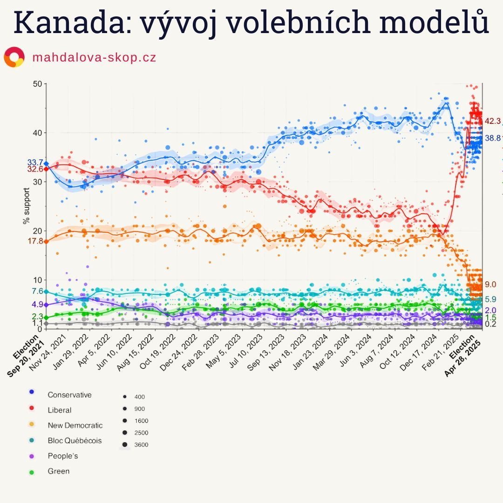

The American president went after neighboring Canada: threatening tariffs, annexation, and talking about the country as the "51st US state." What was supposed to be just a show for domestic audiences triggered a political earthquake in Canada. Angry voters mobilized – and it was the Liberals who offered them a comprehensible defense.

- Liberals won with 145 seats.
- Trump's rhetoric mobilized Canadians – but against him.
- Conservatives ended with 125 seats and their leader lost even at home.
- Mark Carney transformed electoral mood into a defensive reflex.
- Trudeau withdrew, but helped break the trend.

---

## Trudeau Fell, Carney Bet on Sovereignty

Justin Trudeau sensed it. He knew that for many voters he was an insurmountable obstacle to restoring trust. He decided to step down. And thereby opened the door for Mark Carney, former governor of central banks in both Canada and Britain.

Carney didn't waste time. Right after taking over, he abolished the unpopular carbon tax – a symbol of rising costs – and made it clear that he was serious about a restart.
Daily, he then reminded people that **Canada should be proud of how it differs from the USA**: better healthcare, education, lower crime. In the campaign, he built on calm, trust, and a clear message: *"Our country is not for sale."*

---

## Poilievre, Canada's Trump, Lost His Breath

Pierre Poilievre, Conservative leader, was still looking forward to the prime minister's chair in January. He appealed to voters as a "man of the people," promising tax cuts and a tough stance against "elites."
But his nickname *"Canada's Trump"* ultimately became his undoing.

Trump's rhetoric (e.g., the statement *"Canada should become our esteemed 51st state"*) transformed the election into a vote on national pride. Poilievre did tweet at the last minute:

> "Canada will always be proud and independent and will **NEVER** be the 51st state,"

but it wasn't enough. In voters' eyes, he didn't come across as someone who could stand up to Trump – more like his shadow.

---

## Polymarket: Electoral Drama in Real Time

Election night started surprisingly. The first districts gave the Conservatives a lead – and on betting markets, the probability of Poilievre's victory rose to 65%.

On Polymarket, speculators started clutching their heads. But as results came in from cities and liberal strongholds, Carney started rising. The mood reversed. The Polymarket curve sharply broke – and the Conservatives fell.

In the end, the Liberals gained **145 seats out of 343**, Conservatives only **125**. Both main opposition leaders – Poilievre and Singh – moreover **failed to defend their own districts**.

---

## Canada Voted Against Trump

A poll among early voters shows that decisions were most influenced by:

- **inflation and cost of living (47%)**
- **relations with the USA and tariffs (35%)**
- **economy (33%)**

For Liberal voters, the **American threat was a key mobilization factor**.

> "We've always stood by you," Trudeau messaged the White House.
> "We helped you, we were your neighbors that the world envied you for. And now you're punishing us."

According to polls, after Trump's return to office, the perception of the USA completely changed: while last year two-thirds of Canadians considered Americans friends, now only a quarter do.

---

## Credit Also Goes to the One Who Left

Election winner Mark Carney was disciplined and convincing in the campaign, but without Trudeau, his path wouldn't have existed. Trudeau understood when to leave.
**Carney understood how to unite the nation – even against such an unexpected opponent as the American president.**

In his victory speech, he said:

> "Trump is trying to break us so he can claim us.
> That will never happen.
> Canada belongs to Canadians."

---

```box
<strong>How did Germany vote? [German Elections: Did East Germany Vote Radically? Not Quite](https://www.mahdalova-skop.cz/clanek/volby-nemecko-2025-02-27-vysledky)</strong>

We also wrote about Elon Musk's interview with the leader of the far-right AfD party: [Commentary: Hitler Was Not a Communist](https://www.mahdalova-skop.cz/clanek/komentar-2025-01-09-hitler-nebyl-komunista)

World-renowned writer and philosopher Umberto Eco (1932-2016), who grew up as a boy in Mussolini's Italy, left us a valuable tool - he defined the characteristic features of fascism: [Features of Fascism According to Umberto Eco](https://www.mahdalova-skop.cz/clanek/explainer-2025-01-06-znaky-fasismu-podle-eca)

```

```box

[data source: national opinion polls conducted from the 2021 Canadian federal election to the 2025 election](https://en.wikipedia.org/wiki/Opinion_polling_for_the_2025_Canadian_federal_election)
```
