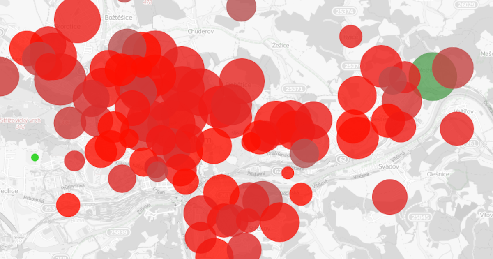

## Introduction

Elections are a cornerstone of democracy, and ensuring their integrity is critical. Using statistical and analytical methods, we can identify irregularities in election results that might otherwise go unnoticed. These irregularities can range from **intentional fraud** to **unintentional errors**, each of which can significantly impact election outcomes.

---

## Types of Irregularities

### Intentional Frauds
- **Vote Buying**: Offering incentives for votes, often in economically disadvantaged areas.
- **Vote Stuffing**: Adding extra, illegal votes to skew results.
- **Vote Stealing**: Manipulating or reallocating votes to benefit a particular candidate.

### Unintentional Errors
- **Counting Errors**: Mistakes in tallying the votes.
- **Documentation Errors**: Incorrect recording of vote counts, such as miswriting "200" instead of "20."

---

## Case Studies in Electoral Forensics

### 1. Suspected Vote Buying: Czech General Elections 2017

In the Ústí nad Labem region, an unusual voting pattern in the 2017 Czech general elections suggested possible vote buying by one candidate. Our graphical analysis revealed a statistically significant concentration of votes in specific precincts, particularly in economically disadvantaged areas. These anomalies stood out against typical voting distributions, raising questions about their legitimacy.

#### Graphical Analysis:
Below is an example of a typical distribution compared to the anomaly:

- **Normal Voting Pattern:** Several preferential votes for the candidate (red).  
- **Anomalous Pattern:** Several dozens of preferential votes for the candidate (green).

### 2. Misattributed Votes: European Parliament Elections 2024

Our analysis uncovered **139 misplaced votes** intended for Michaela Šojdrová, a candidate from the KDU-ČSL party, during the 2024 European Parliament elections. These votes were mistakenly allocated to another candidate in six precincts across Moravia. Further investigation suggested this was likely due to **documentation errors** during vote reporting.

#### Key Findings:
- **Precincts Identified:** Horní Lideč, Uherský Brod (Precinct 14), and others.
- **Votes Recovered:** 139 confirmed misplaced votes.  
- **Impact:** Šojdrová was only 477 votes short of winning a mandate, making these discrepancies significant.

<iframe src='https://flo.uri.sh/visualisation/21050485/embed' title='Interactive or visual content' className='flourish-embed-iframe' frameBorder='0' scrolling='no' width='100%' height='600px' sandbox='allow-same-origin allow-forms allow-scripts allow-downloads allow-popups allow-popups-to-escape-sandbox allow-top-navigation-by-user-activation'></iframe>

More details about this case in the [full article](/a/2024-07-08-electoral-forensic-case-study/).

---

## Conclusion

Our analytical election forensics demonstrates the power of data-driven methods to uncover both fraudulent activities and unintentional errors in election results. These case studies highlight how statistical tools and detailed investigations can enhance electoral transparency and protect democratic integrity. With these methods, every vote can truly count.

For more information or to collaborate on electoral data analysis, feel free to reach out.
