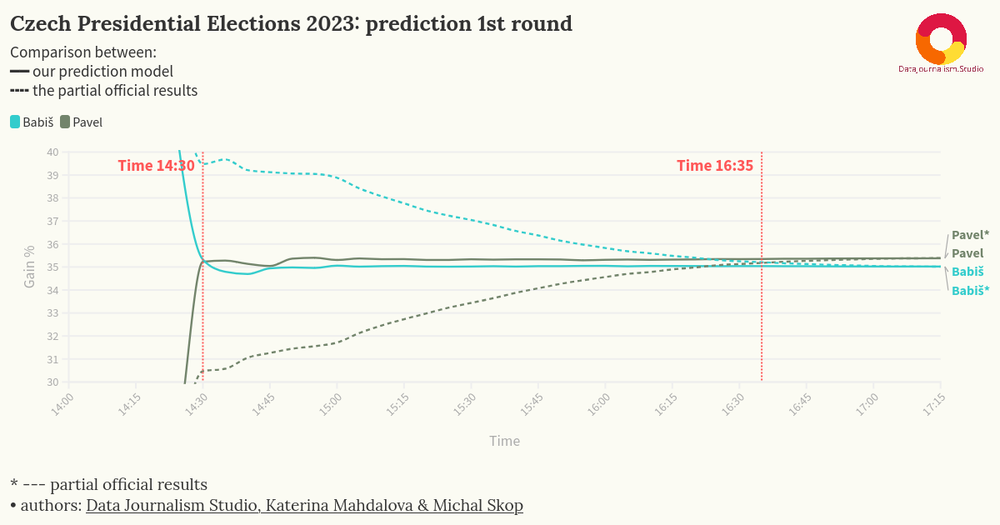
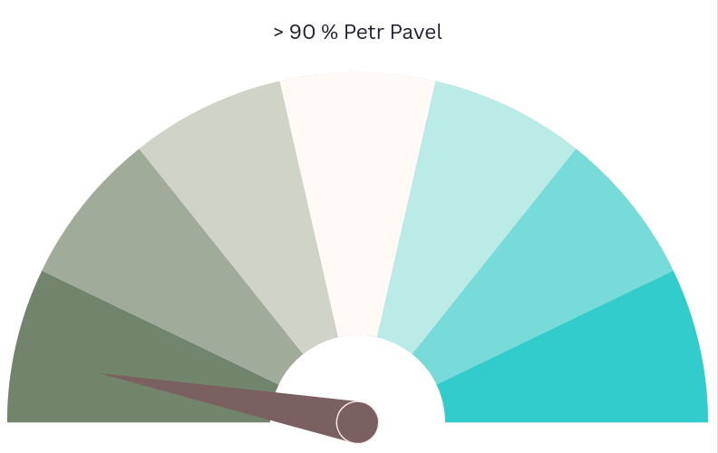

In a world where speed and accuracy dominate, real-time election predictions are reshaping how we experience election nights. Imagine knowing the winner within minutes of polls closing—that’s the promise of our cutting-edge models.

*Figure: Prediction trends compared to official counts over time.*

## The Breakthrough: Early and Accurate Predictions

In 2023, our groundbreaking model achieved a milestone in Czechia: we announced that Petr Pavel would become the president just **27 minutes** after polling stations closed. This prediction was based on only **0.6% of the votes counted**, a testament to the power and precision of our approach.

### How Does It Work?

Election results are usually reported first from smaller precincts, which are quicker to count. Historically, these early results often diverge significantly from final outcomes, leading to speculation and uncertainty. Our prediction model eliminates this uncertainty by analyzing early results in the context of historical voting patterns and trends. Key features of the approach include:

- **Weighted Averages**: Early results are combined with historical data to predict outcomes in uncounted precincts.
- **Correlation Analysis**: Patterns from past elections are used to model expected voting behavior across regions.
- **Continuous Refinement**: Predictions are updated every five minutes as new data is reported, steadily increasing accuracy.

By the time 1.5% of votes are counted, our model delivers results with **decimal-point precision**. For instance, during the first round of the 2023 presidential election, we accurately predicted the percentages for Petr Pavel and Andrej Babiš, long before the official results were released.

<iframe src='https://flo.uri.sh/visualisation/21035812/embed' title='Interactive or visual content' className='flourish-embed-iframe' frameborder='0' scrolling='no' width="100%" height="600px" sandbox='allow-same-origin allow-forms allow-scripts allow-downloads allow-popups allow-popups-to-escape-sandbox allow-top-navigation-by-user-activation'></iframe>
*Figure: Prediction accuracy stabilizes within the first minutes of vote counting.*

## Global Reach and Adaptability

Our methodology has proven effective across various countries, including the **USA**, **Poland**, **Slovakia**, **Brazil**, and **Romania**. Each deployment adapts to the unique characteristics of the electoral system. 

### Example: Slovak Parliamentary Election

For example, in Slovakia, only summary votes for each district (okres) are available during counting, which complicates model construction. Despite these challenges, we successfully predicted results of 2023 elections early. While **two exit polls incorrectly forecasted the winner, our prediction identified the correct outcome** just two hours after the polling stations closed.

## The Election Needle: A Simple Yet Powerful Visual

To make our predictions more accessible, we introduced the "Election Needle," a visual indicator inspired by tachometers. The needle tilts toward the candidate most likely to win, providing an intuitive understanding of the forecasted outcome. The concept of the needle, or "rafička," was carefully localized for Czech audiences in collaboration with translators and linguists.

*Figure: The "rafička" indicates the likelihood of each candidate's victory.*

## Real-Time Data in Action

The practical application of this technology was evident in the first round of the 2023 presidential election. Early results showed Andrej Babiš leading with 39.7% and Petr Pavel trailing at 30.5%. However, our model predicted that Pavel would gain momentum as votes from larger urban areas were counted. By the time just 1.5% of the votes were in, we confidently declared Pavel the likely winner.

Over time, the margin of error in our predictions shrank to mere hundredths of a percentage point, offering a level of precision that traditional commentary cannot match.

<iframe src='https://flo.uri.sh/visualisation/21036003/embed' title='Interactive or visual content' className='flourish-embed-iframe' frameBorder='0' scrolling='no' width="100%" height="600px" sandbox='allow-same-origin allow-forms allow-scripts allow-downloads allow-popups allow-popups-to-escape-sandbox allow-top-navigation-by-user-activation'></iframe>
*Figure: Prediction trends compared to official counts over time.*

## The Challenges and Opportunities Ahead

The adoption of real-time predictions is still in its early stages worldwide. While our work in local and presidential elections has demonstrated the value of this approach, many newsrooms remain cautious, relying on traditional analyses by commentators and political scientists. This hesitance underscores a key challenge: adapting editorial workflows to integrate predictive analytics effectively.

Yet the potential benefits are immense. Predictions remove the uncertainty of waiting for "big cities" to report their results, enabling audiences to gain clarity much earlier in the process. Moreover, they enhance transparency by leveraging open data released by institutions like Statistical Offices.

## Conclusion

Real-time election result predictions are not just a technological achievement; they represent a paradigm shift in how elections are reported. By providing accurate and timely forecasts, we can replace speculation with data-driven insights, making election night a more transparent and engaging experience for audiences worldwide.

---

*Authored by Katerina Mahdalova, Michal Skop*

