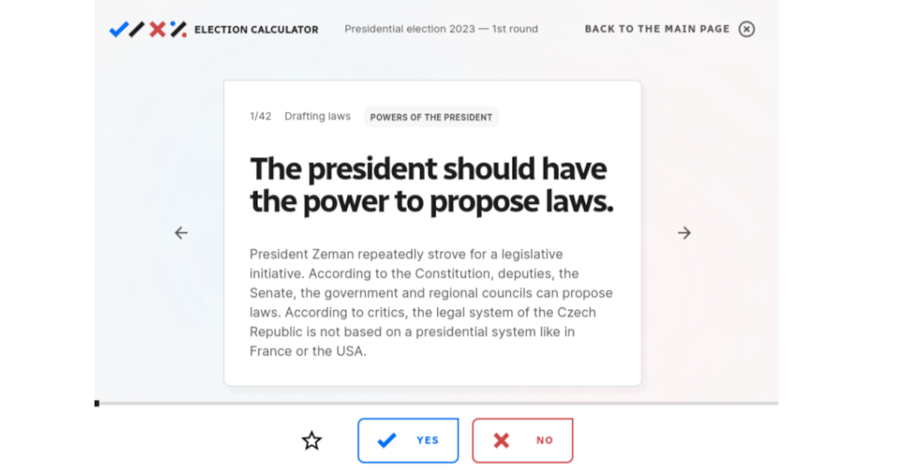

A **voting advice application (VAA)** is a web-based tool designed to help voters make informed decisions by offering personalized recommendations based on their responses to a series of questions.

Using a VAA is quick, straightforward, and even fun! In just 10 minutes, voters can gain valuable insights before heading to the polls, enhancing their understanding of the political landscape.

---

## Why VAAs Matter

Voting advice applications are one of the most effective pre-election tools for increasing informed political participation, especially among demographics less interested in politics, such as younger voters. 

### Evidence-Based Benefits
Academic research highlights the positive impact of VAAs:
- **Increased voter turnout**: People who use a VAA are **1.25 to 2 times more likely to vote** compared to those who do not. ([Source](https://www.cambridge.org/core/journals/european-political-science-review/article/candidates-voters-and-voting-advice-applications/))
- **More informed voting choices**: VAA users are **20-35% more likely to switch parties** if their results show a poor match with their initially preferred party. ([Source](https://osf.io/utdn4/download))

By using a VAA, voters can quickly identify which candidate or party aligns best with their values, fostering more informed and meaningful participation in the democratic process.

---

## Supporting Information Campaigns

Our experience in **Slovakia and the Czech Republic** demonstrates the power of VAAs when paired with targeted communication campaigns:

- **Slovak 2023 Campaign**: Aimed at young voters to enhance political engagement.  
  [Learn more](https://infovolby.sk/clanok/chcem-tu-zostat)  
- **Czech 2021 Campaign**: Focused on empowering younger demographics to make informed voting choices.  
  [Learn more](https://volbypromlade.webflow.io/?/)  

---

## How VAAs Work: Simple and Effective

VAAs are designed to be user-friendly and intuitive. Here’s how they work:

### Step 1: Answer the Questions
Voters respond to **30-40 questions** about their opinions, priorities, and values.

### Step 2: Get Personalized Advice
The VAA generates a tailored recommendation, showing how closely the voter’s preferences align with candidates or political parties.

---

## Benefits of VAAs

### For Voters
- Simplifies decision-making by providing clear, data-driven recommendations.
- Encourages political engagement, particularly among younger and less politically active demographics.

### For Organizations
A VAA can bring substantial benefits to your organization:
1. **Increased Recognition**: VAAs are highly popular among voters. For instance, the Czech VAA for the 2023 presidential election attracted **2.4 million users**—over **40% of all voters**.
2. **Media Partnerships**: Media outlets often adopt branded versions of VAAs, incorporating customized colors and features. This boosts your organization’s visibility and strengthens connections with both voters and the media.

---

## Our Expertise: Empowering Voters Across Central Europe

Since 2009, we were part of NGO [KohoVolit.eu](https://kohovolit.eu), which has been at the forefront of developing innovative VAAs:
- [**Volební kalkulačka**](https://volebnikalkulacka.cz) in Czechia  
- [**Volebná kalkulačka**](https://volebnakalkulacka.sk) in Slovakia  
- [**Wahlrechner**](https://wahlrechner.at) in Austria  
- [**Voksmonitor**](https://voksmonitor.hu) in Hungary  

These tools have empowered voters across Central Europe, helping them make informed decisions and fostering greater engagement in the democratic process.

---

## Conclusion

Voting advice applications are powerful tools that enhance political participation and voter awareness. By adopting a VAA for your organization, you can drive meaningful impact, increase your recognition, and expand your reach among voters and media.  
Check out the latest version of our VAA: [volebnikalkulacka.cz](https://volebnikalkulacka.cz) or [wahlrechner.at](https://wahlrechner.at).

For more information or to collaborate on voting advice applications, feel free to reach out.
