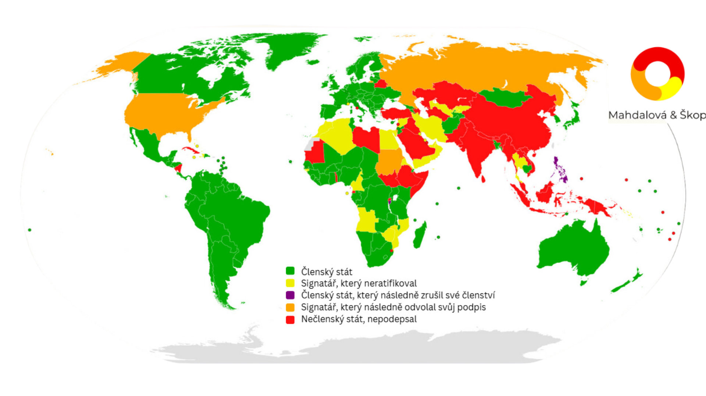

Zatykač na Benjamina Netanjahua a Yoava Gallanta (ministra obrany) vydaný Mezinárodním trestním soudem (ICC) - odkaz na tiskovou zprávu je zde: [icc-cpi.int/…/situation-state…](https://www.icc-cpi.int/news/situation-state-palestine-icc-pre-trial-chamber-i-rejects-state-israels-challenges)

Politici jsou oficiálně obviněni z válečných zločinů a zločinů proti lidskosti. ICC tak na základě shromážděných důkazů považuje za důvodné, že jejich jednání, například omezování humanitární pomoci civilistům v Gaze nebo útoky na civilní obyvatelstvo, porušovalo mezinárodní humanitární právo.

Pokud by Netanjahu nebo Gallant cestovali do států, které jsou signatáři Římského statutu (zakládajícího dokumentu ICC), mohou být na základě tohoto zatykače zadrženi a předáni soudu.

Symbolicky to znamená, že ICC považuje jejich činy za dostatečně závažné k tomu, aby byly vyšetřovány na mezinárodní úrovni.

Izrael, stejně jako USA haagský tribunál neuznávají a nespolupracují s ním. Navzdory tomu má tento krok potenciál zvýšit tlak na mezinárodní úrovni ohledně odpovědnosti za činy spáchané během konfliktu mezi Izraelem a Palestinou.

