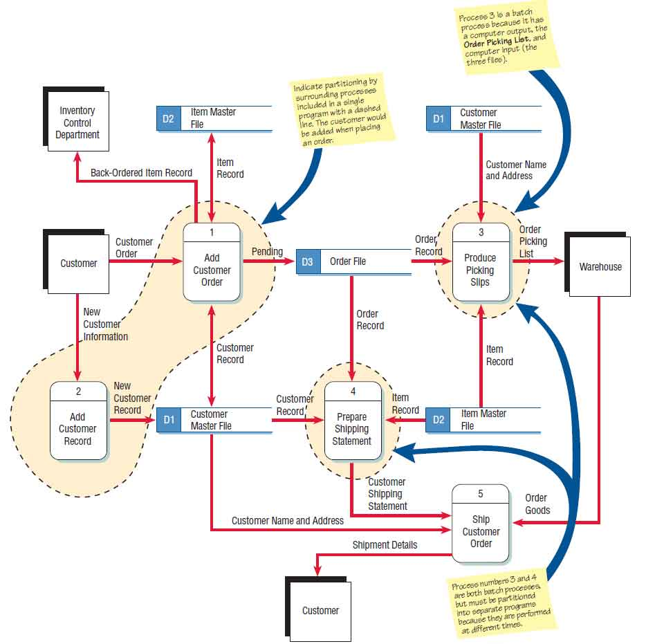

Web development has evolved significantly over the past decade. In this comprehensive guide, we'll explore the modern tools, frameworks, and best practices that shape today's web development landscape.

## Performance Considerations

When building modern web applications, performance is crucial. Let's look at some performance metrics:

<blockquote>
  This is a blockquote
</blockquote>

## Advanced Layout Techniques

Modern CSS has made complex layouts much easier to implement. Here's an example of a responsive grid layout:

### Title 3
#### Title 4
##### Title 5
###### Title 6

<iframe width="100%" height="315" src="https://datajournalism.studio/" frameBorder="0" allow="autoplay; encrypted-media" allowFullScreen></iframe>

<ul>
  <li>Item 1</li>
  <li>Item 2</li>
  <li>Item 3</li>
</ul>

<ol>
  <li>Item 1</li>
  <li>Item 2</li>
  <li>Item 3</li>
</ol>

