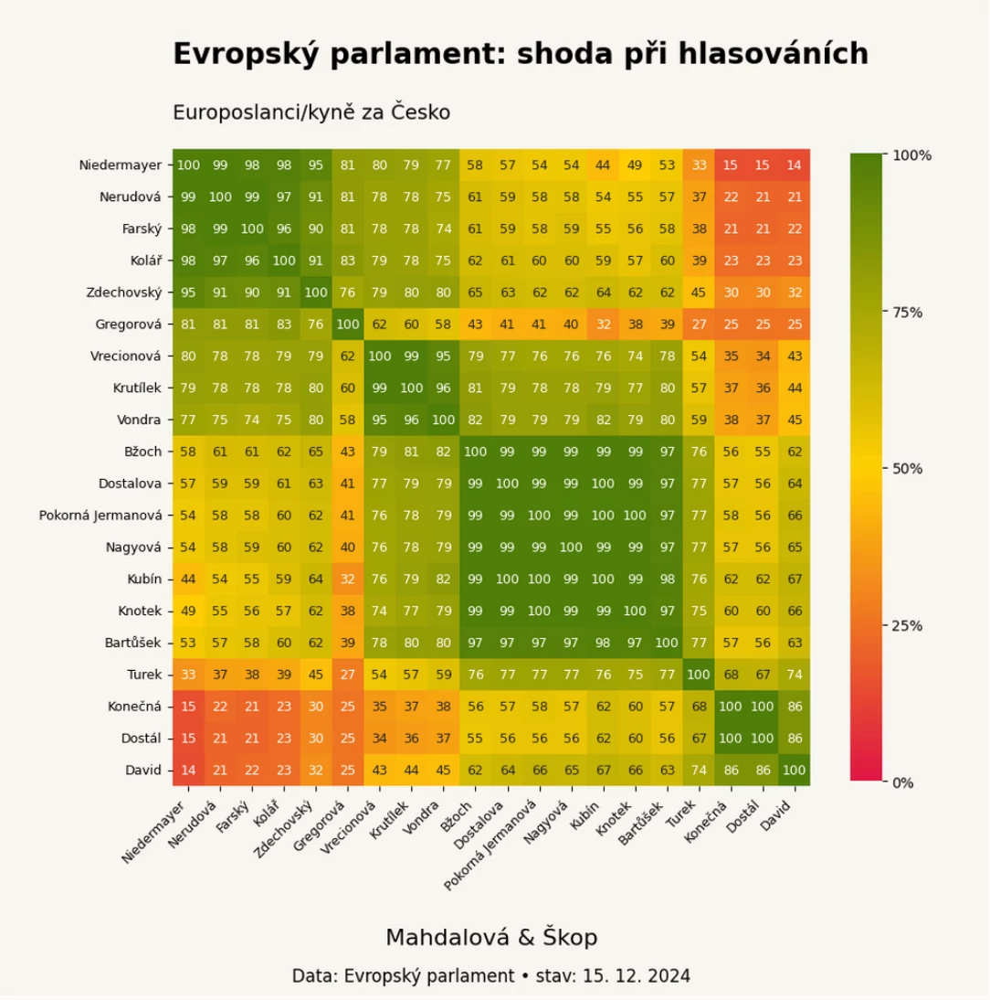
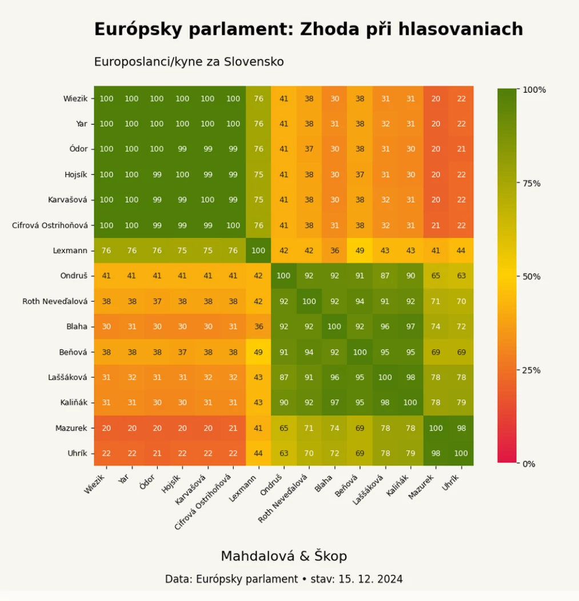

_Unikátní analýza hlasování v Europarlamentu za rok 2024. Podívejte se s námi, kdo má ke komu blízko, kdo má skutečně šanci věci ovlivňovat a kdo žije v iluzi, že vzdoruje, přitom je zcela mimo. Ocitnout se v europarlamentu v izolaci znamená vzdát se rozhodování. Tak co, kdo vás nezradil?_

## Česko 🇨🇿

Situace mezi českými europoslanci je poměrně rozdrobená. Na jedné straně jsou europoslanci v **největší lidovecké skupině v Europarlamentu** (za ČR je tu celkem 5 poslanců z TOP 09, STANu a KDU-ČSL). Druhou velkou českou skupinou je 6 poslanců za ANO a Nikola Bartůšek z Přísahy, kteří se řadí k **"opozičním" Patriotům**.



Mezi těmito dvěma skupinami se pohybují 3 europoslanci za ODS (politická skupina Konzervativců), kteří balancují mezi vlivem hlavní koalice a opozicí. Markéta Gregorová z Pirátů je ve skupině Zelených a hlasuje blízko evropských sociálních demokratů.

V **extrémních polohách Europarlamentu** se pohybují Kateřina Konečná s Ondřejem Dostálem (Stačilo!-KSČM / nezařazení), Filip Turek (Přísaha / Patrioti) a Ivan David (SPD / Suverenisté)

## Slovensko 🇸🇰

Mezi europoslanci zvolenými na Slovensku je situace jednodušší. V Europarlamentu jsou zástupci pěti slovenských stran, přičemž Progresívne Slovensko (Renew) a KDH (Lidovci) patří do hlavní koalice.

SMER, HLAS a Republika skončily v opozici mezi nezařazenými (s výjimkou poslance Uhríka z Republiky). HLAS a SMER hlasují prakticky totožně a v EP zůstávají zcela bokem.



## Celý Europarlament 🇪🇺

V Evropském parlamentu hrají klíčovou roli politické skupiny neboli frakce. Tyto frakce umožňují poslancům a poslankyním efektivně spolupracovat a zvládat širokou škálu témat. Aktuálně v parlamentu působí osm hlavních frakcí (viz níže).

Jednotliví europoslanci se nemohou detailně věnovat všem projednávaným otázkám, a proto se často spoléhají na své kolegy a kolegyně v rámci frakce, kteří se specializují na konkrétní oblasti.

### Rozložení sil

Analýza hlasování potvrzuje, jak zásadní jsou politické frakce. I když primárně nehodnotíme přímo příslušnost jednotlivých poslanců ke skupinám, jejich hlasování to obvykle jasně odhalí.

V grafu, který shrnuje výsledky hlasování, každý bod představuje jednoho poslance nebo poslankyni. Většina bodů se seskupí do shluků odpovídajících jednotlivým frakcím, protože členové téže frakce hlasují zpravidla podobně. Přesto není shoda nikdy stoprocentní – i uvnitř jedné skupiny se občas najdou odlišné názory.

### Hlavní koalice

V Evropském parlamentu má největší vliv tzv. hlavní koalice:

* **Křesťansko-demokratičtí Lidovci (EPP)**
* **Liberální Renew Europe**
* **Sociální demokracie (S&D)**

K tomuto jádru se na jedné straně připojují Zelení a Levice, na druhé straně pak Konzervativci.

### Další frakce

Frakce mimo hlavní koalici, **Patrioti, Suverenisté** a nezařazení poslanci, mají výrazně menší vliv. Často se jejich členové pohybují mimo hlavní jednání a jejich šance na prosazení svých návrhů je omezená.

<iframe src='https://flo.uri.sh/visualisation/20847121/embed' title='Interactive or visual content' className='flourish-embed-iframe' frameBorder='0' scrolling='no' width='100%' height='600px'></iframe>

Here's the continuation:

## Hlasování o Komisi

Evropská komise, známá jako "vláda EU," je výkonným orgánem Evropské unie, odpovědným za předkládání legislativních návrhů, řízení každodenní agendy EU a prosazování unijní legislativy.

Předsedkyní komise je Ursula von der Leyen. Její členové – komisaři – jsou navrženi členskými státy a schváleni právě Evropským parlamentem. Českým komisařem je Jozef Síkela (za STAN), slovenským Maroš Šefčovič (navržený stranou SMER).

Hlasování o nové Evropské komisi z 27. listopadu 2024 ilustruje rozdělení v Europarlamentu. **Většina hlavní koalice podpořila složení Komise**, včetně českých lidovců a slovenských Renew, zatímco opoziční skupiny hlasovaly spíše proti. Graf ukazuje, jak se jednotliví europoslanci postavili – zelené body značí podporu, červené odmítnutí.

<iframe src='https://flo.uri.sh/visualisation/21182056/embed' title='Interactive or visual content' className='flourish-embed-iframe' frameBorder='0' scrolling='no' width='100%' height='600px'></iframe>


## Česko - země nejdále od rozhodování

Vezmeme si střed europoslanců za danou zemi, nějakého "průměrného europoslance", který by reprezentoval svoji zemi. Potom **Čech a Maďar** by byli těmi, kteří by byli těmi **největšími extrémy** v Europarlamentu, nejdále od středu. Zároveň ale nejdále od středu směrem pryč od hlavní skupiny poslanců, od koalice, od rozhodování.

<iframe src='https://flo.uri.sh/visualisation/20864626/embed' title='Interactive or visual content' className='flourish-embed-iframe' frameBorder='0' scrolling='no' width='100%' height='600px'></iframe>

## Přehled skupin Europarlamentu - české a slovenské strany

### Hlavní koalice
- Křesťanští demokraté (lidovci): TOP 09, STAN, KDU-ČSL, KDH
- Sociální demokraté: -
- Renew (liberálové): Progresívne Slovensko

### Rozšířená koalice
- Zelení a Svobodná aliance: Piráti
- Konzervativci a reformisté: ODS
- Levice: -

### Mimo hlavní proud
- Patrioti: ANO, Přísaha a Motoristé
- Suverenisté: SPD, Republika
- většina nezařazených: Stačilo!, SMER, HLAS, Republika

## Teorie podkovy

Model europoslanců sestavený na základě jejich hlasování odpovídá Teorii podkovy, podle které mají extrémní levice a pravice často podobné postoje. Tato **podobnost** je vidět na příkladu hlasování **"levicové" Konečné** (KSČM) a **"pravicového" Turka** z Přísahy/Motoristů.

<iframe src='https://flo.uri.sh/visualisation/20847121/embed' title='Interactive or visual content' className='flourish-embed-iframe' frameBorder='0' scrolling='no' width='100%' height='600px'></iframe>

```box
## Jak se počítají hlasovací koalice

Analýza všech zaznamenaných jmenných hlasování za končící volební období 2019–2024 je zpracována na základě dat z Evropského parlamentu. Využívá se statistická metoda vážená analýza hlavních komponent. Každý bod v grafu představuje jednoho europoslance nebo europoslankyni. Vzdálenost dvou bodů odpovídá tomu, jak často hlasovali společně. Kdyby dva europoslanci hlasovali vždy stejně, byli by v grafu na stejném místě. Čím dál od sebe jsou, tím častěji hlasovali právě opačně. Grafické znázornění odhaluje nejen jasné hlasovací bloky, ale i jemné rozdíly mezi jednotlivými poslanci.

Metoda je vážená, tedy upravená tak, aby vynikly rozdíly mezi europoslanci. Větší váha se přikládá hlasováním, při nichž byl parlament více rozdělen a účastnilo se ho více europoslanců. Vůbec největší vliv na rozmístění europoslanců by mělo hlasování, které by skončilo jen o jeden hlas, nejmenší pak jednomyslná rozhodnutí. Těm se nejčastěji blíží různá procedurální či formální hlasování.
```

