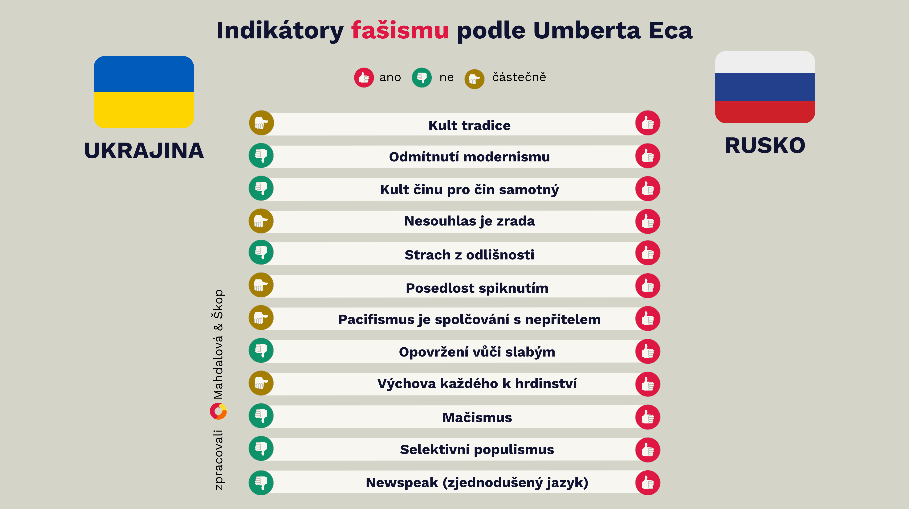

Slovo "fašismus" slýcháme ve veřejném prostoru čím dál častěji. Ale co vlastně znamená, když někdo označí stát nebo režim za fašistický? Není to jen prázdná nálepka, kterou používáme pro režimy či země, které se nám z nějakého důvodu nelíbí?

Světoznámý spisovatel a filozof Umberto Eco, který vyrůstal v Mussoliniho Itálii, nám zanechal cenný nástroj. Definoval dvanáct charakteristických znaků fašismu, které nám mohou pomoci rozpoznat nebezpečné tendence dřív, než bude pozdě. Jeho seznam je dnes aktuálnější než kdy jindy.

V době, kdy se mezinárodní vztahy dramaticky mění a geopolitické napětí roste, je důležitější než kdy dříve umět rozpoznat varovné signály. Na příkladu současného konfliktu mezi Ruskem a Ukrajinou si ukážeme, jak Ecovy indikátory fungují v praxi a proč by nás měly zajímat.

## Proč byste měli zbystřit
Ecův seznam není jen teoretický nástroj - je to praktický průvodce pro občany demokratických společností. Ukazuje nám, jak se autoritářské režimy postupně formují a jak můžeme rozpoznat nebezpečné tendence v jakékoli společnosti, včetně té naší.

Současná situace v Rusku není jen vzdáleným problémem - je varováním pro celý svět. Když pochopíme, jak fašismus funguje a jak se projevuje, můžeme lépe chránit demokratické hodnoty ve vlastní zemi.

## Co s tím můžeme dělat?

• Vzdělávat se o historii a mechanismech autoritářských režimů

• Aktivně podporovat demokratické instituce a občanskou společnost

• Kriticky myslet a ověřovat informace

• Postavit se proti netoleranci a diskriminaci v každodenním životě

Demokracie není samozřejmost - je to systém, který vyžaduje aktivní účast a ochranu každého z nás. Ecových dvanáct bodů nám připomíná, že fašismus nezačíná tanky v ulicích, ale drobnými, postupnými změnami ve společnosti, kterým musíme umět čelit.

## Dvanáct signálů fašismu podle Umberta Eca

1. Kult tradice: Když se minulost stává zbraní
V Rusku se setkáváme s neustálým odkazováním na "slavnou minulost" a "tradiční hodnoty". Tyto odkazy nejsou nevinné - slouží k ospravedlnění současné politiky a potlačování změn. Ukrajina naopak svou identitu staví na směřování k budoucnosti a modernizaci.

2. Odmítání modernismu: Strach ze změny
Když režim systematicky odmítá moderní hodnoty jako lidská práva či rovnost, měli bychom zpozornět. V Rusku vidíme, jak se "ochrana tradičních hodnot" stává záminkou pro potlačování základních svobod. Modernita není nepřítel - je to přirozený vývoj společnosti.

3. Kult akce: Když se přestává myslet
"Nejdřív jednej, pak přemýšlej" - tento přístup je typický pro autoritářské režimy. V Rusku jsou vojenské akce prezentovány jako důkaz síly, bez ohledu na jejich důsledky. Oproti tomu demokratické společnosti preferují dialog a diplomatická řešení.

4. Nesouhlas jako zrada: Když kritika znamená nebezpečí
V zdravé demokracii je kritika vlády normální součástí politického života. Když se ale každý nesouhlas začne označovat za zradu národa, jako to vidíme v Rusku, je to vážný varovný signál.

5. Strach z jinakosti: Když se různorodost stává hrozbou
Fašistické režimy potřebují nepřítele - často jsou jím menšiny nebo "ti jiní". Ruská propaganda cílí na LGBTQ+ komunitu a další menšiny, zatímco Ukrajina i přes válečný stav zachovává respekt k různorodosti své společnosti.

6. Posedlost spiknutím: Když za vším stojí nepřítel
Konspirační teorie nejsou nevinná zábava - jsou mocným nástrojem manipulace. Ruský režim neustále mluví o "západním spiknutí", aby odvedl pozornost od vnitřních problémů.

7. Pacifismus jako slabost: Když je mír považován za prohru
V autoritářských režimech je touha po míru často vykreslována jako znak slabosti. Rusko označuje zastánce míru za "agenty Západu", zatímco demokratické země vidí v mírovém řešení konfliktů sílu, ne slabost.

8. Pohrdání slabými: Když společnost ztrácí soucit
Způsob, jakým společnost zachází se svými nejzranitelnějšími členy, hodně vypovídá o její povaze. Ruský režim otevřeně pohrdá "slabými", což se projevuje v diskriminaci menšin a perzekuci aktivistů.

9. Výchova k hrdinství: Když se smrt romantizuje
Zdravý patriotismus je jedna věc, ale když se společnost zaměřuje na "hrdinskou smrt" jako nejvyšší ctnost, je to nebezpečný signál. Ruská propaganda glorifikuje válečné oběti, zatímco demokratické země si váží života každého občana.

10. Mačismus: Když se síla stává vším
Kult síly a "pravého mužství" je dalším typickým znakem. V Rusku vidíme jasný příklad v kultu osobnosti Vladimira Putina a jeho demonstracích fyzické zdatnosti.

11. Selektivní populismus: Když "lid" mluví jen jedním hlasem
Autoritářské režimy rády mluví jménem "lidu", ale jen když se jim to hodí. Skutečná demokracie respektuje různorodost názorů a potřeb všech občanů.

12. Zjednodušený jazyk: Když mizí prostor pro nuance
Složité problémy nemají jednoduchá řešení. Když režim komunikuje pouze v černobílých termínech a zjednodušených heslech, je to znak manipulace.

