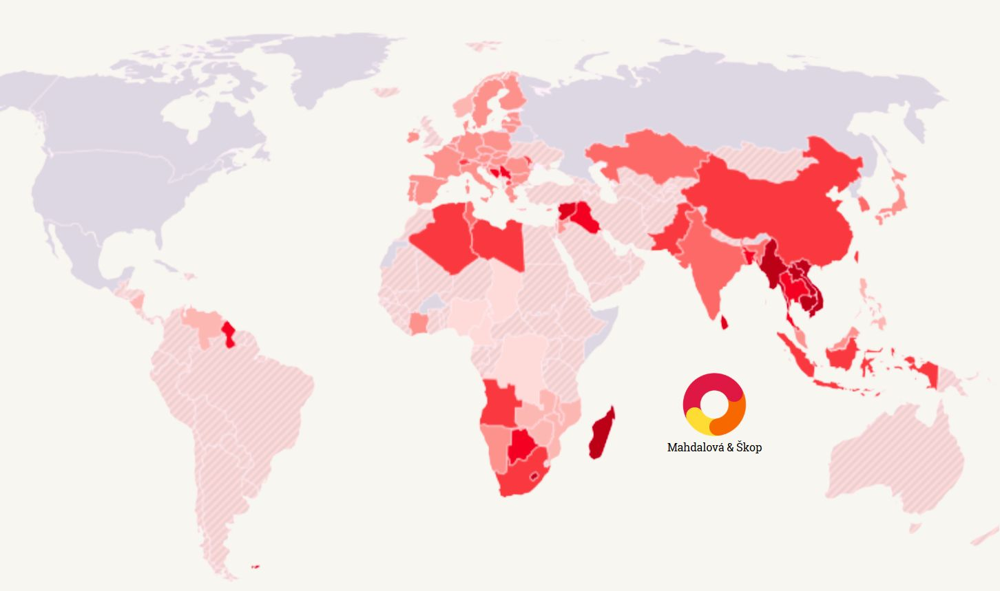

 
Spojené státy zavádějí **nejtvrdší obchodní opatření za desítky let**. Prezident Donald Trump oznámil 10% clo na veškerý dovoz do země a k tomu **sadu dodatečných cel na konkrétní státy** – včetně klíčových spojenců, jako jsou země EU, Japonsko, Jižní Korea nebo Kanada.

Donald Trump tento den označil za „**Liberation Day**“ – den, kdy se Amerika „osvobozuje od neférových obchodních praktik světa“. Ve skutečnosti ale jde **ostrý příklon k jednostrannému protekcionismu** a naopak o odklon od desetiletí budované obchodní diplomacie, kterou Spojené státy samy pomáhaly formovat. Složitá síť vyjednávání, výjimek a pravidel je nahrazena jednoduchým vzorcem – a tvrdým vzkazem spojencům: přátelství nechrání před clem, rozhoduje obchodní bilance.

```box
#### Symbolika

Trump rád používá výrazné pojmenování událostí, které mají silný emocionální náboj. Označení „Liberation Day“ má evokovat historické osvobození – přitom jde o technicko-ekonomický krok s velmi reálnými následky. Z hlediska mezinárodního práva i tradice je odstraňování tarifních bariér výsledkem složité diplomacie – multilaterální vyjednávání, kompromisy, pravidla WTO. Trump tento přístup nahrazuje vlastními vzorci a mocenským diktátem.
```

## Co Trump udělal – a proč

Trump zavedl dvě klíčová opatření:

- **Univerzální clo ve výši 10 %** na všechen dovoz  
- **Individuální „reciproční“ cla** na desítky zemí, často ve výši 20–46 %, podle údajně neférového chování

Oficiálně tím chce:
- **zastavit obchodní nerovnováhu**
- **obnovit domácí výrobu**
- **zvýšit bezpečnost**, aby nebyly závislé na dovozu klíčových surovin a produktů

Ve svém projevu mluvil o „zlatém věku americké výroby“ a obvinil i tradiční spojence, že jsou „horší než nepřátelé“. 

```box
#### 
Po desetiletí byly USA jedním z hlavních zastánců volného obchodu a zakladatelským pilířem institucí jako GATT nebo Světová obchodní organizace (WTO). Nové tarify znamenají dramatický zlom v této tradici. Zvlášť překvapující je zaměření na spojence – obvykle právě oni bývají chráněni před podobnými opatřeními kvůli společné bezpečnostní a hospodářské agendě (např. NATO, G7, bilaterální smlouvy).

Trump dlouhodobě tvrdí, že obchodní deficit (tedy že USA více dovážejí než vyvážejí) je důkazem, že „někdo Ameriku podvádí“. Ve skutečnosti je deficit běžnou součástí ekonomiky silného spotřebitelského trhu a odráží např. sílu dolaru nebo fakt, že americké firmy často investují v zahraničí místo exportu. Argument o národní bezpečnosti se opírá o zákon z 50. let, který ale nebyl navržen pro plošná cla vůči spojencům.
```


## Jak cla skutečně vznikají: Trumpův vzorec

Za všemi novými tarify nestojí analýza reálných celních bariér, ale jednoduchý výpočet:

> **Trumpovo clo = (obchodní deficit USA s danou zemí ÷ dovoz z dané země) ÷ 2**

Výsledkem je **automatický trest za obchodní schodek** – bez ohledu na jeho příčinu.

| Země        | Obchodní deficit | Import do USA | Poměr (deficit/import) | Nové clo |
|-------------|------------------|----------------|--------------------------|----------|
| Vietnam     | 113 mld. USD     | 125 mld. USD   | 91 %                     | 46 %     |
| Čína        | 270              | 401            | 67 %                     | 34 %     |
| Thajsko     | 42               | 58             | 72 %                     | 36 %     |
| EU          | 214              | 555            | 38 %                     | 20 %     |
| Japonsko    | 63               | 136            | 46 %                     | 24 %     |
| Jižní Korea | 60               | 121            | 50 %                     | 25 %     |

Clo tak **netrestá obchodní praktiky, ale samotnou existenci obchodního vztahu**, pokud není vyrovnaný.

Tento vzorec se poprvé objevil v Trumpově kampani jako „tarifní aritmetika“. Nezohledňuje ale reálné překážky (např. netarifní bariéry, technické normy, kvóty), historický vývoj vztahů ani sektorové rozdíly. Např. Evropa dováží z USA hodně letecké techniky, ale USA z Evropy spotřební zboží – tedy různé typy produktů, různé marže. Tento výpočet to ignoruje.

## Dopady: Spojenec = cíl

Podle odhadů agentury Fitch se průměrná americká celní sazba **vyšplhá z 2,5 % na 22 %** – hodnotu naposledy dosaženou kolem roku 1910.

### Pro USA:
- **Zdražení tisíců výrobků** včetně elektroniky, aut i potravin
- **Riziko recese** – burzy klesají, investoři utíkají ke zlatu a jenům
- **Ohrožení pozice dolaru**, pokud Trump přistoupí k manipulaci s kurzy

### Pro spojence:
- **Evropské firmy ztrácejí konkurenceschopnost** (např. Škoda Auto, Siemens, Bosch)
- **Japonsko a Jižní Korea** připravují krizové balíčky pro vývozce
- **Zpochybnění USA jako stabilního partnera**

Kristalina Georgieva (MMF) očekává **snížení globálního růstu**. Ekonomové jako Antonio Fatas varují, že svět směřuje k „globální recesi“.

Clo tak netrestá obchodní praktiky, ale samotnou existenci obchodního vztahu, pokud není vyrovnaný.

V mezinárodním obchodu je běžné, že bilance není symetrická – např. menší země vyvážejí víc než dovážejí, protože nemají tak silný spotřebitelský trh. Export do USA tvoří pro některé ekonomiky zásadní podíl na HDP (Vietnam, Tchaj-wan, Thajsko). Uvalením cel Trump v podstatě říká: pokud vám obchod s USA funguje lépe než nám, zaplatíte za to.

Vysoká cla znamenají vyšší ceny nejen pro americké spotřebitele, ale i pro firmy, které dovážejí komponenty. Americká ekonomika je dnes silně integrovaná do globálních dodavatelských řetězců. Zvýšení cel zvyšuje náklady, snižuje investice, zpomaluje ekonomiku. Pokud navíc cla povedou k odvetě (což EU a Japonsko zvažují), může vzniknout celní spirála, jako v roce 1930.

## Reakce v USA: ne všichni republikáni tleskají

Čtyři republikánští senátoři (McConnell, Paul) a senátorky (Collins, Murkowski) podpořili návrh na **zrušení cel na Kanadu** – zemi, která je Trumpem obviňována z dovozu fentanylu.

> „Tyto tarify zraňují ty, kdo si to mohou dovolit nejméně,“  
> řekla Collinsová s odkazem na ceny pohonných hmot a potravin.

Trump na síti Truth Social reagoval výpady proti „slabochům“ ve vlastní straně. 

I zde je důležitý kontext: Republikánská strana byla tradičně pro volný obchod – ještě za Reagana, Bushe nebo McCaina. Trump tento postoj obrátil naruby. Vystoupení čtyř senátorů ukazuje, že i v GOP existuje obava z dopadů na domácnosti, podnikatele i rozpočty jednotlivých států. Ale většina zůstává loajální kvůli politickému tlaku nebo obavě z primárek.

## Trump a ekonomika: strategie nebo chaos?

Trump se stylizuje do role ochránce průmyslu. Ale jeho hospodářská politika:
- **postrádá konzistenci**
- **nepracuje s daty**
- **působí krátkodobě destruktivně**

Podobně jako **Smoot-Hawley Act z roku 1930**, mohou i jeho cla **spustit vlnu odvet**, narušit řetězce a zhoršit výhled ekonomiky nejen USA, ale i celého světa.

Trump často střídá strategie bez předchozí analýzy, přeskakuje mezi sliby o výrobě, daních, clech a měnové politice. Jeho opatření mají často symbolickou hodnotu, ale reálné škody – například cla v roce 2018–2019 podle nezávislých studií vedla k poklesu pracovních míst v exportním sektoru. Navíc podkopávají důvěru spojenců i investorů.

## Závěr: Jednoduchý vzorec, globální následky

Trumpova „reciproční cla“ ve skutečnosti **trestají spojence a narušují globální stabilitu**. Nejde o spravedlivější světový obchod, ale o **vnitropolitický kalkul**, který může mít globální následky.

Pro Evropu je to varování: **Spojené státy zůstávají silou, ale nikoliv předvídatelnou.** A v tomto „obráceném světě“, jak jej popsala šéfka ECB Christine Lagardeová, **se Evropa bude muset o to víc spolehnout sama na sebe.**

Šéfka Evropské centrálmní banky Christine Lagarde mluví o „obráceném světě“, ve kterém se rozpadá dosavadní struktura – kde USA byly pilířem multilateralismu, Evropa se mohla spolehnout na pravidla, a globální obchod přispíval ke stabilitě. Nové kroky Trumpovy administrativy ohrožují tuto architekturu – a nutí Evropu budovat vlastní soběstačnost, například v oblasti energetiky, obrany i strategických technologií.


```box

## Dále k tématu:

- [Číslo dne: 20 milionů dolarů (nestačilo)](https://www.mahdalova-skop.cz/clanek/cislo-dne-2025-04-02-soudkyne-porazila-muska)  
- [V Kanadě se vzedmula liberální vlna](https://www.mahdalova-skop.cz/clanek/cislo-dne-2025-03-03-v-kanade-se-vzedmula-liberalni-vlna)  
- [Timothy Snyder: Samozřejmě, že je to puč](https://www.mahdalova-skop.cz/clanek/komentar-2025-02-05-snyder-samozrejme-ze-je-to-puc)
- [Americká cla: Trest za to, že jste moc dobří](https://www.mahdalova-skop.cz/clanek/kontext-2025-04-03-americka-cla-trest-za-to-ze-jste-moc-dobri)

```
