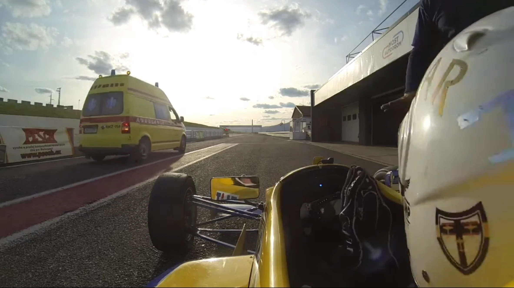
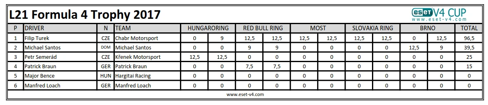
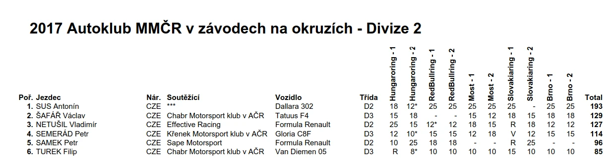
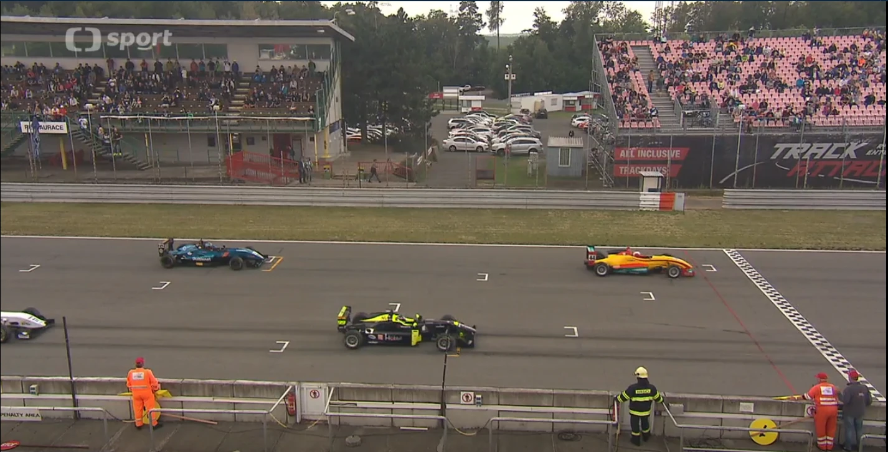
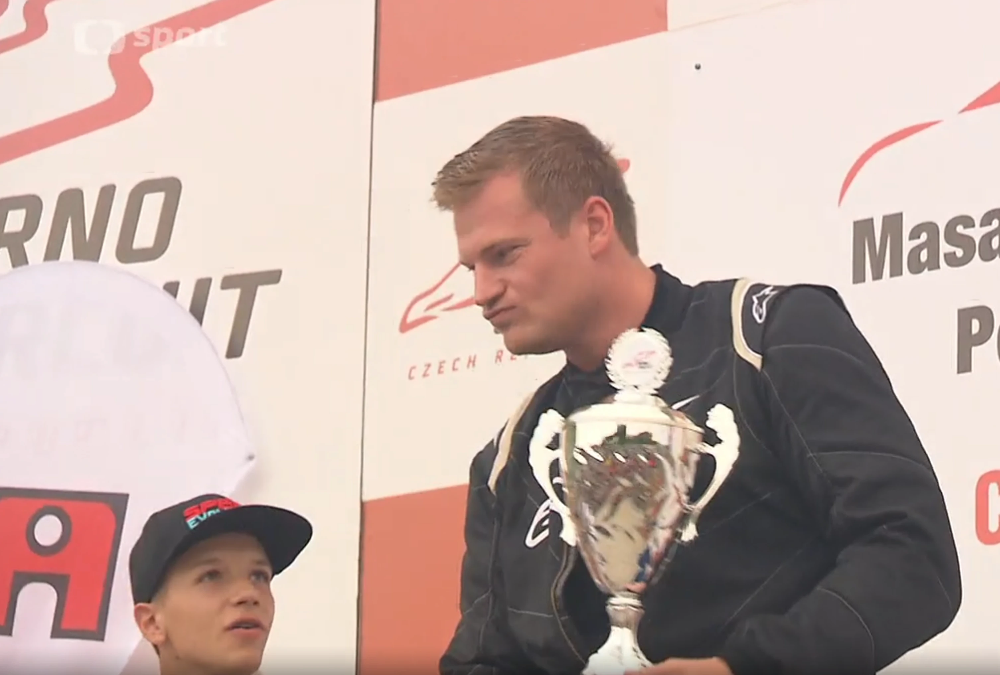
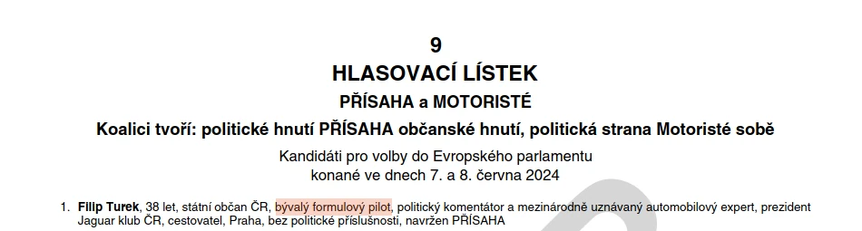

_**Životní Turkův úspěch v závodech formulí** byl závod v květnu 2017, kdy v nejslabší kategorii formulí porazil oba dva další jezdce: patnáctiletého juniora z Dominikánské republiky, který právě přesedlal z motokár, a obvodního lékaře z východního Německa. **Více závodníků v jeho kategorii nejelo**. Celkově v tomto závodě dojel čtvrtý od konce._

| 📊 **Turek ve formulích (kompletní datový přehled)** |                                                                                       |
|------------------------------------------------------|----------------------------------------------------------------------------------------|
| 👤 Celkem závodů v kariéře                           | 27                                                                                     |
| 🏁 Vítězství                                         | 12                                                                                     |
|                                                      | 🔹 z toho 4× jako jediný účastník                                                      |
|                                                      | 🔹 6× ze dvou závodníků                                                                |
|                                                      | 🔹 2× nad dvěma soupeři (15letý junior + praktický lékař)                              |
| 🏆 Titul                                             | ESET F4 Trophy 2017                                                                    |
|                                                      | 🔹 počet hodnocených jezdců: 4                                                         |
|                                                      | 🔹 Turek jako jediný odjel celý seriál (vyhrál díky samotné účastí)                   |
| 🔚 Nejčastější umístění v mezinárodním žebříčku      | poslední z těch, co dojeli                                                             |


_Turek ve svých formulových začátcích v roce 2015 na autodromu v Mostě v helmě se znakem [nacistické stíhací letky Jagdgeschwader 27 “Afrika”](https://en.wikipedia.org/wiki/Jagdgeschwader_27). Zdroj: Filip Turek  - Formule Autodrom Most_

Filip Turek, současný europoslanec, se ve veřejném prostoru **prezentuje jako bývalý formulový závodník s působivými úspěchy**. Podrobná analýza jeho závodní kariéry v letech 2015–2017 však ukazuje, že realita za deklarovaným titulem **vypadá výrazně skromněji**. V amatérském Carbonia Cupu absolvoval 16 závodů, většinou proti dvěma soupeřům, přičemž **nejčastějším výsledkem bylo poslední místo**. Přesto si z těchto závodů odnesl **pět vítězství** – vždy nad jediným pravidelným konkurentem ve slabším voze. V roce 2017 se přesunul do oficiální středoevropské série ESET V4 Cup, kde odjel deset závodů v nejnižší podkategorii Formula 4 Trophy. **Čtyřikrát zvítězil jako jediný jezdec ve své kategorii**. Celkově byli v této sérii hodnoceni jen čtyři závodníci a hlavní soupeř, patnáctiletý junior, se zúčastnil pouhých dvou podniků.

Formule 4, ve které závodil, je juniorská vstupní kategorie, určená zejména pro mladé jezdce po přechodu z motokár. Blíže má spíš k českému „okresnímu přeboru“ než ke Grand Prix F1 v Monaku.

## 2017: Životní vítězství v závodě 3 jezdců

_→ “Nejhezčí závod, který se mi povedl, byl na Red Bull Ringu v roce 2017, kde jsem byl rychlejší než několik Formulí 3, což je auto o level výš.”  Filip Turek_

V tomto „legendárním” druhém závodě dne 20. 5. 2017 [Turek skončíl 23. z 26 závodníků](https://fia-cez.com/wp-content/uploads/2017/05/formula2.pdf), předjel jednoho závodníka ve Formuli Renault (nikoliv F3) a poté již dříve zmíněné dva jezdce z vlastní kategorie. V prvním závodě toho dne skončil sice o jedno místo lépe, ale 2 závodníci nebyli vůbec hodnoceni. 

Jinými slovy: Turkův „životní úspěch“, jak jej sám popisuje – závod na Red Bull Ringu v květnu 2017, kde měl být „rychlejší než několik Formulí 3“ – ve skutečnosti znamenal 23. místo z 26 účastníků, kdy předjel i jednu Formuli Renault. Ve své kategorii zvítězil nad dvěma závodníky: juniorem z Dominikánské republiky a německým obvodním lékařem. V mezinárodních klasifikacích (FIA CEZ, Mistrovství ČR) pravidelně končil na posledních místech z těch, kteří závody dokončili.

Šlo o **jediné závody v jeho kariéře** formulového závodníka, které **ve své kategorii vyhrál** a zároveň v ní **jeli více než 2 jezdci**.


_Foto: Turek - životní úspěch v Rakousku 2017. **Jediné jeho vítězství, kdy byli v kategorii alespoň 3 závodníci** - Turek, 15 letý junior Santos z Dominikánské republiky a německý obvodní lékař Braun. Při ostatních Turkových vítězstvích byli v kategorii jen dva, nebo byl v kategorii dokonce zcela sám. Zdroj: [Drexler formel cup](https://www.drexler-formel-cup.com/en/gallery.html#2017)._

```box
### Není formule jako formule

Zatímco většina lidí si pod „formulovým závoděním“ představí Formuli 1 Hamiltona nebo Verstappena, existují i nižší kategorie, kde může závodit v podstatě každý. 

Formule 4, ve které závodil europoslanec Turek, je jednou z těchto kategorií – je to ta nejnižší podkategorie celé pyramidy formulí, primárně určena pro juniory jako první stupeň po motokárách. Doba závodu v F1 je klasicky mezi 1 až 2.5 hodinami, v těchto nižších soutěžích je to obvykle 10 až 30 minut a jedou se často 2 závody v jednom dni. 

Rozdíl mezi Velkou cenou Monaka F1 a lokálními závody F4 je zhruba jako mezi fotbalovým zápasem Real Madrid-FC Barcelona a českým okresním přeborem.
```

## 2017: ESET V4 Cup Formule 4 Trophy - aneb když se ostatní nezúčastní, výhra je jistá

_→ “V roce 2017 byl ten úspěch krásný v tom, že můj poslední závod rozhodl, že jsem se stal šampionem své kategorie. [Jsem] držitelem titulu Formule 4 Trophy Central Europe 2017.”  Filip Turek_

V roce 2017 Turek jezdil formulové závody **FIA** (Mezinárodní automobilová asociace) **oblasti Střední Evropa**, která zahrnuje část Evropy **od Česka po Albánii**, jelo se celkem 5 dvojzávodů (dva závody v jednom dni). Zároveň stejné závody se počítaly do Mistrovství České republiky a také i do tzv. ESET V4 Cupu. Některé i do jiných soutěží.

```box
### Jeden závod, ale mnoho soutěží

Jednotlivé závody celoročních soutěží se různě překrývají. Přihlásíte se do jednoho závodu – a najednou jste účastníkem třeba hned šesti různých šampionátů.

Například: závod na rakouském Red Bull Ringu v roce 2017 se současně počítal do:
	- [FIA Central European Zone Championship](https://fia-cez.com/en/vysledky-2017/)
	- [Mezinárodního mistrovství České republiky](https://www.autoklub.cz/wp-content/uploads/2018/11/13504-zao_mmcr_divize2.pdf)
	- [ESET Mistrovství Slovenské republiky 2017](https://www.iracingnews.cz/zimni-spanek-je-u-konce-jezdci-vyrazi-na-hungaroring/)
	- [rakouského Remus Cupu](https://en.wikipedia.org/wiki/2017_Remus_F3_Cup)
	- italského F2000
	- ESET V4 Cupu
a možná ještě do dalších soutěží.

Když se vám závod povede, jste vítěz. Když se vám nepovede? Možná jste stejně vítěz. Alespoň v některé kategorii některé ze soutěží.
```
Turek se stal vítězem právě posledně jmenovaného ESET V4 Cupu 2017 a to v kategorii **Formule 4 Trophy**, což byla **nejnižší formulová podkategorie**, nižší než samotná Formule 4. Celkem byli v této kategorii v roce 2017 hodnoceni 4 závodníci, další 2 neodjeli ani jeden závod.

**Turek vyhrál díky tomu, že se zúčastnil všech 5 dvojzávodů**, zatímco **druhý v pořadí**, již zmíněný 15 letý junior Santos z Dominikánské republiky, **se zúčastnil jen dvou dvojzávodů** a další dva závodníci dokonce jenom jednoho dvojzávodu v této kategorii. 

```box
### Trophy není trofej

Pojmenování <i>Trophy</i> bylo v rámci ESET V4 Cupu označení pro podkategorii formule 4 určenou pro starší či slabší formule.

Zjednodušeně řečeno jde o „školku pro závodníky formulí”. Je to úplně ta nejnižší možná kategorie formulí, určená hlavně pro přechod z motokár, juniory, nebo lidi, kteří si chtějí zkusit závodit bez velkého tlaku a s levnějším vybavením.

Ovšem pozor – ESET F4 Trophy nebyla úplně „Formule 4“, jak ji známe třeba z Itálie nebo Německa. Tam jezdí patnáctiletí talenti, kteří míří do vyšších kategorií F3 až F1. V „<i>Trophy</i>“ jezdili často lidé s levnějšími, staršími auty – třeba i se závodními vozy, které měly motor z motorky jako měl Turek. Bylo to spíš o tom si zajezdit, než opravdu soutěžit.

Takže když někdo řekne „jel jsem ESET F4 Trophy“, neznamená to, že závodil ve skutečné profesionální Formuli 4. Znamená to spíš, že si zajezdil v začátečnické a amatérské skupině, která má k opravdové formuli hodně daleko.
```

Jeden dvojzávod série 2017 jeli v kategorii „_Trophy_” tři závodníci (to je ten „legendární” Red Bull Ring z úvodu), dvakrát tam byli dva závodníci a **ve dvou případech byl Turek v kategorii zcela sám**. Takže Turek byl jistým vítězem této podkategorie již dávno před závody v Brně už jenom díky bodům za 4 první místa, kdy byl v kategorii jediným závodníkem (obsadil tedy první a zároveň poslední místo).


_Celkové výsledky nejnižší podkategorie formulí v rámci ESET V4 Cupu 2017 - Formula 4 Trophy. Kdo se zúčastnil, zvítězil. Zdroj: [ESET V4 Cup](https://web.archive.org/web/20170918072322/http://files.smv4.webnode.cz/200079851-be871bf7d1/FORMULA_2017_CATEGORY.pdf )_

Stejné závody, kterých se Turek zúčastnil, se počítaly i do série FIA Střední Evropy, zde skončil [poslední ze 3 závodníků](https://fia-cez.com/wp-content/uploads/2017/10/F4.pdf). Potom také do Mezinárodního mistrovství ČR, kde skončil [poslední ze 6 závodníků](https://www.autoklub.cz/wp-content/uploads/2018/11/13504-zao_mmcr_divize2.pdf), kdy se mu “podařilo” být hodnocený jako poslední z těch, kdo dokončili, dokonce ve všech závodech. Dva závody se počítaly i do rakouského [Remus Cupu 2017](https://formel3guide.com/images/punkte/2017-punkte-remus.pdf), kde skončil 4. ze 6, vítězem této soutěže se stal právě dominikánský junior Santos.


_Celkové výsledky Mezinárodního mistrovství ČR v divizi 2, 2017. Zdroj: [Autoklub ČR](https://www.autoklub.cz/wp-content/uploads/2018/11/13504-zao_mmcr_divize2.pdf)_

```box
### Ani Formule 4 není všude stejná


Formule 4 je nyní oficiální juniorská kategorie pod záštitou FIA, určená k tomu, aby pomohla mladým talentům přejít z motokár do vyšších kategorií jako F3 nebo F2. Např. vyhrát v 15 letech italskou, britskou nebo německou F4 znamená, že se o vás začne mluvit.

 Ale ve středoevropských poměrech to byla levnější a volnější kategorie, např. Turek jezdil ve formulích s motory z motorek. Vítězství ve středoevropské F4 mohlo znamenat i jen to, že jste vůbec byli ochotni na závody přijet. 

Proto také v takovýchto závodech závodilo při jedné jízdě dohromady několik kategorií formulí, aby bylo vůbec s kým závodit.
```

## 2017: Sláva v Brně - druhé a první místo ze dvou

_→ „Zároveň jsem vyhrál Masaryk Racing Days, což je největší sláva v Brně. Je to obrovský víkend, hodně diváků. V tom Brně jsem poprvé cítil, že i na tom našem území můžeš mít tribuny plné lidí, a zároveň to byl den, který se mi to nejvíc povedlo.”  Filip Turek_


_Foto: Start spojeného závodu všech kategorií formulí v Brně 2017 s „tribunami plnými lidí”. Zdroj: [ČT](https://www.ceskatelevize.cz/porady/10207469169-svet-motoru/317297371269007/)_

Turek na Masaryk Racing Days 2017 [v prvním závodě skončil poslední, 27. z 27 hodnocených](https://fia-cez.com/wp-content/uploads/2017/10/d2_1.pdf), předjel ho i jeho největší a často jediný občasný soupeř sezóny z jeho kategorie, 15 letý dominikánský junior Santos. [V druhém závodě dojel Turek 23. z 27 hodnocených](https://fia-cez.com/wp-content/uploads/2017/10/d2_2.pdf) a zvítězil ve své kategorii, neboť předjel Santose. Byl to jeho poslední závod formulové kariéry.


_Foto: Santos a Turek v Brně 2017 - jediní dva závodníci v kategorii. V prvním závodě vyhrál Santos, v druhém Turek. Zdroj: [ČT](https://www.ceskatelevize.cz/porady/10207469169-svet-motoru/317297371269007/)_

## Jak to začalo - Sezóna 2015 a 2016 v amatérské soutěži Carbonia Cup

_→ [První závod] „Bylo to v Mostě a dojel jsem třetí!” Filip Turek_

Bylo to 12. 4. 2015 a závod byl na pouhých 10 minut. Ve své kategorii dojel Turek [opravdu 3., a to ze 3 závodníků, tedy poslední](https://www.carboniacup.cz/files/File/zavod_D_vysledky_skupin_140415-212024.pdf). Celkově za všechny kategorie skončil 5. z 8 těch, kteří dojeli všechna kola závodu.

Celkově v sezóně 2015 strávené v Carbonia Cupu skončil ve své kategorii Turek z 8 závodů 6x poslední (vždy 3. ze 3 závodníků), jednou nedojel a jednou skončil 2. ze 3, když poslední závodník odjel pouze 2 okruhy z 10.

V roce 2016 Turek v amatérském Carbonia Cupu 5x zvítězil ve své kategorii a to vždy ze 2 (stále stejných) závodníků, jednou skončil druhý ze 3 a 2x poslední ze 3 závodníků své kategorie. Jeden závod Turek nedokončil.

```box
### Carbonia Cup

[Carbonia Cup](https://www.carboniacup.cz/) je seriál závodů pro širokou veřejnost. Zjednodušeně, pokud máte auto, helmu a chuť, můžete jet taky. 

Oficiálně jde o amatérský okruhový pohár pro jezdce s různými vozy: od sériových hatchbacků přes historická auta až po starší formule. Závody bývají krátké (10–20 minut), startovní pole pestré, úroveň přípravy rozkolísaná. V praxi to znamená, že někdo přiveze starou formuli na vozíku za autem, jiný dorazí přímo závodním vozem.
```

## Přehled Turkových vítězství

Turek se **chlubí 11 vítězstvími** v kariéře, **my jsme jich napočítali dokonce 12!**

V roce 2016 to bylo pětkrát v amatérském Carbonia Cupu v kategorii D1, kdy porazil vždy jednoho (a toho samého) soupeře.

V roce 2017 v rámci ESET-V4 Cupu při závodech čtyřikrát zvítězil, když byl v kategorii zcela sám. Jednou (v Brně) porazil jednoho dalšího závodníka. 

Životním úspěchem bylo v tomto roce dvojnásobné vítězství v Rakousku nad dvěma dalšími závodníky, patnáctiletým juniorem Michaelem Santosem z Dominikánské republiky a německým obvodním lékařem dr. Kay Patrickem Braunem.

Nejúspěšnějším okruhem pro Turka potom byla slovenská Orechová Potôň, kde zvítězil pětkrát (dvakrát byl sám v kategorii a třikrát byli v kategorii celkem dva závodníci).


_Turkův popis na volebním lístku do Evropského parlamentu: „bývalý formulový pilot…” zdroj: MVČR_


## Turek výsledky: Carbonia Cup 2015 a 2016

| **mahdalova-skop.cz** | **místo** | **kat. D1** |
|-------|-------|----------|
| 12. 4. 2015 | Most | 3. ze 3 hodnocených |
| 12. 5. 2015 | Slovakia Ring | 3. ze 3 |
| 12. 5. 2015 | Slovakia Ring | 2. ze 3 |
| 6. 7. 2015 | LausitzRing | 3. ze 3 |
| 5. 8. 2015 | Most | 3. ze 3 |
| 14. 9. 2015 | Slovakia Ring | 3. ze 3 |
| 14. 9. 2015 | Slovakia Ring | 3. ze 3 |
| 11. 10. 2015 | Most | nehodnocen / 5 |
| 10. 4. 2016 | Most | 3. ze 3 |
| 9. 5. 2016 | Slovakia Ring | nehodnocen / 1 |
| 9. 5. 2016 | Slovakia Ring | 1. ze 2 |
| 5. 6. 2016 | Hungaroring | 1. ze 2 |
| 4. 7. 2016 | LausitzRing | 2. ze 3 |
| 10. 8. 2016 | Most | 3. ze 3 |
| 8. 9. 2016 | Slovakia Ring | 1. ze 2 |
| 8. 9. 2016 | Slovakia Ring | 1. ze 2 |
| 9. 10. 2016 | Most | 1. ze 2 |

Výsledky [2015](http://www.carboniacup.cz/index.php?sel=content&menuID=144&parentID=39) a [2016](http://www.carboniacup.cz/index.php?sel=content&menuID=154&parentID=144)

## Turek výsledky: FIA CEZ 2017 / ESET V4 Cup 2017 / Mez. mistrovství ČR

| **mahdalova-skop.cz** | **místo**  | **celkem**  | **ESET V4 CUP** | **MM ČR** |
|-------|-------|--------|-------------|-------|
| 23. 4. 2017 | Hungaroring 1 | nehodnocen / hodnoceno 15 | ~ / 1 | ~ / 5 |
| 23. 4. 2017 | Hungaroring 2 | 13. z 15 | 2. ze 2 | 6. z 6 |
| 20. 5. 2017 | RedBullRing 1 | 22. z 24 | 1. ze 3 | 5. z 5 |
| 20. 5. 2017 | RedBullRing 2 | 23. z 26 | 1. ze 3 | 5. z 5 |
| 17. 6. 2017 | Most 1 | 7. ze 7 | 1. z 1 | 5. z 5 |
| 17. 6. 2017 | Most 2 | 7. ze 7 | 1. z 1 | 5. z 5 |
| 23. 8. 2017 | Slovakia Ring 1 | 13. z 13 | 1. z 1 | 3. ze 3 |
| 23. 8. 2017 | Slovakia Ring 2 | 13. z 13 | 1. z 1 | 5. z 5 |
| 9. 9. 2017 | Brno 1 | 27. z 27 | 2. ze 2 | 5. z 5 |
| 10. 9. 2017 | Brno 2 | 23. z 27 | 1. ze 2 | 5. z 5 |

Výsledky [FIA CEZ 2017](https://fia-cez.com/wp-content/uploads/2017/10/F4.pdf), [ESET V4 Cup 2017](https://web.archive.org/web/20170918072322/http://files.smv4.webnode.cz/200079851-be871bf7d1/FORMULA_2017_CATEGORY.pdf), [Mez. mistrovství ČR](https://www.autoklub.cz/wp-content/uploads/2018/11/13504-zao_mmcr_divize2.pdf)

_Turkovy citace jsou z knihy Filip Turek: Hranatá legenda, z článku [Formule je životní droga stejně jako svlékání holek, to nelze ničím vynahradit](https://redbull.biggboss.cz/articles/5592/formule-je-zivotni-droga-stejne-jako-svlekani-holek-to-nelze-nicim-vynahradit) a z webu Turkovy firmy [Art of Performance](https://artofperformance.cz/servis-renovace-a-prodej-klasickych-aut/nas-tym/)._
