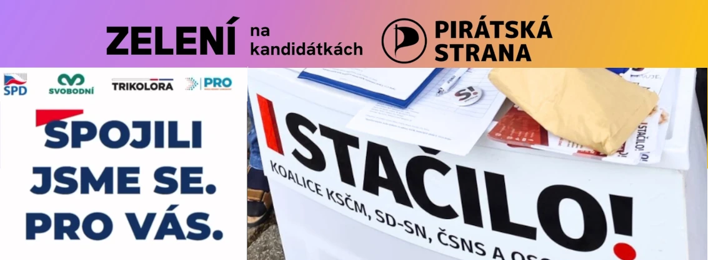

## Šance stran na vstup do Sněmovny

| Strana | Šance na vstup do Sněmovny k 24. 8. |  |
|--------|-------------------------------------|--------|
| ANO | 100 % | ⭐⭐⭐⭐⭐ |
| SPOLU | 100 % | ⭐⭐⭐⭐⭐ |
| SPD | 100 % | ⭐⭐⭐⭐⭐ |
| STAN | 100 % | ⭐⭐⭐⭐⭐ |
| Piráti | 95 % | ⭐⭐⭐⭐⭐ |
| Stačilo! | 80 % | ⭐⭐⭐⭐ |
| Motoristé | 33 % | ⭐⭐ |
| Přísaha | 1 % | ⭐ |

---
Podle modelu [Mandáty.cz](https://mandaty.cz), založeném primárně na průzkumech, je situace dost jasná. Babišovo ANO, SPOLU premiéra Fialy, SPD a STAN mají vstup do Sněmovny skoro jistý, Piráti velmi pravděpodobný.

Stačilo! v současné době by spíše vstoupilo do Sněmovny, Motoristé spíše ne a šance Přísahy je skoro 0. Ostatní strany by podle průzkumů se jistě do Sněmovny nedostaly.

## Šance na většinu ve Sněmovně (101 a více mandátů)

Před volbami se profilují 2 bloky: **"opoziční blok"** vedený ANO a **"koaliční blok"** vedený SPOLU.

Rozeberme si jednotlivé scénáře, co by znamenalo, kdyby se některé strany, které jsou dnes na hranici vstupu do Sněmovny, nakonec do Sněmovny nedostaly. Opět podle modelu [Mandáty.cz](https://mandaty.cz).

### Šance na výhru jednotlivých bloků

| Scénář | Šance, že nastane tato varianta (k 24.8.) | Opoziční blok  ANO + SPD + Stačilo! + Motoristé + Přísaha | Koaliční blok  SPOLU + STAN + Piráti |
|--------|-------------------------------------------|-----------------------------------------------------------|-------------------------------------|
| Celkem | 100 % | 95 % ⭐⭐⭐⭐⭐ | 4 % ⭐ |
| Motoristé se nedostanou | 66 % | 92 % ⭐⭐⭐⭐⭐ | 7 % ⭐ |
| Stačilo! se nedostanou | 18 % | 79 % ⭐⭐⭐⭐ | 17 % ⭐ |
| Motoristé ani Stačilo! se nedostanou | 13 % | 71 % ⭐⭐⭐⭐ | 24 % ⭐⭐ |
| Piráti se nedostanou | 4 % | 100 % ⭐⭐⭐⭐⭐ | 0 % |

*Pozn: součet do 100 % jsou případy, kdy oba bloky získají shodně přesně 100 mandátů.*

Babiš a jeho ANO velmi pravděpodobně vítězí a jenom záleží na tom, kdo z opozičního bloku se do Sněmovny dostane.

Největší šance koaliční bloku by byla v případě, kdy by se ani Motoristé ani Stačilo! do Sněmovny nedostaly. I v takovém případě by sice Babiš byl stále favoritem, ale už by ty šance byly vyrovnanější.

Naopak, pokud by se nedostali Piráti, šance koaliční bloku by byly dnes nulové.

---

## Šance na většinu ve Sněmovně (101 a více mandátů) - pokud by "skryté koalice" byly opravdu brané jako koalice

### Proč je důležité, jestli kandiduje strana, nebo koalice?

[Strana Volt podala žaloby](https://voltcesko.org/novinky/zaloba-pro-demokracii-volt-cesko-podava-zaloby-na-nepriznane-koalice) na "skryté koalice" SPD a Stačilo! a [Přísaha podala obdobnou](https://www.prisaha.cz/pozice/vysvetleno-proc-prisaha-podava-zalobu-na-kandidatku-piratu-a-zelenych) na Piráty.

Zatímco samostatná strana ke vstupu do Sněmovny potřebuje získat alespoň **5 % hlasů**, koalice mají podstatně vyšší limit: u koalice 2 stran je to **8 % hlasů** a u koalice 3 a více stran je to **11 %**.

Ve všech 3 případech - ve velmi různé míře - jde o obcházení zákona, tedy toho vyššího limitu pro koalice. Nicméně Nejvyšší správní soud, který je nejdůležitějším soudem ohledně volebních záležitostí, byl doposud k tomu postupu obcházení zákona velmi tolerantní a posuzoval to velmi formálně: koalice je podle něj jen to, když se sama označí jako koalice.

Pokud "papírově" kandidujete jako samostatná strana, tak je to dle něj v pořádku. Alespoň tak to rozhodl [v roce 2017 v případu TOP 09](https://vyhledavac.nssoud.cz/DokumentOriginal/Html/644259) a podpory od stran LES a Koruna Česká. Samozřejmě, podmínky se od té doby trochu změnily (např. nižší limity pro koalice) a i posuzovaný případ byl "trochu slabší" než dnešní "skryté koalice".

Ale zatím, minimálně do rozhodnutí soudů, stále kandiduje oficiálně jediná koalice a to SPOLU (ODS, TOP 09 a KDU-ČSL), která tedy pro vstup do Sněmovny potřebuje alespoň 11 % hlasů.

### A jak by vypadaly scénáře ve variantě, že by soud uznal "skryté koalice" skutečně jako koalice?

| Scénáře za podmínky "skryté koalice" jsou koalice | Šance, že nastane tato varianta (k 24.8.) | Opoziční blok  ANO + SPD + Stačilo! + Motoristé + Přísaha | Koaliční blok  SPOLU + STAN + Piráti |
|--------------------------------------------------|-------------------------------------------|-----------------------------------------------------------|-------------------------------------|
| Celkem | 100 % | 77 % ⭐⭐⭐⭐ | 22 % ⭐⭐ |
| Motoristé se nedostanou | 66 % | 70 % ⭐⭐⭐⭐ | 29 % ⭐⭐ |
| Stačilo! se nedostanou | 100 % | 77 % ⭐⭐⭐⭐ | 22 % ⭐⭐ |
| Motoristé a Stačilo! se nedostanou | 66 % | 70 % ⭐⭐⭐⭐ | 29 % ⭐⭐ |
| Piráti se nedostanou | 45 % | 91 % ⭐⭐⭐⭐⭐ | 8 % ⭐ |
| SPD se nedostanou | 25 % | 36 % ⭐⭐ | 61 % ⭐⭐⭐ |

I v tomto případě by byl stále favoritem Babiš a opoziční blok, ale situace už by byla mnohem vyrovnanější. Speciálně Stačilo! by se s dnešními preferencemi prakticky jistě nedostala do parlamentu.

A v případě, kdyby se ani "skrytá koalice" SPD nedostala do parlamentu, favoritem by se stal koaliční blok. **Je to jediný scénář, kdy by byl dnes favoritem.**

---

## SPD: Spojili jsme se. Pro vás. Ale jen trochu

SPD přímo promuje, že jde o spojení 4 stran. Možná překvapivě ale z ostatních stran "koalice", tedy Svobodných, Trikolory a PRO, jsou na kandidátkách vždy jen 2 lidé, ač na předních pozicích. Ostatní jsou z SPD a několik nestraníků.

<iframe src='https://flo.uri.sh/visualisation/24813778/embed' title='Interactive or visual content' class='flourish-embed-iframe' frameborder='0' scrolling='no' style={{width: '100%', height: '300px'}} sandbox='allow-same-origin allow-forms allow-scripts allow-downloads allow-popups allow-popups-to-escape-sandbox allow-top-navigation-by-user-activation'></iframe>

---

## Piráti: Zelení na kandidátkách Pirátů. A k tomu jeden Mourek

Piráti se dohodli se Zelenými a ti ve vlastní kampani říkají, že jsou "Zelení na kandidátkách Pirátů". Jsou na nižších místech kandidátek, nejvýše na 5. místě. Bez kroužkování tedy bez šance na zvolení. Nicméně, ve Středních Čechách kandiduje také Jan Červenka, člen strany Mourek (na 21. místě kandidátky).

<iframe src='https://flo.uri.sh/visualisation/24813824/embed' title='Interactive or visual content' class='flourish-embed-iframe' frameBorder='0' scrolling='no' style={{width: '100%', height: '300px'}} sandbox='allow-same-origin allow-forms allow-scripts allow-downloads allow-popups allow-popups-to-escape-sandbox allow-top-navigation-by-user-activation'></iframe>

---

## Stačilo! Koalice vedená KSČM pod jiným jménem

Stačilo! je letos založené hnutí, které navazuje na úspěšnou komunistickou koalici k eurovolbám 2024 (zisk 2 mandátů). Hnutí slouží spíše jako nástroj k tomu, aby zakrylo fakt, že jde o koalici vedenou KSČM. Celkem tedy jde o členy 6 stran. Za ČSNS jsou 2x na prvních místech (Jihočeský, Královéhradecký kraj) členové spolku Svatopluk.

<iframe src='https://flo.uri.sh/visualisation/24813933/embed' title='Interactive or visual content' class='flourish-embed-iframe' frameborder='0' scrolling='no' style={{width: '100%', height: '300px'}} sandbox='allow-same-origin allow-forms allow-scripts allow-downloads allow-popups allow-popups-to-escape-sandbox allow-top-navigation-by-user-activation'></iframe>

