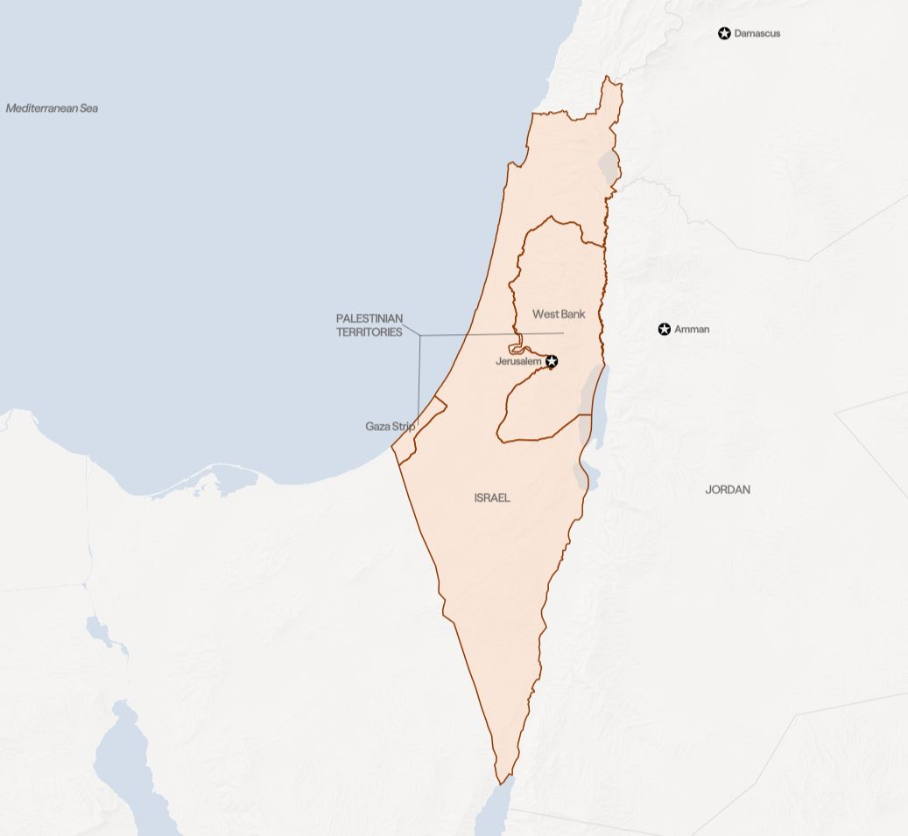

V říjnu 2025 se z Pásma Gazy vrátili poslední živí izraelští rukojmí. Hamás rozpustil svou vládu, do zničeného území začaly znovu proudit kamiony s humanitární pomocí a zbraně z velké části utichly.

Vypadá to jako konec války.

Ani jedna z otázek, kvůli kterým se v Gaze válčilo, ale rozhodnutá není. Kdo bude Gazu spravovat. Zda a kdy Hamás složí zbraně. Kdy se stáhne izraelská armáda. A jestli vůbec může vedle Izraele vzniknout životaschopný palestinský stát.

Izraelsko-palestinský konflikt patří k těm, u nichž se dnešní zprávy nedají číst bez toho, co jim předcházelo. Každá další válka, příměří i mírový plán navazují na spory, které se nedaří uzavřít celá desetiletí: hranice Izraele a budoucí Palestiny, status Jeruzaléma, izraelské osady na okupovaném Západním břehu, bezpečnost Izraele, palestinská státnost i osud uprchlíků.

Poslední velký zlom přišel 7. října 2023, kdy ozbrojenci Hamásu překročili hranici z Gazy, zabili přes 1 200 lidí a odvlekli 251 rukojmích. Byl to nejkrvavější útok na Izrael v jeho historii. Odpovědí byla vojenská operace, která podle palestinského ministerstva zdravotnictví do roku 2026 stála přes 70 tisíc životů a vysídlila téměř celé obyvatelstvo Gazy.

Abychom pochopili, proč ani příměří z roku 2025 spor neuzavřelo, je potřeba se vrátit před rok 1948.

```infobox
Tento přehled vychází z hesla **Israeli-Palestinian Conflict** v [Globálním přehledu konfliktů](https://www.cfr.org/global-conflict-tracker/conflict/israeli-palestinian-conflict), který vydává americký think tank Council on Foreign Relations, a doplňuje ho o zpravodajství světových agentur. Počty obětí v Gaze pocházejí od tamního ministerstva zdravotnictví ovládaného Hamásem; nezahrnují rozlišení mezi civilisty a bojovníky a Izrael je zpochybňuje. Uvádíme je proto vždy s tímto zdrojem. Stav informací je k 10. srpnu 2026.
```



_Izrael, Pásmo Gazy a Západní břeh s východním Jeruzalémem. Právě o hranice a status těchto území se spor vede nepřetržitě od roku 1948._

## Osm desetiletí v jedné ose

Chronologie konfliktu je dlouhá, ale drží se několika opakujících se vzorců: válka, příměří, nevyřešená příčina, další válka. Časová osa ukazuje klíčové okamžiky od plánu OSN na rozdělení Palestiny až po srpen 2026.

<Timeline yamlFile="timeline.yaml" />

## Spor o totéž území je starší než stát Izrael

Moderní spor o zemi mezi Středozemním mořem a řekou Jordán se začal formovat už na konci 19. století.

Do tehdejší osmanské Palestiny přicházelo stále více Židů. Utíkali před evropským antisemitismem a zároveň se hlásili k sionistické myšlence návratu do země historicky a nábožensky spojené s židovským národem. Migrace zesílila ve 30. letech s nacistickým pronásledováním a po holokaustu, během něhož nacistické Německo a jeho spojenci zavraždili šest milionů Židů.

Po druhé světové válce spravovala Palestinu Británie. V roce 1947 přijala OSN rezoluci 181, která počítala s rozdělením území na **židovský a arabský stát**; Jeruzalém a další místa náboženského významu měla připadnout pod mezinárodní správu.

Židovská agentura plán přijala. Arabská liga a palestinské vedení jej odmítly.

## Rok 1948 dal vzniknout Izraeli i palestinské křivdě

Dne 14. května 1948 vyhlásil Izrael nezávislost. Následující den na nově vzniklý stát zaútočilo pět arabských zemí a začala první arabsko-izraelská válka.

Válka skončila izraelským vítězstvím. Přinesla ale i událost, která dodnes zásadně utváří palestinskou identitu: přibližně **750 tisíc Palestinců** bylo vyhnáno nebo uprchlo ze svých domovů. Palestinci ji označují jako **Nakbu**, arabsky katastrofu. Zhruba stejný počet Židů byl v následujících letech nucen opustit arabské země a odešel do Izraele.

Gazu obsadil Egypt, Západní břeh a východní Jeruzalém Jordánsko. Palestinský stát, s nímž počítal plán OSN, nevznikl. A to je jeden z důvodů, proč je spor stále otevřený.

## Rok 1967 nakreslil hranice, o které se válčí dodnes

Dalším zlomem byla šestidenní válka v červnu 1967.

Po rostoucím napětí s Egyptem, Sýrií a Jordánskem zahájil Izrael preventivní útok a během šesti dní ovládl rozsáhlá území. Od Egypta obsadil **Sinajský poloostrov a Pásmo Gazy**, od Jordánska **Západní břeh a východní Jeruzalém** a od Sýrie **Golanské výšiny**.

Právě rok 1967 tvoří dodnes základ většiny debat o budoucích hranicích. Rada bezpečnosti OSN pak přijala rezoluci 242, která vyzývala ke stažení izraelských sil z obsazených území a zároveň uznávala právo států regionu na bezpečnost. Vznikl princip **„území za mír“**.

S Egyptem nakonec zafungoval. Po další válce v roce 1973 následovala jednání a v roce 1979 uzavřely obě země [mírovou smlouvu](https://history.state.gov/milestones/1977-1980/camp-david); Izrael vrátil Egyptu Sinaj. Palestinská otázka ale zůstala otevřená.

## Oslo slibovalo dva státy, místo nich přišla druhá intifáda

V roce 1987 vypuklo na palestinských územích první masové povstání proti izraelské okupaci – první intifáda.

O několik let později přišla naděje. [Dohody z Osla](https://history.state.gov/milestones/1993-2000/oslo) z roku 1993 vytvořily **Palestinskou samosprávu** a přinesly vzájemné uznání mezi izraelskou vládou a Organizací pro osvobození Palestiny. [Navazující dohoda z roku 1995](https://peacemaker.un.org/israelopt-osloII95) počítala se stažením Izraele z dalších palestinských měst. Poprvé existovala reálná představa, že přechodné uspořádání povede ke vzniku dvou států.

Nestalo se to. Mírový proces se v následujícím desetiletí rozpadl.

V roce 2000 začala druhá intifáda. Byla mnohem krvavější než ta první. Palestinské ozbrojené skupiny včetně Hamásu podnikaly sebevražedné atentáty proti izraelským civilistům a Izrael odpovídal rozsáhlými operacemi. Ke spouštěčům patřila i [návštěva](https://www.theguardian.com/world/2000/sep/29/israel) tehdejšího opozičního politika <Person id="saron">Ariela Šarona</Person> na Chrámové hoře u mešity al-Aksá, třetího nejposvátnějšího místa islámu.

Izrael začal kolem Západního břehu stavět bezpečnostní bariéru. V roce 2005 se pak jednostranně stáhl z Pásma Gazy.

## Palestina se rozdělila na dvě: Hamás v Gaze, Fatah na Západním břehu

Zásadní změna přišla po palestinských parlamentních volbách v roce 2006. Vyhrál je Hamás.

Spojené státy a Evropská unie s ním odmítly spolupracovat, protože ho už dříve zařadily mezi teroristické organizace. Zatímco Fatah <Person id="abbas">Mahmúda Abbáse</Person> stát Izrael uznává, [zakládající charta Hamásu z roku 1988](https://avalon.law.yale.edu/21st_century/hamas.asp) volá po jeho zničení.

Napětí mezi oběma palestinskými silami přerostlo v boj. V roce 2007 Hamás násilím ovládl Gazu a palestinská území se politicky rozdělila:

- **Gazu** od té doby kontroloval Hamás.
- **Západní břeh** zůstal pod Palestinskou samosprávou vedenou Fatahem.

Izrael a Egypt následně uvalily na Gazu blokádu. V dalších letech se opakoval cyklus raketových útoků z Gazy a izraelských operací. Velké boje přišly v letech 2008–2009, 2012, [2014](https://www.reuters.com/world/middle-east/israel-gaza-fighting-enters-its-second-week-2021-05-16/) a 2021. Asymetrie byla pokaždé podobná: v roce 2014 zahynulo přes 2 200 Palestinců a 73 Izraelců, v roce 2021 přes 250 Palestinců a 13 Izraelců.

Žádný z těchto konfliktů základní politický problém nevyřešil.

## 7. říjen 2023 byl nejkrvavější den izraelských dějin

Útok Hamásu 7. října 2023 vybočil ze všeho předchozího svým rozsahem.

Ozbrojenci pronikli z Gazy do jižního Izraele, útočili na civilisty i vojáky a unesli přes 250 lidí. Izrael následující den vyhlásil Hamásu válku a ministr obrany nařídil [„úplnou blokádu“](https://www.nytimes.com/live/2023/10/09/world/israel-gaza-war-hamas?smid=url-share) Gazy. 27. října začala rozsáhlá pozemní invaze s deklarovaným cílem zničit vojenské schopnosti Hamásu a osvobodit rukojmí.

V listopadu 2023 přišlo první krátké příměří a výměna části rukojmích za palestinské vězně. Boje ale pokračovaly a izraelská armáda postupovala přes Chán Júnis, Rafáh i severní Gazu.

Izrael přitom dosáhl několika vojenských úspěchů. V červnu 2024 [osvobodil](https://www.pbs.org/newshour/world/israel-rescues-4-hostages-from-hamas-captivity-while-at-least-94-palestinians-are-killed-during-fighting-in-gaza) čtyři živé rukojmí. Postupně byli [zabiti](https://apnews.com/article/sinwar-death-israel-hamas-hostages-gaza-170b010299a62f679fe5ee7324a69ff5) nejvyšší představitelé hnutí – šéf politbyra <Person id="hanija">Ismáíl Haníja</Person>, jeho nástupce <Person id="sinvar">Jahjá Sinvár</Person> i vojenský velitel Muhammad Díf.

Cena války pro civilní obyvatelstvo Gazy ale byla mimořádná.

## Za dva roky války zbylo v Gaze na dva miliony lidí pár tisíc lůžek

Podle palestinského ministerstva zdravotnictví přesáhl počet mrtvých v Gaze 70 tisíc. Izrael upozorňuje, že číslo zahrnuje civilisty i bojovníky, a argumentuje tím, že Hamás vede válku z hustě obydlených oblastí a využívá civilní infrastrukturu.

Rozsah zničení je přesto enormní. Podle Světové zdravotnické organizace bylo do roku 2025 [poškozeno nebo zničeno 94 procent nemocnic](https://www.who.int/news/item/22-05-2025-health-system-at-breaking-point-as-hostilities-further-intensify--who-warns) v Gaze. Na více než dva miliony obyvatel zůstávalo k dispozici kolem dvou tisíc nemocničních lůžek.

Izraelská blokáda humanitární pomoci na jaře 2025 nedostatek potravin dále prohloubila. OSN a humanitární organizace varovaly před podmínkami blížícími se hladomoru. V srpnu 2025 bylo podle OSN [vysídleno přibližně 1,9 milionu obyvatel](https://www.un.org/unispal/document/unrwa-sitrep-184-15aug25/) Gazy – devět z deseti lidí.

## Příměří z října 2025 vrátilo rukojmí, jádro sporu nechalo být

V říjnu 2025 [oznámil](https://www.aljazeera.com/news/2025/10/8/trump-says-he-may-travel-to-middle-east-as-gaza-deal-very-close) americký prezident <Person id="trump">Donald Trump</Person> dohodu mezi Izraelem a Hamásem. Příměří bylo součástí širšího dvacetibodového rámce, který měl vést k ukončení války, odzbrojení Hamásu a rekonstrukci Gazy pod novou civilní správou.

Změn bylo hned několik. Hamás propustil zbývající izraelské rukojmí a rozpustil svou dosavadní vládu v Gaze; správu území měl převzít technokratický palestinský výbor. Izrael zmírnil omezení humanitární pomoci a do Gazy začalo proudit více zásob.

Jádro sporu ale zůstalo. Hamás odmítl složit zbraně. Izrael pokračoval v některých vojenských úderech. Obě strany se navzájem obviňovaly z porušování příměří.

A začala další, pravděpodobně ještě složitější fáze: jednání o tom, co bude s Gazou dlouhodobě.

## Kdo bude Gazu spravovat, se rozhoduje teď

Spojené státy, Katar, Saúdská Arábie a Turecko se snaží vyjednat druhou fázi poválečného uspořádání. Ve hře je mezinárodní bezpečnostní síla, civilní správa Gazy a pozdější převzetí území reformovanou Palestinskou samosprávou.

Jednotlivé části plánu ale na sebe narážejí. Izrael požaduje odzbrojení Hamásu. Hamás se zbraní vzdát nechce, dokud podle něj pokračují izraelské údery a okupace.

A právě tady se mírový proces znovu zadrhl.

## Netanjahu a Hamás se zablokovali navzájem

Dne **9. srpna 2026**, den před vydáním tohoto textu, oznámil premiér <Person id="netanjahu">Benjamin Netanjahu</Person>, že izraelská vláda [odmítla](https://www.nytimes.com/2026/08/09/world/middleeast/israel-netanyahu-trump-15-point-plan-hamas-peace-gaza.html) další část amerického mírového plánu pro Gazu.

Sporné je především pořadí kroků. Plán počítá s odzbrojením Hamásu a stažením izraelských jednotek. Netanjahu ale prohlásil, že se **izraelská armáda nestáhne, dokud Hamás neodzbrojí**.

Může to působit jako technický spor. Ve skutečnosti jde o jeden ze základních uzlů celého poválečného uspořádání:

- Hamás nechce odzbrojit bez záruky, že se izraelská armáda stáhne.
- Izrael nechce stáhnout vojáky, dokud Hamás neodzbrojí.

Obě podmínky se navzájem blokují.

## Západní břeh je druhou, tišší frontou téhož konfliktu

Většina světové pozornosti míří do Gazy. Další významná část konfliktu se ale odehrává na okupovaném Západním břehu.

Vláda Benjamina Netanjahua, která nastoupila na konci roku 2022 a zahrnuje několik krajně pravicových stran, výrazně podporuje [rozšiřování izraelských osad](https://www.dw.com/en/israel-new-netanyahu-government-vows-to-expand-settlements/a-64228466). Současně roste násilí mezi osadníky a Palestinci. OSN zaznamenala během prvních čtrnácti měsíců války [nejméně 1 860 násilných incidentů](https://www.aljazeera.com/news/2025/1/22/mapping-1800-israeli-settler-attacks-in-the-occupied-west-bank-since-october-7) na Západním břehu, nejčastěji v okolí Nábulusu, Ramalláhu a Hebronu – v průměru více než čtyři útoky denně.

Na začátku roku 2025 zahájila izraelská armáda operaci Železná zeď proti ozbrojeným skupinám na severu Západního břehu. Podle OSN vyvolala největší vysídlení Palestinců v oblasti od roku 1967.

Nad celým územím navíc visí posudek nejvyšší soudní instance OSN. Mezinárodní soudní dvůr v červenci 2024 [prohlásil](https://news.un.org/en/story/2024/07/1152296) izraelskou přítomnost na okupovaných palestinských územích za protiprávní a vyzval k jejímu co nejrychlejšímu ukončení. Posudek je nezávazný, politickou váhu má ale značnou.

## Válka z Gazy přetekla do celého regionu

Po 7. říjnu se konflikt rozšířil daleko za hranice Gazy.

Libanonský Hizballáh začal ostřelovat severní Izrael a izraelská armáda později vstoupila do Libanonu. Jemenští Húsíové útočili raketami na Izrael i na obchodní lodě v Rudém moři. Další ozbrojené skupiny podporované Íránem napadaly americké základny v Iráku a Sýrii.

Napětí mezi Izraelem a Íránem přerostlo v červnu 2025 v přímý dvanáctidenní konflikt. Spojené státy během něj bombardovaly některá z nejlépe chráněných íránských jaderných zařízení.

Původně lokální spor dvou národů o jedno území se tak stále těsněji propojuje se soupeřením Izraele, Íránu, arabských států a Spojených států o budoucí uspořádání celého Blízkého východu.

## Rozhoduje se o roce 2027

Návrh rezoluce OSN, o kterém jednají zprostředkovatelé, počítá s tím, že Gazu bude přechodně spravovat mezinárodní správa opřená o bezpečnostní sílu. Po vypršení jejího mandátu v roce 2027 má území převzít reformovaná Palestinská samospráva.

Zda k tomu dojde, závisí na týchž otázkách, které konflikt otevřel už v roce 1948. Hamás zůstává ozbrojený. Izrael nehodlá stáhnout armádu bez jeho odzbrojení. Palestinská samospráva je slabá a její budoucí role v Gaze není jasná. Na Západním břehu pokračuje osadnická politika i násilí. A cesta k samostatnému palestinskému státu zůstává nejistá.

Historie tohoto konfliktu zná řadu příměří, která zastavila boje, ale neodstranila jejich příčiny. To z roku 2025 zatím míří stejným směrem.

---

_Text redakčně vychází z hesla **Israeli-Palestinian Conflict** z [Globálního přehledu konfliktů](https://www.cfr.org/global-conflict-tracker/conflict/israeli-palestinian-conflict) think tanku Council on Foreign Relations, doplněného o zpravodajství světových agentur. Upraveno a doplněno pro české čtenáře; stav informací k 10. srpnu 2026._
