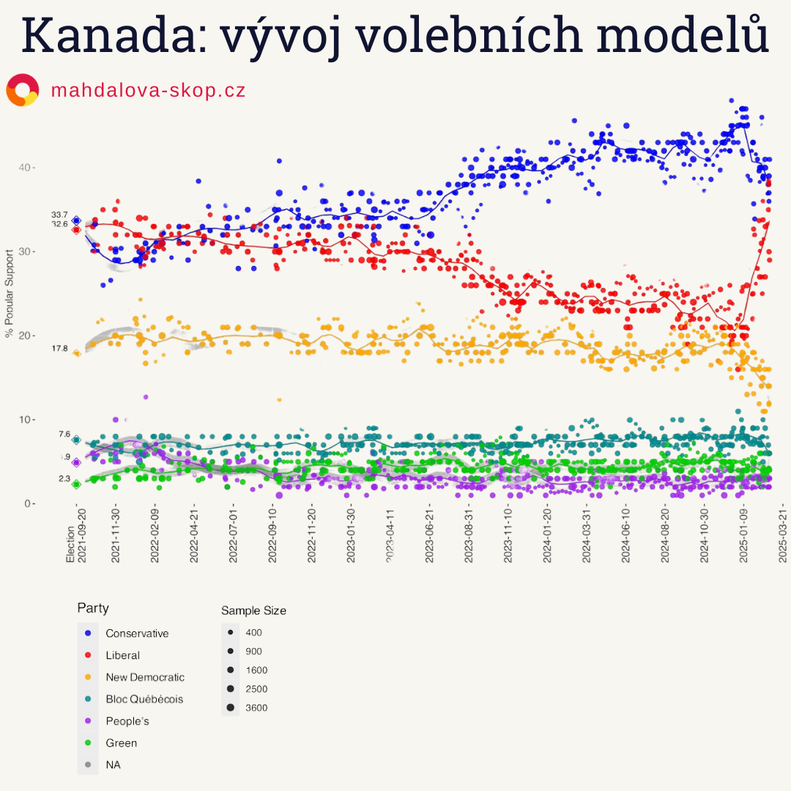

Hned na začátku volebního roku došlo v Kanadě k velice rychlému zvratu ve voličských náladách. Výsledkem je nynější prudký nárůst podpory pro liberály. Podle průzkumu Ipsos zveřejněného 25. února se preference liberálů zvýšily o 10 procentních bodů na 38 %, zatímco konzervativci klesli na 36 %. Jedná se o druhý průzkum, který vedení v průzkumech liberálům - zhruba po dvou letech výrazné podpory konzervativcům.

Ještě před několika týdny se zdálo, že Liberální strana Kanady (LPC) směřuje k výrazné porážce ve volbách, které se budou konac letos na konci října. Justin Trudeau v lednu oznámil rezignaci na post předsedy strany i na funkci premiéra, a podle všech dostupných dat měli konzervativci pod vedením Pierra Poilievra jasnou cestu k volebnímu vítězství. Poilievre, který více než rok udržoval náskok přibližně 20 procentních bodů, se profiloval jako lídr, jenž přinese změnu po devíti letech liberální vlády.

Události posledního měsíce však tento vývoj zásadně narušily. Donald Trump, který v lednu znovu převzal úřad amerického prezidenta, učinil několik kontroverzních prohlášení namířených proti Kanadě. Hrozby 25% cel na kanadské zboží, obvinění Kanady z pašování fentanylu a nelegálních migrantů a spekulace o možném připojení Kanady jako 51. státu USA vyvolaly silnou reakci mezi voliči.

Trumpovy výroky zásadně změnily vnímání politické scény. Poilievre, který dříve těžil ze spřízněnosti s Trumpem a měl podporu osobností jako Elon Musk nebo Joe Rogan, se svou kampaní pod heslem „Kanada je rozbitá“, ztrácí svá hlavní témata založená ekonomice. Místo nich nastupují kanadská suverenita a vztahy s USA. Předvolební dynamiku Kanady nyní dramaticky ovlivňuje zahraniční politika.

