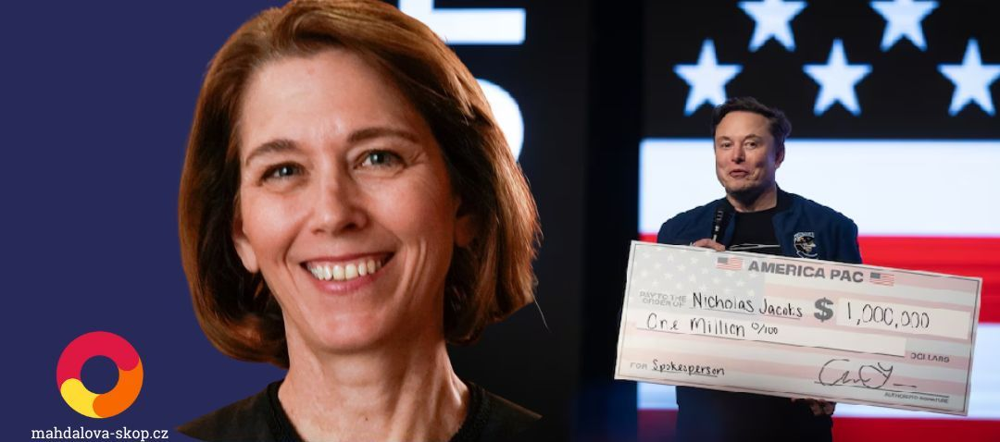

aneb Soudkyně Susan Crawford porazila Muska

Šedesátiletá soudkyně z Madisonu Susan Crawford zvítězila v nejdražší soudní volbě v historii USA. Do otevřeného křesla ve wisconsinském nejvyšším soudu usedne liberální právnička s dlouholetou kariérou ve státní správě. Porazila kandidáta republikánů Brada Schimela – a s ním i jeho hlavního patrona, nejbohatšího muže planety Elona Muska.

<iframe src='https://flo.uri.sh/story/3016280/embed' title='Interactive or visual content' className='flourish-embed-iframe' frameBorder='0' scrolling='no' width="100%" height="600px" allowFullScreen></iframe>

Z výsledků je vidět, že se ve státě Wiskonsin vzedmula liberální vlna. 

Musk do kampaně za Schimela nepřímo nasměroval přes 20 milionů dolarů, přičemž jen organizace Building America’s Future utratila na podporu republikánského kandidáta 6,5 milionu dolarů. Do předvolebního boje vstoupil i osobně, když krátce před volbou uspořádal v Green Bay okázalý mítink, na němž rozdával šeky na milion dolarů. Kritici označili jeho akci za pokus ovlivnit voliče hrubou silou peněz – snahu o soudní zákaz rozdávání výherních šeků ale nakonec Nejvyšší soud státu Wisconsin zamítl. Musk rovněž požadoval, aby členové soudu, kteří podpořili Crawford, byli vyloučeni.

## Boj za spravedlnost proti nejbohatšímu muži světa

Susan Crawford v kampani nazvala svého oponenta „Elon Schimel“ a přetavila Muskovo masivní angažmá ve svou výhodu: představila se jako obránkyně nezávislé justice proti miliardářskému vlivu. „Nikdy jsem si nemyslela, že povedu boj za spravedlnost proti nejbohatšímu muži na světě. A vyhráli jsme,“ prohlásila v noci na středu při svém vítězném projevu.

Její vítězství mění poměr sil ve Wisconsinském nejvyšším soudu, kde se nyní očekává rozhodování o klíčových tématech jako potratová legislativa či práva odborů. Crawford je známá svou kritikou zrušení rozsudku Roe v. Wade a v minulosti zastupovala Planned Parenthood i učitelské odbory v řízení proti tzv. zákonu Act 10, který omezil kolektivní vyjednávání.

Kampaň, kterou demokraté přejmenovali na „Lid vs. Musk“, ukázala, že přímý střet mezi technologickým magnátem a liberální kandidátkou dokáže výrazně mobilizovat voliče. A výsledky naznačují, že ne vždy platí, že vítězí ten, kdo má víc peněz.

Výhra Susan Crawford zároveň upevňuje převahu liberálně smýšlejících soudců u Wisconsinského nejvyššího soudu, kde nyní drží většinu čtyři ku třem. Přestože se jedná o oficiálně nestranický orgán, ideologické rozdělení mezi soudci je patrné – jednotliví kandidáti bývají vnímáni skrze své postoje k zásadním společenským otázkám. Kandidovala s podporou Demokratické strany, která dlouhodobě stojí za liberálními uchazeči o soudní funkce.

```box

## Více k tématu:

- [V Kanadě se vzedmula liberální vlna](https://www.mahdalova-skop.cz/clanek/cislo-dne-2025-03-03-v-kanade-se-vzedmula-liberalni-vlna)
- [Timothy Snyder: Samozřejmě, že je to puč](https://www.mahdalova-skop.cz/clanek/komentar-2025-02-05-snyder-samozrejme-ze-je-to-puc)
- [Americká cla: Trest za to, že jste moc dobří](https://www.mahdalova-skop.cz/clanek/kontext-2025-04-03-americka-cla-trest-za-to-ze-jste-moc-dobri)
- [Trumpova obchodní válka](https://www.mahdalova-skop.cz/clanek/analyza-2025-03-04-trumpova-obchodni-valka)
- [Německé volby: Ostblok volil radikálně? Ne tak docela](https://www.mahdalova-skop.cz/clanek/volby-nemecko-2025-02-27-vysledky)

```


