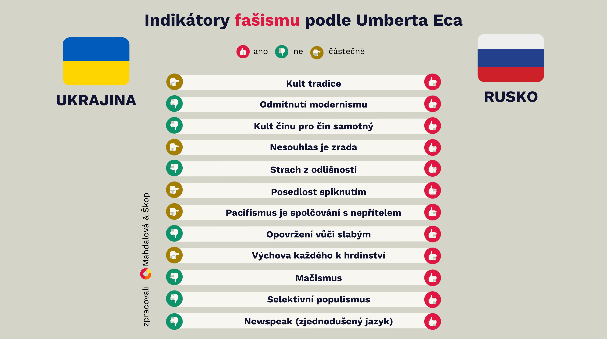

Pojem _fašismus_ slýcháme ve veřejném prostoru běžně. Ale co vlastně znamená, když někdo v současné době označí stát nebo režim za fašistický? Není to jen prázdná nálepka, která se používá ve vyhrocených debatách a která jen vytěsňuje věcnou kritiku?

Světoznámý spisovatel a filosof Umberto Eco (1932-2016), který jako chlapec vyrůstal v Mussoliniho Itálii, nám zanechal cenný nástroj: definoval charakteristické znaky fašismu a jeho seznam je dnes aktuálnější než kdy jindy. Na příkladu současného konfliktu mezi Ruskem a Ukrajinou si ukážeme, jak Ecovy indikátory fungují v praxi a proč by nás měly zajímat.

## Proč byste měli zbystřit

Ecův seznam není jen teoretický nástroj - je to praktický průvodce pro občany demokratických společností a ukazuje nám, jak se autoritářské režimy postupně formují a jak můžeme rozpoznat nebezpečné tendence v jakékoli společnosti, včetně té naší. Současná situace v Rusku není jen vzdálený problém, týká se nás také. Když pochopíme, jak fašismus funguje a jak se projevuje, můžeme lépe chránit demokratické hodnoty ve vlastní zemi. Demokracie není samozřejmost - je to systém, který vyžaduje aktivní účast každého z nás. Fašismus nezačíná tanky v ulicích, ale drobnými, postupnými změnami ve společnosti.

## Co s tím můžeme dělat?

• Vzdělávat se, zajímat se o historii a mechanismy autoritářských režimů

• Aktivně podporovat demokratické instituce a občanskou společnost

• Kriticky myslet a ověřovat informace

• Postavit se proti netoleranci v každodenním životě

## Signály fašismu podle Umberta Eca

⚙️ 1. Kult tradice: Když se minulost stává zbraní

V Rusku se setkáváme s neustálým odkazováním na "slavnou minulost" a "tradiční hodnoty". Tyto odkazy nejsou nevinné - slouží k ospravedlnění současné politiky a potlačování změn. Ukrajina naopak svou identitu staví na směřování k budoucnosti a modernizaci.

⚙️ 2. Odmítání modernismu: Strach ze změny

Když režim systematicky odmítá moderní hodnoty jako lidská práva či rovnost, měli bychom zpozornět. V Rusku vidíme, jak se "ochrana tradičních hodnot" stává záminkou pro potlačování základních svobod. Modernita není nepřítel - je to přirozený vývoj společnosti.

⚙️ 3. Kult akce: Když se přestává myslet

"Nejdřív jednej, pak přemýšlej" - tento přístup je typický pro autoritářské režimy. V Rusku jsou vojenské akce prezentovány jako důkaz síly, bez ohledu na jejich důsledky. Oproti tomu demokratické společnosti preferují dialog a diplomatická řešení.

⚙️ 4. Nesouhlas jako zrada: Kritika znamená nebezpečí

Ve zdravé demokracii je kritika vlády normální součástí politického života. Když se ale každý nesouhlas začne označovat za zradu národa, jako to vidíme v Rusku, je to vážný varovný signál.

⚙️ 5. Strach z jinakosti: Různorodost se stává hrozbou

Fašistické režimy potřebují nepřítele - často jsou jím menšiny nebo "ti jiní". Ruská propaganda cílí na LGBTQ+ komunitu a další menšiny, zatímco Ukrajina i přes válečný stav zachovává respekt k různorodosti své společnosti.

⚙️ 6. Posedlost spiknutím: Za vším stojí (domnělý) nepřítel

Konspirační teorie nejsou nevinná zábava - jsou mocným nástrojem manipulace. Ruský režim neustále mluví o "západním spiknutí", aby odvedl pozornost od vnitřních problémů.

⚙️ 7. Pacifismus jako slabost: Mír se považuje za prohru

V autoritářských režimech je touha po míru často vykreslována jako znak slabosti. Rusko označuje zastánce míru za "agenty Západu", zatímco demokratické země vidí v mírovém řešení konfliktů sílu, ne slabost.

⚙️ 8. Pohrdání slabými: Když společnost ztrácí soucit

Způsob, jakým společnost zachází se svými nejzranitelnějšími členy, hodně vypovídá o její povaze. Ruský režim otevřeně pohrdá "slabými", což se projevuje v diskriminaci menšin a perzekuci aktivistů.

⚙️ 9. Výchova k hrdinství: Romantizování smrti

Zdravý patriotismus je jedna věc, ale když se společnost zaměřuje na "hrdinskou smrt" jako nejvyšší ctnost, je to nebezpečný signál. Ruská propaganda glorifikuje válečné oběti, zatímco demokratické země si váží života každého občana.

⚙️ 10. Mačismus: Nadvláda síly

Kult síly a "pravého mužství" je dalším typickým znakem. V Rusku vidíme jasný příklad v kultu osobnosti Vladimira Putina a jeho demonstracích fyzické zdatnosti.

⚙️ 11. Selektivní populismus: Když "lid" mluví jen jedním hlasem

Autoritářské režimy rády mluví jménem "lidu", ale jen když se jim to hodí. Skutečná demokracie respektuje různorodost názorů a potřeb všech občanů.

⚙️ 12. Zjednodušený jazyk: Mizí prostor pro nuance

Složité problémy nemají jednoduchá řešení. Když režim komunikuje pouze v černobílých termínech a zjednodušených heslech, je to znak manipulace.

Pro úplnost doplňujeme i zbylé dva znaky z celkových čtrnácti, jak je Umberto Eco formuloval.

⚙️ 13. Trvalá sociální frustrace: Společnost ztrácí naději

Tento důležitý znak se projevuje vytvářením atmosféry permanentní nespokojenosti a frustrace ve společnosti. Režim záměrně podporuje pocit ekonomické nebo sociální krize, který pak využívá k ospravedlnění svých činů a k mobilizaci mas proti údajným viníkům. V Rusku vidíme tento prvek v neustálém zdůrazňování "ponížení" po rozpadu SSSR a obviňování Západu z ekonomických problémů.

⚙️ 14. Permanentní válečný stav: Když mír (údajně) není možný

Posledním, ale neméně důležitým znakem je vytváření atmosféry neustálého ohrožení a válečného stavu. Nejde jen o skutečné vojenské konflikty, ale především o mentální nastavení společnosti, která je udržována v přesvědčení, že je neustále v ohrožení a musí být připravena k boji. Tento stav ospravedlňuje omezování občanských svobod a posilování moci státu. Vidíme ho i v tom, jak Rusko svým občanům vysvětluje, že napadlo Ukrajinu. Jedním z argumentů je, že "hrozilo", že Ukrajina vstoupí do NATO, ačkoli nic takového nebylo na pořadu dne.

## Namísto vážného varování prázdná nadávka

Už téměř 80 let nás nejen historici a historičky, ale i další osobnosti varují před nebezpečím, které přináší nadužívání slova _fašismus_. Už v roce 1944 spisovatel **George Orwell**, známý svým bojem proti totalitě, pozoroval znepokojivý trend. V době, kdy Evropa ještě bojovala s skutečným fašismem, napsal:

> Slovo _fašismus_ se stalo prakticky bezvýznamným. V běžné konverzaci se používá ještě divočeji než v tisku. Slyšel jsem ho používat pro farmáře, obchodníky, tělesné tresty, lov lišek, býčí zápasy, Gándhího, dokonce i pro mládežnické ubytovny a astrologii.

Na Orwellovo varování navazovali mnozí další, třeba přední historik **Stanley G. Payne**:

> _Fašismus_ získal v západní kultuře pozici téměř náboženského symbolu absolutního zla. To dává jeho použití jako urážce mimořádnou sílu, jakou žádné jiné označení nemá.

Ještě v roce 2004 harvardská profesorka **Samantha Power** upozornila na to, že:

> _Fašismus_ se – na rozdíl od komunismu, socialismu či konzervatismu – stal spíše urážkou sloužící k očernění oponentů než popisným termínem.

Co vidíme dnes? Vytrácí se schopnost rozpoznat skutečné fašistické tendence. Když se vážné varování změní v běžnou nadávku, postupně vymizí citlivost a schopnost vnímat skutečné náznaky nebo rovnou projevy autoritářství. Zároveň se tím znevažují historické tragédie a znemožňuje se věcná politická debata. Existuje ale řešení. Dá se začít používat tento termín zodpovědně – vycházet z přesných definic, podkládat svá tvrzení konkrétními fakty a nedopouštět se emotivního zneužívání. Ve veřejném prostoru k tomu samozřejmě bude docházet i nadále, je ale dobré o tom vědět, případně upozorňovat autory emotivních výkřiků. Když si to nevezmou k srdci oni sami, přečte si to tzv. mlčící většina (lidé, kteří se ve veřejném prostoru pohybují, čtou příspěvky, ale sami nediskutují).

