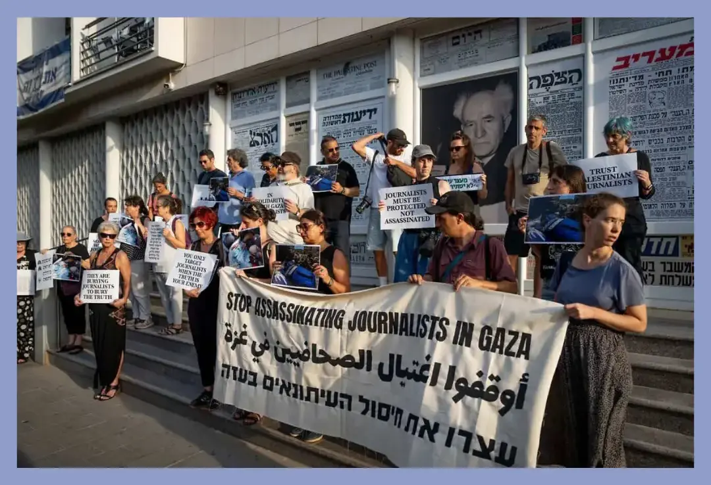

Novináři v Gaze jsou záměrně zabíjeni. Data to dokládají, mezinárodní organizace to potvrzují. Solidarita s kolegy není propaganda — je to základní profesní reflex.

## Proč podpis a proč zrovna teď

Podepsali jsme výzvu, která žádá okamžitou pomoc novinářům v Gaze. Udělali jsme to jednoduše proto, že novináři jsou tam zabíjeni — a to systematicky, záměrně, s vysvětleními, která odborné organizace po celém světě opakovaně odmítají jako nepodložená.

Solidarita s kolegy není propaganda. Je to základní profesní reflex. Kdybychom mlčeli, zatímco jsou novináři mučeni hladem a likvidováni za to, že dělají svou práci, zradili bychom nejen je — zradili bychom samotný smysl žurnalistiky.

A přece: přesně tato solidarita bývá zpochybňována. Slýcháme, že data jsou zfalšovaná. Že ti mrtví vůbec nebyli novináři. Že žádný hladomor neexistuje. Že kdo takové věci říká, naskočil na propagandu Hamásu.

Pojďme si tato tvrzení projít jedno po druhém.

```infobox warning right

*Mezinárodní výzvu podepsali mimo jiné:* 

- Reportéři bez hranic (RSF)
- Výbor na ochranu novinářů (CPJ)
- Ženevské globální mediální centrum (GGMC)
- Mezinárodní podpora médií (IMS)
- Index proti cenzuře
- Mezinárodní tiskový institut (IPI)
- Centrum na obranu svobody novinářů (CDFJ)
- Síť etické žurnalistiky
- Federace afrických novinářů
- Národní tiskový klub (NPC) a Centrum svobody médií při NPC
- Mediální síť Al-Džazíra
- Arabská organizace pro lidská práva ve Spojeném království
- Euro-středomořský monitor lidských práv
- Nadace Jamese Foleyho
- Nadace Roryho Pecka
- Národní svaz somálských novinářů (NUSOJ)
```

---

## „Data o mrtvých jsou falšovaná. Hamas si čísla vymýšlí."

Toto tvrzení je dnes — s ohledem na dostupné důkazy — neudržitelné.

Gazské ministerstvo zdravotnictví historicky patří k nejspolehlivějším zdrojům válečné statistiky ve svém regionu. Odborná studie publikovaná v prestižním lékařském časopise *The Lancet* ukázala, že v předchozích konfliktech se jeho údaje lišily od nezávislých odhadů OSN jen o 1,5 až 3,8 procenta.

V aktuálním konfliktu navíc přibyly zcela nezávislé ověřovací studie. Výzkumníci z Royal Holloway, University of London, provedli v prosinci 2024 a lednu 2025 terénní šetření ve 2 000 domácnostech napříč Gazou — bez jakékoli závislosti na administrativních záznamech ministerstva zdravotnictví. Výsledek, publikovaný v *The Lancet Global Health* v únoru 2026: pouze v prvních 15 měsících války bylo násilně zabito více než 75 200 lidí, přičemž oficiální ministerské číslo bylo v té době 49 090. Ministerstvo tedy nepřehánělo — naopak **podhodnocovalo, o přibližně třetinu**.

Celkem 56,2 procenta násilných obětí tvoří ženy, děti a starší lidé. To jednoznačně zpochybňuje narativ, že izraelská armáda zasahuje převážně bojovníky.

A co novináři konkrétně? Výbor na ochranu novinářů (CPJ) vede podrobnou databázi s jmény. K 6. lednu 2026 eviduje minimálně 252 zabitých novinářů a mediálních pracovníků od začátku války. Izraelské úřady opakovaně označovaly zabité novináře za teroristy — ale jak CPJ dokumentuje, v žádném z těchto případů nepředložily věrohodné důkazy. V srpnu 2025 deník *+972 Magazine* odhalil, že izraelská armáda vytvořila speciální jednotku nazvanou „Legitimization Cell", jejíž úkolem bylo propojovat palestinské novináře s Hamásem — právě proto, aby bylo jejich zabití ospravedlnitelné.

---

## „To nejsou novináři, to jsou agenti Hamásu."

Toto tvrzení má svou logiku: pokud lze kohokoli předem označit za teroristu, pak jeho smrt přestává být válečným zločinem. Je to pohodlné. A právě proto je nebezpečné.

CPJ ve svém výzkumu z května 2023 — tedy ještě před říjnem 2023 — zdokumentoval u Izraele opakující se vzorec: vážné obvinění novináře z vazeb na teroristické organizace bez věrohodných důkazů, po němž zpravidla následuje jeho fyzická likvidace. Po říjnu 2023 se tento vzorec výrazně zintenzivnil.

Konkrétní příklady: Ismail Al-Ghoul, novinář Al-Džazíry, byl zabit v červenci 2024. Jako „důkaz" jeho příslušnosti k Hamásu Izrael předložil dokumenty, podle nichž prý obdržel vojenskou hodnost — **v deseti letech**. Tento „důkaz" odborníci i Al-Džazíra odmítli. Hamza Dahdouh, kameraman a syn šéfa gazské kanceláře Al-Džazíry, byl zabit v lednu 2024. Anas Al-Šaríf byl zabit v srpnu 2025 spolu s dalšími čtyřmi kolegy — izraelská armáda útok potvrdila a označila ho za operativce Hamásu, opět bez věrohodných důkazů. Všechny renomované mezinárodní novinářské organizace toto obvinění odmítly.

Válka v Gaze je v historii novinářství bezprecedentní. Podle CPJ je to nejsmrtelnější konflikt pro novináře, jaký tato organizace za více než 30 let existence dokumentuje. Podle Projektu Costs of War je to nejsmrtelnější konflikt pro média v celé zaznamenané historii válek — smrtelnější než druhá světová válka, Vietnam, Irák dohromady.

---

## „V Gaze není hladomor. To je propaganda Hamásu."

Klasifikaci hladomoru neprovádí Al-Džazíra ani palestinská ministerstva. Provádí ji IPC — Integrated Food Security Phase Classification, mezinárodní systém 21 partnerů včetně OSN, WHO, UNICEF, WFP a dalších. Jde o stejný nástroj, který se používá k hodnocení potravinových krizí v Etiopii, Jemenu nebo Súdánu.

K 15. srpnu 2025 IPC formálně potvrdil hladomor (IPC fáze 5) v gazském governorátu. Podmínky pro tuto klasifikaci jsou přísné: musí být překročeny tři nezávislé prahové hodnoty zároveň — extrémní nedostatek potravin, akutní podvýživa a smrtnost způsobená hladověním. Všechny tři byly naplněny.

UNRWA a její partneři publikovali v *The Lancet* studii sledující podvýživu u dětí do pěti let — téměř 220 000 dětí bylo screenováno za 20 měsíců. Výsledek je jednoznačný: podvýživa se přesně kopíruje s omezením přístupu humanitární pomoci. Když Izrael přísun povolil, čísla klesala. Když byl přísun blokován, čísla raketově rostla. V srpnu 2025 trpělo akutní podvýživou téměř 30 procent malých dětí v Gaze.

WHO v srpnu 2025 vydalo prohlášení o „člověkem způsobeném hladomoru", na který svět příliš dlouho čekal. Agentura AFP vydala v červenci 2025 vlastní prohlášení, že její novináři v Gaze jsou v bezprostředním nebezpečí, že zemřou hlady — jeden z nich byl již fyzicky neschopen pracovat.

Hladomor v Gaze existoval a data to dokládají. Označovat to za „propagandu" vůbec není na místě.

<RelatedArticles
  slugs={[
    "kontext-2025-05-22-bezpodminecna-podpora-izraele-poskozuje-nasi-bezpecnost",
    "explainer-2024-11-21-netanjahu-icc-zeme-rimsky-statut",
    "kontext-2024-11-14-amsterdam-video",
  ]}
  heading="Psali jsme"
/>


<RelatedArticles
  slugs={[
    "kontext-2025-05-22-bezpodminecna-podpora-izraele-poskozuje-nasi-bezpecnost",
    "explainer-2024-11-21-netanjahu-icc-zeme-rimsky-statut",
    "kontext-2024-11-14-amsterdam-video",
  ]}
  heading="Psali jsme"
  preset="sidebar"
  showExcerpt={false}
  showAuthor={true}
  showDate={true}
  showReadingTime={false}
  showFormatBadge={true}
  imagePosition="left"
  count={3}
/>

## „Kdo to říká, naskočil na propagandu Hamásu."

Podívejme se na ty, kdo tato fakta dokumentují a zveřejňují.

**Reportéři bez hranic (RSF)** jsou francouzská organizace, jeden z nejrespektovanějších globálních hlídacích psů svobody tisku. **Výbor na ochranu novinářů (CPJ)** je americká nezávislá organizace s třiceti lety databáze. **Mezinárodní tiskový institut (IPI)** je vídeňská organizace s členstvím z desítek zemí. **WHO, UNICEF, WFP a FAO** jsou agentury OSN, jejichž financování a mandát nezávisí na palestinském vedení. ***The Lancet*** je jeden z nejprestižnějších lékařských časopisů světa, recenzovaný odborníky. **AFP, Reuters a Associated Press** jsou světové tiskové agentury.

A česky: výzvu podepsalo 262 novinářů ze 66 redakcí. Jsou mezi nimi Pavla Jazairiová, Jaroslav Veis, Alena Wagnerová a 23 šéfredaktorů. Tvrdit, že tito lidé „naskočili na propagandu Hamásu", je urážka jejich profesionálního úsudku a celoživotní práce.

---

## Jak odpovědět na konkrétní námitky

### „Zdrojem vašich informací je jen Hamas — zahraniční novináři se do Gazy dostat nemohou."

Tato námitka v sobě kříží jednu věcnou otázku a jedno logické selhání.

Ano, zahraniční novináři jsou z Gazy blokováni. To je přesně jeden ze čtyř bodů výzvy, kterou jsme podepsali — požadujeme, aby byl tento blok zrušen. Zdrojem problému je tedy to samé, co je předmětem naší výzvy.

Blokáda přístupu ale neznamená, že neexistují žádné nezávislé informace. Existují palestinští novináři s mezinárodní akreditací, kteří pro AFP, Reuters, AP, BBC pracují roky a jejichž materiály jsou editovány zahraničními redakcemi s vysokými standardy. Existují satelitní snímky, data z nemocnic, záznamy OSN a humanitárních organizací. Existují nezávislé recenzované studie — jako šetření *The Lancet*, IPC, UNRWA — jejichž metodologie je veřejně dostupná a hodnocena odborníky bez vazby na žádnou válčící stranu.

Izraelská armáda novinářům přístup nabízí — ale výhradně ve formě organizovaných press tours pod vlastním dozorem. Žádná seriózní novinářská organizace na světě nepovažuje přístup pod dohledem bojující strany za nezávislé zpravodajství. To platí stejně pro Izrael jako pro jakoukoli jinou armádu.

### „Novináři nemají podepisovat politické výzvy. To je aktivismus."

Novinářská nestrannost je skutečná hodnota. Novináři by se neměli stávat mluvčími žádné válčící strany.

Výzva, kterou jsme podepsali, ale není politická výzva ve smyslu podpory té nebo oné strany konfliktu. Je to **profesní výzva**: chceme, aby naši kolegové měli přístup k jídlu, vodě a lékařské péči, a aby zahraniční novináři mohli do Gazy vstoupit. Tyto požadavky nejsou pro ani proti Izraeli nebo Hamásu — jsou pro základní podmínky výkonu novinářské práce.

Nestrannost neznamená mlčení, když jsou kolegové zabíjeni. Znamená poctivost při hledání faktů — a ta nás k podpisu výzvy přivedla.

### „Ukrajinci také nepouštějí novináře volně na frontu."

To je pravda. Zároveň to není argument pro to, aby bylo v Gaze vše v pořádku. Srovnání nestejných situací nepomáhá ani jedné z nich.

Na Ukrajině zahraniční novináři pracují — s omezeními, s akreditacemi, s pravidly. Reportáže z obou stran fronty existují. Do Gazy zahraniční novináři vstoupit nemohou vůbec, s jedinou výjimkou organizovaných izraelských press tours. To je strukturálně jiná situace.

A co do počtu zabitých novinářů: v celém konfliktu na Ukrajině bylo od roku 2022 zabito v přímé spojitosti s válkou přibližně pět zahraničních novinářů. V Gaze jich bylo zabito přes 250 za 26 měsíců. Čísla nejsou srovnatelná.

---

## O českém zpravodajství

Musíme říct jednu nepříjemnou věc: česká mediální krajina v pokrytí Gazy a Izraele není vyvážená. Existuje systematické vychýlení ve prospěch izraelské perspektivy — v tom, koho citujeme, jak rámujeme události, co považujeme za „kontroverzní" a co za samozřejmé.

To neznamená, že by česká média sympatizovala s Hamásem nebo zpochybňovala právo Izraele na sebeobranu. Znamená to, že strukturální asymetrie v přístupu ke zdrojům, v jazykové kompetenci, v historické paměti a v tlaku mediálního prostředí vedou k tomu, že některé příběhy — třeba zabití novinářů nebo rozsah hladomoru — dostávají méně prostoru, než by dostaly v jiném kontextu.

Podpis pod výzvou je také připomínka sobě samým: abychom se ptali stejně přísně na obě strany.


## Text výzvy

*262 novinářů a novinářek ze 66 redakcí včetně veřejnoprávních médií, Blesku, Reflexu, Respektu a Seznamu, mezi nimi 23 šéfredaktorů. Sběr podpisů byl uzavřen 18. srpna 2025 ve 12:00.*

```infobox warning
**Otevřený dopis českému prezidentovi, české vládě, české občanské společnosti a české novinářské obci**

Vážený pane prezidente, vážené ministryně a ministři, vážené kolegyně a kolegové,

jako čeští novináři a novinářky se na vás obracíme otevřeným dopisem, jehož obsah je prakticky doslovným překladem textu, který vládám, mezinárodním organizacím, mediálním institucím a občanské společnosti adresovala skupina renomovaných mezinárodních organizací, mimo jiné Výbor na obranu novinářů, Reportéři bez hranic či Mezinárodní tiskový institut. Dopis byl ve své anglické verzi publikován jen pár dní před posledním otřesným incidentem, při němž izraelská armáda záměrně zabila dalších šest novinářů televizní stanice Al-Džazíra.

My, níže podepsaní novináři, jako obhájci pravdy a transparentnosti požadujeme okamžitý konec záměrnému trýznění hladem a cílenému zabíjení novinářů v Gaze Izraelem.

Novináři v Gaze jsou zabíjeni hladem. Nikoli metaforicky. A nijak pomalu. Nýbrž záměrně, právě nyní, za přihlížení celého světa. Třetina obyvatelstva Gazy neměla přístup k potravinám po několik dní. Mezi hladovějícími jsou novináři, poslední nezávislé hlasy, které přinášejí o dění v Gaze informace. Jsou to lidé, jejichž odvaha přináší světu fakta o zřejmých humanitárních dopadech izraelské války proti Gaze. Nyní jsou záměrně zabíjeni hladem.

Nejedná se o náhodu. Jedná se o taktiku. Utrpení novinářů v Gaze není vedlejším nezamýšleným důsledkem; Izrael uplatňuje záměr umlčet pravdu vyhladověním těch, kteří ji přinášejí.

Od října 2023 bylo v Gaze zabito 230 novinářů a pracovníků médií. Ti, kteří v Gaze ještě zůstávají, jsou spolu se svými rodinami vystaveni soustavným útokům, zastrašování, nemají přístup k základním potřebám a nevědí, zda je spíše čeká smrt leteckým úderem anebo vyhladověním. Jejich situace je ponurá a zhoršuje se každým dnem. Bez okamžité intervence mezinárodního společenství jejich životy zůstávají vážně ohroženy a může se stát, že nebudou schopni pokračovat v přinášení zpráv, že jejich hlasy utichnou.

Novinářská komunita nese obrovskou odpovědnost; je naší povinností promluvit a zmobilizovat všechny dostupné prostředky, abychom podpořili své kolegy v naší ušlechtilé profesi. Pokud se mezinárodní společenství neodhodlá k akci, smrt zbývajících novinářů v Gaze nebude jen morální katastrofou, ale bude také smrtí pravdy o Gaze. Naše nečinnost by vstoupila do dějin jako monumentální selhání v ochraně našich kolegů a jako zrada principů, na nichž si každý novinář zakládá.

**My, níže podepsaní, požadujeme:**

**Okamžitý přístup potravinové a lékařské pomoci:** bezodkladné doručení potravin, pitné vody a lékařských potřeb všem novinářům v Gaze chráněnými humanitárními koridory.

**Okamžité uvolnění přístupu pro mezinárodní média:** ukončení zákazu vstupu zahraničních reportérů do Gazy a umožnění jejich nezávislé a svobodné práce.

**Vyvození odpovědnosti:** řádné vyšetření a potrestání všech, kdo nesou odpovědnost za trýznění hladem a zabíjení novinářů, v souladu s platným mezinárodním právem.

**Soustavnou ochranu a podporu:** závazek zavedení dlouhodobých mechanismů ochrany pro novináře působící v konfliktních zónách se zvláštní podporou pro ty, kteří působí v obléhaných územích.

Odmítáme mlčky přihlížet, když umírá pravda. Nemůžeme mlčky nechat své kolegy umírat hlady.

**Žádáme o bezodkladnou akci. Teď.**

---
Abecední seznam signatářů/ek:

- Anna Absolonová, reportérka, Deník Referendum
- Sarah Abulkasim, redaktorka, Radio Wave, Český rozhlas
- Oliver Adámek, redaktor, Reflex
- Martin Bartkovský, šéfredaktor, Reflex
- Anežka Bartlová, šéfredaktorka, Artalk
- Michal Bartoš, kulturní publicista
- Linda Bartošová, novinářka, Podcast Sirény
- Petra Bartošová, editorka, Deník N
- Michal Bartůněk, editor, DVTV
- Barbora Báštěcká, redaktorka Svět neziskovek a na volné noze
- Jiří Bejček, editor, iSport
- Nikola Benčová, environmentalistka a novinářka
- Evelína Beníšková, redaktorka, CzechCrunch
- Tomáš Berný, webeditor, Radio Wave
- Jan Bělíček, šéfredaktor, Deník Alarm
- Stanislav Biler, novinář, Deník Alarm
- David Binar, novinář na volné noze
- David Bláha, redaktor, A2
- Karolína Blažková, novinářka, e15
- Ludmila Blažková, redaktorka, Deník N
- Jan Boček, datový novinář, Český rozhlas
- Vojtěch Boháč, šéfredaktor, Voxpot
- Kamila Boháčková, redaktorka, ČT Art
- Petr Bouška, redaktor, Radio Wave, Český rozhlas
- Otakar Bureš, editor, Deník Referendum
- Robert Candra, editor podcastů, Seznam Zprávy
- Jan Cibulka, novinář, Samizdat, Český rozhlas
- Alžběta Cibulková, redaktorka, Artalk
- Miloš Cihelka, editor deníku Blesk
- Barbora Cihelková, redaktorka, Právo
- Judita Císařová, moderátorka a redaktorka, ČRo Radio Wave
- Michal Čejka, redaktor, Česká televize
- Jan Černín, redaktor, Deník Referendum
- Jana Červenková, publicistka a spisovatelka
- Kateřina Čopjaková, kulturní novinářka
- Jan Čulík, šéfredaktor, Britské Listy
- Michael Daněk, šéfredaktor, Drbna.cz
- Petra Dvořáková, reportérka, Deník Referendum
- Anna Dohnalová, zahraniční reportérka, Seznam Zprávy
- Eliška Dokulilová, podcastová dramaturgyně
- Tereza Domínová, šéfredaktorka, dok.revue
- Tomáš Doruška, externí spolupracovník České televize
- Anna Dostálová, šéfredaktorka, Studentské listy
- Natálie Drtinová, kulturní publicistka
- Nataša Dudinská, novinářka a dokumentaristka
- Magdalena Dušková, redaktorka, Deník Alarm
- Matěj Dvořák, hudební redaktor, Radio Wave, Český rozhlas
- Jakub Radan Dvořák, Deník N
- Tereza Engelová, novinářka, HlídacíPes.org
- Jan Exner, šéfredaktor odborových periodik
- Magdaléna Fajtová, redaktorka, Respekt
- Simona Fendrychová, novinářka
- Jaroslav Fiala, novinář, spolupracovník Deníku N
- Klára Filipová, novinářka, Okraj.cz a Samizdat
- Michaela Fišerová, novinářka, Deník N
- Martina Foldynová, moderátorka a redaktorka, ČRo Radio Wave
- Nora Fridrichová, novinářka, podcast Nora, platforma HeroHero
- Anastasiia Furman, novinářka, spolupracovnice Deníku N
- Dominik Gajarský, člen redakce Artyčok.tv
- Petr Gojda, podcaster, Investigace.cz
- Hana Grohová, editorka sociálních sítí, novinářka a fotografka, Deník N
- Lukáš Grygar, editor, Voxpot
- Anita Haas Mejzrová, novinářka, Deník N
- Sofija Halilović, redaktorka a editorka, Studentské listy
- Patrick Hamouz, šéfredaktor, Jádu
- Anna-Marie Hanzlíková, redaktorka, Refresher
- Petr Haraším, komentátor, Britské listy
- Alena Harciníková, Český rozhlas Vltava
- Filip Harzer, reportér, Seznam Zprávy
- Jan Havlíček, redaktor, běžecký časopis B
- Tereza Havlínková, moderátorka a redaktorka, Radio Wave, Český rozhlas
- Aneta Havránková, redaktorka, Bold News
- Dorota Holubová, fotografka
- Šimon Holý, redaktor, Poprask (Reflex), Rant Prostoru (revue Prostor)
- Pavlína Horáková, redaktorka a moderátorka, Reflex
- Petr Horký, redaktor, Respekt
- Michal Hořejší, editor, Deník Referendum
- Lukáš Houdek, novinář, Heroine
- Kateřina Hrabánková, redaktorka, Česká televize
- Matouš Hrdina, editor, Seznam Zprávy
- Anna Hrdinová, redaktorka, Seznam Zprávy
- Tomáš Hrivňák, redaktor, Denník N
- Jaroslav Hroch, redaktor, Seznam Zprávy
- Miloš Hroch, kulturní novinář
- Vladimír Hulec, šéfredaktor revue Taneční zóna
- Jolana Humpálová, zástupkyně šéfredaktora, Voxpot
- Jiří Chábera, redaktor, Český rozhlas
- Ladislava Chateau, spisovatelka a novinářka
- Václav Jamek, spisovatel, pravidelný autor časopisu Listy
- Pavla Jazairiová, reportérka, spisovatelka
- Petr Jedlička, redaktor, Deník Referendum
- Magdalena Jehličková, editorka, Deník Referendum
- Kristýna Jelínková, novinářka
- Brit Jensen, audio dokumentaristka a novinářka
- Jakub Jetmar, publicista
- Aneta Jetmar Martínková, publicistka, Podcast Sirény
- Klára Ješinová, redaktorka, Česká televize
- Gabriela Jezberová, novinářka, Magazín Reportér
- Vojtěch Jírovec, redaktor, Česká televize
- Jitka Kačánová, šéfredaktorka, Mladý svět
- František Kalenda, publicista
- Renata Kalenská, redaktorka, Deník N
- Marta Kalousková, redaktorka, Česká televize
- Michal Kašpárek, datový tým Českého rozhlasu
- Kristýna Kašpárková, šéfredaktorka, Universitas.cz
- Jan Klamm, editor, A2
- Eva Klíčová, editorka, Deník Alarm
- Eliška Koldová, redaktorka, Druhá směna
- Jitka Komendová, editorka, Deník Referendum
- Lucie Komm Berg, redaktorka Revue Prostor
- Jiří Kordík, redaktor (zahraniční redakce), Český rozhlas
- Anna Košlerová, reportérka, Český rozhlas
- Daniel Kotecký, reportér, Deník Referendum
- Ondřej Kotek, redaktor, DVTV
- Jiří Koukal, redaktor, ČT art
- Kristýna Kousalíková, redaktorka, Sedmá generace
- Ivana Kozáková, redaktorka, Deník N
- Jakub Krahulec, externí spolupracovník Českého rozhlasu
- Lenka Králová, podcasterka, V Tranzu
- Milan Krám, regionální novinář, Regionální média — Mostecko
- Lucie Kyliánová, moderátorka, Zkratky života
- Aneta Lakomá, novinářka
- Timon Láska, kulturní novinář
- Tomáš Linhart, reportér, Deník N
- Barbora Linka, Radio Wave, Český rozhlas
- Ondřej Lipár, Managing Editor, Vogue CS
- Tereza Lišková, moderátorka, Český rozhlas Vltava
- Julie Lubojacká, redaktorka, Deník N
- Eliška Mádrová, novinářka, Český rozhlas
- Kateřina Mahdalová, datová novinářka, šéfredaktorka, DataTimes.cz
- Zuzana Machálková, novinářka, Respekt
- Adam Malý, redaktor, Regionální média — Mostecko
- Martin Marek, novinář, YouTube Věděli jste
- Marek Martinovský, redaktor, Česká televize
- Alžběta Medková, redaktorka, A2
- Jitka Menclová, redaktorka, Reflex
- Matěj Metelec, redaktor, A2
- Denisa Michalinová, kulturní publicistka
- Ivana Míšková, redaktorka zpravodajství, Deník Referendum
- Matěj Moravanský, klimatický redaktor, Deník Referendum
- Hana Němečková, podcastová producentka, Storylab Audio
- Michaela Nováčková, redaktorka, Aktuálně.cz
- Anna Novák, novinářka
- Ondřej Novák, šéfredaktor, Obnovitelně.cz
- Kristina Nováková, redaktorka, Česká televize
- Matěj Nytra, mezioborový publicista
- Daniel Ort, redaktor, Listy
- Tomáš Pacovský, redaktor publicistiky, Radio Wave
- Viktor Palák, kulturní novinář (Radio Wave, Full Moon, A2)
- Bohdana Paseka, šéfredaktorka, časopis Matka a dítě
- Jakub Patočka, šéfredaktor, Deník Referendum
- Jana Patočková, novinářka, Vogue CS
- Martin Pavlík, novinář, spolupracovník Voxpotu
- Ondřej Pavlík, filmový kritik
- Lucie Pávová, redaktorka, Český rozhlas
- Luděk Pech, pracovník Českého rozhlasu
- Dominika Perlínová, redaktorka, Respekt
- Michaela Peštová, hudební publicistka, Deník Alarm
- Vojtěch Petrů, novinář, Deník Referendum
- Alexandr Petrželka, bývalý redaktor, deník Právo
- Dominika Píhová, reportérka, Deník N
- Jana Plavec, fotografka
- Jakub Plíhal, fotoreportér, Deník N
- Markéta Plíhalová, redaktorka, Respekt
- Markéta Plšková, sportovní reportérka, MF DNES
- Tomáš Plocek, filmový publicista
- Zdislava Pokorná, redaktorka, Deník N
- Hana Polanská, taneční publicistka, Taneční Zóna, Opera plus, Taneční Aktuality
- Tobiáš Pospíchal, novinář, Deník N
- Martina Pouchlá, dramaturgyně a dokumentaristka
- Barbora Prchalová, reportérka, Reflex
- Karel Pučelík, publicista
- Noemi Pukrábková, redaktorka Art Antiques
- Fatima Rahimi, reportérka, Deník Referendum
- Veronika Rajmanová, novinářka
- Milan Rokos, reportér, Seznam Zprávy
- Michal Rusek, šéfredaktor, Časoděj revue
- Apolena Rychlíková, šéfredaktorka, Page Not Found
- Hana Řičicová, novinářka, Podcast Sirény
- Lukáš Rychetský, šéfredaktor, A2 kulturní čtrnáctideník
- Štěpán Sedláček, novinář, Respekt
- Tereza Semotamová, editorka, Jádu
- David Scharf, redaktor, Deník Alarm
- Matěj Schneider, novinář, Voxpot
- Radomír Silber, publicista
- Filip Singer, fotoreportér
- Prokop Singer, novinář, arabista
- Benjamin Slavík, publicista, teoretik
- Jiří Slavičínský, audio dokumentarista a podcaster
- Emma Smetana, moderátorka a novinářka na volné noze
- Jakub Straka, art director a fotograf, WIRED CZ&SK
- Marek Soška, environmentální publicista, Sedmá generace
- Barbora Součková, Radio Wave, Český rozhlas
- Eva Soukeníková, reportérka, Český rozhlas
- Eliška Soukupová, moderátorka a redaktorka, Radio Wave, Český rozhlas
- Veronika Soukupová, kulturní publicistka
- Alexandra Střelcová, kulturní publicistka
- Adéla Svadba, novinářka, Page Not Found
- Martin Svoboda, filmový publicista
- Vít Svoboda, redaktor, Deník N
- Eva Svobodová, editorka, Český rozhlas
- Marie Sýkorová, novinářka
- Julie Šafová, novinářka, Deník Referendum
- Štěpán Šanda, kulturní novinář, Full Moon
- Ondřej Šebestík, redaktor, Radio Wave
- Jaroslav Šindelář, editor, Český rozhlas
- Jan Šíma, kulturní publicista, Deník Alarm
- Anna Šípová, kulturní publicistka, Deník N
- Michal Škop, datový novinář, šéfredaktor, DataTimes.cz
- Zuzana Šotová, novinářka, investigace.cz
- Jiří Špičák, editor, e15
- Michal Špína, zástupce šéfredaktora, A2 kulturní čtrnáctideník
- Kateřina Špičáková, editorka, Vogue, CS
- Pavel Šplíchal, redaktor, Deník Alarm
- Martin Šrajer, filmový kritik
- Vít Štěpánek, redaktor, Media Network / EU Perspectives
- Klára Štingl, externí spolupracovnice Českého rozhlasu
- Michaela Švandová, novinářka, Druhá směna
- Adéla Šponerová, novinářka, Česká televize
- Dominik Tesár, redaktor, zahraniční redakce, Český rozhlas
- Marie Těthalová, šéfredaktorka časopisu Informatorium 3-8
- Tomáš Tichák, šéfredaktor, Listy
- Filip Titlbach, editor podcastů, Deník N
- Helena Todorová, redaktorka, Artalk
- Věra Tůmová, novinářka
- Veronika Tupá, novinářka
- Pavel Turek, redaktor, Respekt
- Ondřej Trhoň, kulturní kritik
- Hana Trojánková, novinářka, Poprask (Reflex), Rant Prostoru (revue Prostor)
- Tomáš Trumpeš, regionální novinář, ohlasy.info
- Nora Třísková, kulturní publicistka
- Tomáš Trněný, novinář
- Saša Uhlová, reportérka, Deník Alarm
- Zdenka Ullmanová, novinářka
- Marie Valentová, editorka, Refresher
- Ana Vavanová, redaktorka, iRozhlas, ČRo
- Jaroslav Veis, novinář
- Kristina Vejnbender, novinářka, Investigace.cz
- Natálie Veselá, OnaDnes
- Daniel Veselý, novinář, Britské listy
- Karel Veselý, kulturní novinář, Deník Alarm
- Zuzana Vlasatá, reportérka, Deník Referendum
- Klára Vlasáková, spisovatelka a publicistka
- Miroslav Vlček, garant oboru žurnalistika, Ostravská univerzita
- Katarína Vlčková, novinářka, Heyfomo.cz
- Štěpán Vojtěch, editor, Deník N
- Filip Vokoun, novinář
- Barbora Voříšková, novinářka, kulturní publicistka a redaktorka Vogue CS
- Klára Votavová, novinářka
- Petr zewlakk Vrabec, fotograf, dokumentarista
- Maja Vusilović, novinářka, Druhá směna
- Petr Wagner, externí spolupracovník Českého rozhlasu
- Alena Wagnerová, reportérka a spisovatelka
- Táňa Zabloudilová, novinářka
- Tomáš Zahradníček, redaktor a historik
- Aneta Zachová, šéfredaktorka, Euractiv.cz
- Lucie Zajda, novinářka a fotografka
- Filip Zajíček, editor, Deník N
- Clara Zanga, redaktorka, Respekt
- Tomáš Znamenáček, regionální novinář, ohlasy.info
- Jan Žabka, regionální novinář, Okraj.cz
- Zbyněk Žitný, editor Teletextu ČT

```


