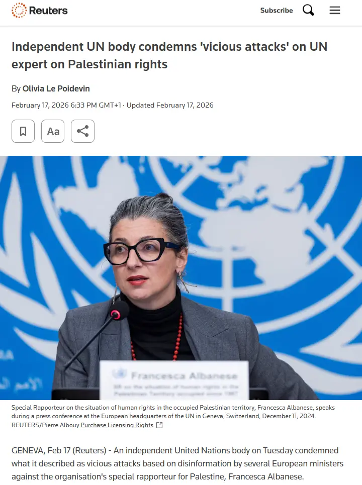

Lobbistická organizace UN Watch rozšířila úmyslně zmanipulované video, ve kterém mluví Francesca Albanese, zvláštní zpravodajka OSN pro lidská práva v okupovaných palestinských územích. Pět evropských ministrů zahraničí na základě tohoto videa požaduje její rezignaci. Když se ukázalo, že video je účelově sestříhané, žádná z vlád se neomluvila, jen Rakousko stáhlo svůj twitterový status.

<RelatedArticles preset="sidebar" slugs={["kontext-2024-11-14-amsterdam-video", "explainer-2024-11-21-netanjahu-icc-zeme-rimsky-statut"]} position="right" heading="Napsali jsme" />

### Odkud se video vzalo

Dne 8. února 2026 – den po vystoupení Francesky Albanese na mediálním fóru Al-Džazíry v Dauhá – zveřejnil ředitel organizace UN Watch Hillel Neuer na síti X [zkrácený klip z jejího projevu](https://x.com/HillelNeuer/status/2020454512356376911) s komentářem, že Albanese „staví židovský stát do role ontologické síly korumpující samo lidstvo". Totéž video se objevilo na [YouTube kanálu UN Watch](https://www.euronews.com/my-europe/2026/02/17/did-the-uns-francesca-albanese-really-call-israel-the-enemy-of-humanity).

První výskyt zkráceného klipu online lze dohledat právě [u Neuera](https://www.computerweekly.com/news/366639200/European-politicians-amplify-disinformation-about-UN-rapporteur). Totéž nezávisle [konstatoval](https://x.com/MartinKonecny/status/2022664436272513375) analytik Martin Konečný z organizace European Middle East Project. A v dalším postu [upozornil](https://x.com/MartinKonecny/status/2024813747919806764/photo/1), že se v zrcadle na fotografii z videa objevuje logo UN Watch.

Fact-checkingová redakce **Euronews (The Cube)** porovnala zkrácené video s kompletním záznamem projevu a [konstatovala](https://www.euronews.com/my-europe/2026/02/17/did-the-uns-francesca-albanese-really-call-israel-the-enemy-of-humanity), že „srovnání mezi sestříhaným klipem a úplným záznamem projevu Albanese naznačuje, že výňatek byl zmanipulován s využitím umělé inteligence" a že „upravené video sdílené na YouTube kanálu UN Watch zřejmě modifikuje hlas Francesky Albanese tak, aby to vypadalo, že označila Izrael za ‚společného nepřítele' lidstva". Euronews zdůraznil, že video obsahuje titulky s označením „UN Watch". **Euronews oslovil UN Watch s žádostí o vyjádření, organizace nereagovala.**

```infobox warning right
**Co doopravdy řekla Francesca Albanese**

Dne 7. února 2026 promluvila Franceska Albanese, zpravodajka OSN, na mediálním fóru Al-Džazíry v Dauhá prostřednictvím videohovoru. Zhruba [ve tříminutovém vystoupení kritizovala mezinárodní reakci na situaci v Gaze](https://www.youtube.com/watch?v=wmJUNHECBGI):


**„Skutečnost, že většina zemí světa Izrael nezastavila, ale naopak ho vyzbrojila, poskytla Izraeli politické výmluvy, politickou ochranu a ekonomickou a finanční podporu.** *To je výzva. Skutečnost, že většina médií v západním světě zesilovala proapartheidní a genocidní narativ, je výzva. A zároveň v tom spočívá příležitost. Protože pokud bylo mezinárodní právo bodnuté do srdce, je také pravda, že nikdy dříve si mezinárodní společenství neuvědomovalo výzvy, kterým všichni čelíme. My, kteří nekontrolujeme velké finanční kapitály, algoritmy a zbraně,* **nyní vidíme, že jako lidstvo máme společného nepřítele, a svobody – respektování základních svobod – jsou poslední mírovou cestou, posledním mírovým nástrojem, který máme k znovuzískání naší svobody."**

*pasáž vyznačená kurzívou byla z falešného videa úmyslně vystřižena*

Když jí pak zmanipulované video přisoudilo, že „společným nepřítelem" myslí Izrael, [upřesnila na sociálních sítích](https://x.com/FranceskAlbs/status/2020983308818186721): „Společným nepřítelem lidstva je SYSTÉM, který umožnil genocidu v Palestině, včetně finančního kapitálu, který ji financuje, algoritmů, které ji zakrývají, a zbraní, které ji umožňují."


```

Redakce **Computer Weekly** (britský oborový server pro IT profesionály) případ [podrobně zmapovala](https://www.computerweekly.com/news/366639200/European-politicians-amplify-disinformation-about-UN-rapporteur) a upozorňuje, že video je zmanipulované, což uvedla i další média a Úřad vysokého komisaře OSN pro lidská práva. Redakce **France24 (Truth or Fake)** ve svém [pětiminutovém fact-checkovém příspěvku](https://www.france24.com/en/tv-shows/truth-or-fake/20260212-no-the-un-s-francesca-albanese-did-not-call-israel-the-common-enemy-of-humanity) rekonstruovala, jak dezinformace vznikla, a potvrdila, že Albanese inkriminovaný výrok nepronesla. Albanese v tomto příspěvku přímo pro France24 označila zkrácení videa za „manipulaci".

Magazín **kontaktoval UN Watch s dotazem na zdroj klipu a na to, zda si byl Neuer vědom, že video bylo upraveno, ale organizace neodpověděla.** Redakce rovněž oslovila kanceláře všech politiků, kteří dezinformaci ve veřejném prostoru rozšířili; odpovědělo pouze německé spolkové ministerstvo zahraničí a své prohlášení nezmírnilo a uvedlo, že záleží na celkovém kontextu.

V tom se německá diplomacie shoduje s mluvčí Úřadu vysokého komisaře OSN pro lidská práva Martou Hurtado. I ona poukazuje na celkový kontext, která považuje za důležitý. Ovšem ten je zcela jiný, než jak ho vnímá německé ministerstvo. Na tiskové konferenci mluvčí Hurtado [potvrdila](https://www.computerweekly.com/news/366639200/European-politicians-amplify-disinformation-about-UN-rapporteur), že Albanese „neoznačila žádný stát za nepřítele lidstva" a vyzvala „všechny, aby si její projev poslechli". Dodala, že Albanese hovořila o „širších systémových hrozbách" pro lidská práva.

Agentura **Reuters** informovala, že se jako zdroj obvinění ukázalo být zmanipulované video, a [citovala panel šesti nezávislých expertů OSN](https://www.reuters.com/world/middle-east/independent-un-body-condemns-vicious-attacks-un-expert-palestinian-rights-2026-02-17/), kteří výzvy k rezignaci Albanese odsoudili s tím, že je „založená na vymyšlených faktech" a vychází z dezinformace.

Podle informací [rakouského webu tkp.at](https://tkp.at/2026/02/15/aussenminister-von-5-eu-laendern-fordern-auf-basis-fake-ki-video-ruecktritt-von-uno-berichterstatterin-albanese/) izraelská ambasáda v Paříži předala sestříhané video francouzskému ministerstvu zahraničí. 

### Kdo na video reagoval

Přední politici a diplomatické osobnosti z Francie, Německa, Itálie, Česka, Rakouska a USA Francescu Albanese ostře odsoudili a mnozí ji vyzvali k okamžité rezignaci. Německý ministr zahraničí Johann Wadephul označil její pozici za „neudržitelnou". Francouzský ministr zahraničí Jean-Noël Barrot [prohlásil před Národním shromážděním 11. února](https://euobserver.com/203567/former-diplomats-accuse-french-foreign-minister-of-disinformation-over-un-envoy-albanese/), že Francie „bezvýhradně odsuzuje tyto nehorázné a zavrženíhodné výroky" – reagoval přitom na interpelaci poslankyně Caroline Yadan, která Albanese falešně obvinila z inkriminovaného výroku. Italský ministr zahraničí Antonio Tajani prohlásil, že její „chování… není vhodné pro pozici, kterou zastává".

Český ministr zahraničí Petr Macinka (Motoristé sobě) na platformě X [citoval Albanese](https://www.dawn.com/news/1974051/un-body-condemns-attacks-on-albanese) jako autorku výroku o „společném nepříteli lidstva" a vyzval k její rezignaci. Americký velvyslanec Mike Waltz ji rovněž citoval a obvinil z antisemitismu. Rakouská ministryně zahraničí Beate Meinl-Reisinger šla ještě dál a obvinila Albanese z šíření nenávistných projevů.

```infobox warning right

[Příspěvek](https://x.com/mzvcr/status/2022211836020654247) českého ministra zahraničí Petra Macinky
```

### UN Watch a její dlouhodobé aktivity

Organizace [UN Watch](https://en.wikipedia.org/wiki/UN_Watch) byla založena v roce 1993 Morrisem B. Abramem, americkým právníkem a bývalým velvyslancem USA při OSN v Ženevě, za podpory Edgara Bronfmana, tehdejšího prezidenta Světového židovského kongresu. V roce 2001 se stala [plnou součástí American Jewish Committee](https://en.wikipedia.org/wiki/UN_Watch) (AJC), jedné z nejvlivnějších pro-izraelských lobbistických organizací v USA. Od roku 2013 se prezentuje jako nezávislá, zůstává však financována ze stejného okruhu dárců. Svou oficiální misí nazývá „sledování výkonu OSN měřítkem jejího vlastního stanového dokumentu".

Agenturu AFP v roce 2009 [charakterizovala UN Watch](https://en.wikipedia.org/wiki/UN_Watch) jako „lobbistickou skupinu se silnými vazbami na Izrael". Organizace odmítá zveřejnit seznam svých dárců – když ji o transparentnost požádala [nizozemská poslankyně Danielle Hirsch](https://en.wikipedia.org/wiki/UN_Watch), ředitel Neuer odmítl s tvrzením, že by zveřejnění dárce ohrozilo.

V praxi se UN Watch dlouhodobě zaměřuje na kampaně za odvolání představitelů OSN kritických vůči Izraeli. V roce 2025 [neúspěšně usilovala](https://www.trtworld.com/article/6e0b924d2b9d) o zabránění prodloužení mandátu Francesky Albanese. Dříve vedla kampaně proti zvláštním zpravodajům Richardu Falkovi a Michaelu Lynkovi. Ředitel Neuer opakovaně svědčil před americkým Kongresem – mj. čtyřikrát proti agentuře UNRWA, než USA její financování zastavily.

### Omluvy se nekonají

K 24. únoru 2026 žádná z pěti vlád veřejnou omluvu nevydala.

Rakouská ministryně Meinl-Reisinger smazala svůj příspěvek na X – jako jediná z pětice alespoň částečně couvla, byť bez omluvy a opravy. Německé ministerstvo zahraničí v reakci na dotaz Computer Weekly uvedlo, že Wadephul „se odkazoval na celý výrok, nikoli na manipulované video" a že „paní Albanese opakovaně pronášela výroky a šířila neudržitelné nepravdy v minulosti, včetně těch o Německu". Francouzský ministr Barrot tvrdí, že jeho výzva „neměla nic společného se sestříhaným videem", a přesunul argumentaci na starší výroky Albanese. České ministerstvo zahraničí pod vedením Petra Macinky se k manipulaci videa vůbec nevyjádřilo a své výroky nedementovalo ani neodstranilo.

```infobox warning left
> „Co je na tomto incidentu obzvláště šokující, je skutečnost, že právě Rakousko a Německo – dvě země, které se ucházejí o místo v Radě bezpečnosti OSN a předstírají, že hájí mezinárodní řád založený na pravidlech – se aktivně podílejí na podkopávání a poškozování právě těchto institucí OSN," říká ředitelka rakouské Amnesty International Shoura Hashemi.
```

[Amnesty International požaduje](https://www.amnesty.org/en/latest/news/2026/02/european-states-must-retract-attacks-francesca-albanese/), aby ministři „šli za pouhé mazání příspěvků na sociálních sítích a veřejně se omluvili a stáhli výzvy k rezignaci". Více než 150 bývalých diplomatů a ministrů [podepsalo otevřený dopis](https://www.presstv.ir/Detail/2026/02/20/764412/Ex-officials-denounce-French-FM-spreading-disinformation-about-UN-Albanese) odsuzující Barrota za „šíření dezinformací". Více než 100 kulturních osobností včetně Marka Ruffala, Javiera Bardema a Annie Lennox [podpořilo Albanese](https://www.france24.com/en/live-news/20260214-top-entertainment-figures-back-under-fire-un-palestinians-expert) otevřeným dopisem.

Claudio Francavilla z **Human Rights Watch** to [shrnul pro EUobserver](https://euobserver.com/203567/former-diplomats-accuse-french-foreign-minister-of-disinformation-over-un-envoy-albanese/): „Buď si nevšimli, že video bylo zmanipulované, nebo si toho všimli a přesto se rozhodli na jeho základě zaútočit. Nevím, která z variant svědčí o vyšší míře nekompetence."

Francouzská Asociace právníků za dodržování mezinárodního práva (**JURDI**) [podala trestní oznámení](https://www.middleeasteye.net/news/french-lawyers-seek-criminal-prosecution-foreign-minister-over-francesca-albanese-remarks) na ministra Barrota za „šíření nepravdivých informací" podle francouzského práva.

---

## Časová osa

<Timeline yamlFile="timeline.yaml" />

---

```infobox
**Kdo je Francesca Albanese**

Italská právnička (nar. 1977), absolventka univerzity v Pise a londýnské SOAS. Od května 2022 zastává funkci zvláštní zpravodajky OSN pro lidská práva v palestinských územích okupovaných od roku 1967. V dubnu 2025 jí [Rada OSN pro lidská práva prodloužila mandát](https://www.trtworld.com/article/6e0b924d2b9d) o další tři roky (do roku 2028), a to navzdory kampani za její odvolání ze strany USA, Izraele a organizace UN Watch.

**Kritici** – Izrael, USA, Anti-Defamation League (ADL), některé evropské vlády – ji obviňují z antisemitismu. Poukazují na její příspěvek z roku 2014 na Facebooku, kde psala o „židovské lobby" ovládající USA – za tuto formulaci se [později omluvila a vyjádřila nad ní lítost](https://en.wikipedia.org/wiki/Francesca_Albanese). Dále ji kritizují za reakci z února 2024, kdy v odpovědi na slova prezidenta Macrona [zpochybnila](https://www.thenationalnews.com/news/us/2026/02/12/francesca-albanese-un-gaza-israel/), že oběti 7. října 2023 byly zabity „kvůli svému judaismu" – za což ji společně odsoudily Francie a Německo, poprvé v historii OSN.

**Obhájci** – 65 akademiků zabývajících se antisemitismem a holocaustem v prosinci 2022 prohlásilo, že „kampaň proti ní není o boji s antisemitismem, ale o snaze ji umlčet". Její mandát podpořilo 116 lidskoprávních organizací. V červenci 2025 na ni Trumpova administrativa jako na první představitelku OSN v historii uvalila sankce. Ty ji podle jejích slov proměnily v „ne-osobu": nemůže používat kreditní karty, dostávat proplácení zdravotních výdajů od amerických pojišťoven ani si rezervovat hotely – jak [popsala pro Middle East Eye](https://www.middleeasteye.net/news/un-panel-european-calls-resignation-albanese-rooted-disinformation) a jak [zaznamenala agentura Reuters](https://www.reuters.com/world/middle-east/independent-un-body-condemns-vicious-attacks-un-expert-palestinian-rights-2026-02-17/).
```

### Český kontext

Český ministr zahraničí Petr Macinka (Motoristé sobě) se k výzvám připojil 12. února. Na platformě X [citoval Albanese](https://www.dawn.com/news/1974051/un-body-condemns-attacks-on-albanese) jako autorku výroku o „společném nepříteli lidstva" a označil ji za osobu, která „šíří nenávist". Neexistují doklady o tom, že by si ministerstvo před zveřejněním příspěvku ověřilo celý projev Albanese.

Po prokázání manipulace videa se české ministerstvo zahraničí ke kauze již nevyjádřilo a své výroky nedementovalo ani neodstranilo.

Reportér České televize [Jakub Szántó případ 13. února komentoval](https://x.com/michaldvorak/status/2022291346967478393) na X slovy, že „Česko se připojilo k Francii" a požaduje „odstranění antisemitské aktivistky Francesky Albanese z oficiální funkce OSN". Když ho uživatelé upozornili, že Albanese inkriminovaný výrok nepronesla, Szántó se už k obsahu svého tvrzení nevyjádřil.

Reportáž ČT z téhož dne zmínila „sestříhané video" jednou větou, ale nevysvětlila, v čem manipulace spočívala, jak vznikla ani kdo za ní stojí. Český rozhlas postupoval obdobně.

### Opakující se vzorec

V listopadu 2024 jsme popsali, [jak jedno video z Amsterdamu prošlo mediálním řetězcem a změnilo si cestou význam](/clanek/kontext-2024-11-14-amsterdam-video). Anonymní účet na X překroutil, kdo na záběrech koho napadá, a česká i světová média zpočátku většinově tento popis převzala nekriticky. Nyní se totéž odehrává ve větším měřítku a s vážnějšími důsledky.

Případ Albanese ukazuje tentýž vzorec:

1. **Manipulace u zdroje.** V Amsterdamu anonymní účet @sentdefender s milionem sledujících. V případě Albanese organizace UN Watch – pro-izraelská lobbistická skupina, jejíž ředitel Hillel Neuer zveřejnil zkrácený klip jako první dohledatelný zdroj online.

2. **Nekritické převzetí.** V Amsterdamu ČTK převzala popis z X bez ověření. V případě Albanese pět evropských ministrů zahraničí citovalo obsah zmanipulovaného videa, aniž si ověřili celý projev.

3. **Selhání opravného mechanismu.** V Amsterdamu se ARD a New York Times omluvily; česká média nikoli. V případě Albanese couvlo pouze Rakousko (smazáním příspěvku, nikoli omluvou); ostatní čtyři vlády trvají na svém i poté, co Euronews, France24, Reuters i panel expertů OSN potvrdili manipulaci.

4. **Důsledky.** Falešný popis se šíří rychle a hlasitě, naopak oprava přichází pozdě, tiše a obvykle dosáhne jen zlomku původního publika.

Rozdíl je v síle dopadů. V Amsterdamu šlo o pokřivení mediálního obrazu jednoho incidentu, v případě Francesky Albanese jde o pokus odstranit nezávislou představitelku OSN na základě prokazatelně nepravdivého tvrzení – a pět evropských vlád se na tomto pokusu aktivně podílí.

---

### Tvrzení českých médií vs. fakta

Česká média i český ministr zahraničí Albanese opakovaně charakterizovali jako osobu, která se „dopouští kontroverzních výroků na adresu Izraele a obecně Židů". Konkrétně jí vyčítají, že koncem září 2025 „přišla s nepodloženým tvrzením, že v důsledku války Izraele proti Hamásu zemřelo v Gaze 680 tisíc lidí, z toho 380 tisíc dětí mladších pěti let", s dovětkem, že „tolik jich tam přitom ani podle palestinských statistik nikdy nežilo".

Co Albanese skutečně řekla? Na [tiskové konferenci v Ženevě 15. září 2025](https://www.un.org/unispal/document/press-briefing-francesca-albanese-16sep25/) uvedla: „65 000 je počet Palestinců s jistotou zabitých (...). Ve skutečnosti bychom měli začít uvažovat o čísle 680 000, protože to je číslo, které uvádějí někteří vědci jako skutečný počet obětí v Gaze." Odkázala přitom na akademickou studii australských badatelů publikovanou v časopise Arena. Dodala, že „bude těžké toto číslo prokázat nebo vyvrátit, zejména pokud vyšetřovatelům zůstane vstup do Gazy zakázán".

Číslo 380 000 dětí pod pět let je skutečně problematické – podle Palestinského centrálního statistického úřadu žilo v Gaze před válkou přibližně 341 790 dětí v tomto věku, tedy méně, než Albanese uváděla jako mrtvé. Na tuto nesrovnalost upozornily jak [protiizraelské](https://www.meforum.org/mef-online/war-numbers-the-most-powerful-weapon-against-israel), tak [proizraelské zdroje](https://unwatch.org/francesca-albaneses-seven-most-shocking-statements-in-september-2025/). Albanese sama uvedla, že číslo použila „provokativně" a že se opírá o odhady vědců, nikoli o ověřená data.

Tato nepřesnost je legitimním předmětem kritiky. Současně ale neplatí, že by Albanese neměla pro svou celkovou analýzu žádnou oporu. Mezinárodní soudní dvůr v Haagu v lednu 2024 nařídil Izraeli přijmout opatření k zabránění genocidě. Mezinárodní trestní soud vydal zatykače na izraelského premiéra a bývalého ministra obrany. Amnesty International v prosinci 2024 vydala rozsáhlou zprávu kvalifikující izraelské operace v Gaze jako genocidu. A 65 akademiků zabývajících se antisemitismem a holocaustem v prosinci 2022 prohlásilo, že „kampaň proti Albanese není o boji s antisemitismem, ale o snaze ji umlčet".

Není to poprvé, kdy Albanese čelí ostré kritice – a není to poprvé, kdy se za ni postavili diplomaté i vědci. Totéž se opakuje nyní, v únoru 2026, kvůli zmanipulovanému videu.


<RelatedArticles filter="explainer" count={9} showFormatBadge={false} showAuthor={false} sort="default" heading="Další články" />
