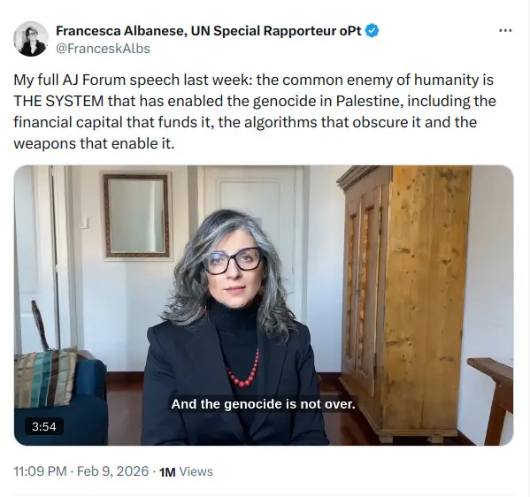
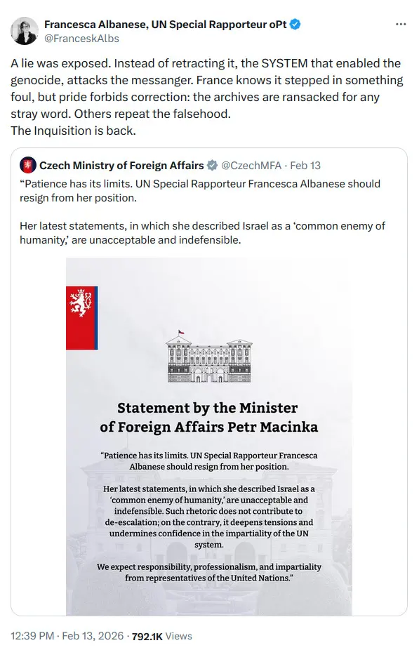

Lobbistická organizace UN Watch rozšířila sestříhané video z konference v Dauhá. Pět evropských ministrů zahraničí na jeho základě požadovalo rezignaci zpravodajky OSN Francesky Albanese. Když se ukázalo, že video je zmanipulované, žádná z vlád se neomluvila.

<RelatedArticles preset="sidebar" slugs={["kontext-2024-11-14-amsterdam-video"]} position="right" heading="Napsali jsme" />

V listopadu 2024 jsme popsali, [jak jedno video z Amsterdamu prošlo mediálním řetězcem a změnilo si cestou význam](/clanek/kontext-2024-11-14-amsterdam-video). Anonymní účet na X překroutil, kdo na záběrech koho napadá, a česká i světová média zpočátku většinově tento popis převzala nekriticky. A zdaleka ne všechna později uvedla informace na pravou míru.

Nyní se totéž odehrává ve větším měřítku – s vážnějšími důsledky.

Tentokrát jde o úmyslně zmanipulované video, ve kterém mluví zvláštní zpravodajka OSN pro lidská práva v okupovaných palestinských územích. Na začátku dezinformačního řetězce stojí lobbistická organizace UN Watch s přímou vazbou na izraelskou diplomacii. Organizaci jako „lobbistickou skupinu se silnými vazbami na Izrael" [označila agentura AFP](https://en.wikipedia.org/wiki/UN_Watch) již v roce 2009; její provázanost s American Jewish Committee a zaměření na obranu izraelských zájmů v OSN [dokumentuje řada zdrojů](https://www.computerweekly.com/news/366639200/European-politicians-amplify-disinformation-about-UN-rapporteur) včetně britského Computer Weekly, který případ podrobně zmapoval. A na konci řetězce stojí ministři zahraničí pěti evropských zemí, kteří požadují rezignaci představitelky OSN na základě výroku, který nikdy nepronesla.

```infobox right
**Co řekla Francesca Albanese**

Dne 7. února 2026 promluvila Francesca Albanese na mediálním fóru Al-Džazíry v Dauhá prostřednictvím videohovoru. V přibližně čtyřminutovém vystoupení kritizovala mezinárodní reakci na situaci v Gaze:

> „Skutečnost, že většina zemí světa Izrael nezastavila, ale naopak ho vyzbrojila, poskytla mu politické výmluvy, politickou ochranu a ekonomickou a finanční podporu – to je výzva. (...) My, kteří nekontrolujeme velké finanční kapitály, algoritmy a zbraně, nyní vidíme, že jako lidstvo máme společného nepřítele a že respektování základních svobod je poslední mírovou cestou, posledním mírovým nástrojem, který máme k znovuzískání naší svobody."

Když jí pak zmanipulované video přisoudilo, že „společným nepřítelem" myslí Izrael, [upřesnila na sociálních sítích](https://x.com/FranceskAlbs): „Společným nepřítelem lidstva je SYSTÉM, který umožnil genocidu v Palestině, včetně finančního kapitálu, který ji financuje, algoritmů, které ji zakrývají, a zbraní, které ji umožňují."


```

**Tvrzení českých médií vs. fakta**

Česká média i český ministr zahraničí Albanese opakovaně charakterizovali jako osobu, která se „dopouští kontroverzních výroků na adresu Izraele a obecně Židů". Konkrétně jí bylo vyčítáno, že koncem září 2025 „přišla s nepodloženým tvrzením, že v důsledku války Izraele proti Hamásu zemřelo v Gaze 680 tisíc lidí, z toho 380 tisíc dětí mladších pěti let", s dovětkem, že „tolik jich tam přitom ani podle palestinských statistik nikdy nežilo".

Co Albanese skutečně řekla? Na [tiskové konferenci v Ženevě 15. září 2025](https://www.un.org/unispal/document/press-briefing-francesca-albanese-16sep25/) uvedla: „65 000 je počet Palestinců s jistotou zabitých (...). Ve skutečnosti bychom měli začít uvažovat o čísle 680 000, protože to je číslo, které uvádějí někteří vědci jako skutečný počet obětí v Gaze." Odkázala přitom na akademickou studii australských badatelů publikovanou v časopise Arena. Dodala, že „bude těžké toto číslo prokázat nebo vyvrátit, zejména pokud vyšetřovatelům zůstane vstup do Gazy zakázán".

Číslo 380 000 dětí pod pět let je skutečně problematické – podle Palestinského centrálního statistického úřadu žilo v Gaze před válkou přibližně 341 790 dětí v tomto věku, tedy méně, než Albanese uváděla jako mrtvé. Na tuto nesrovnalost upozornily jak [protiizraelské](https://www.meforum.org/mef-online/war-numbers-the-most-powerful-weapon-against-israel), tak [proizraelské zdroje](https://unwatch.org/francesca-albaneses-seven-most-shocking-statements-in-september-2025/). Albanese sama uvedla, že číslo použila „provokativně" a že se opírá o odhady vědců, nikoli o ověřená data.

Tato nepřesnost je legitimním předmětem kritiky. Současně ale neplatí, že by Albanese neměla pro svou celkovou analýzu žádnou oporu. Mezinárodní soudní dvůr v Haagu v lednu 2024 nařídil Izraeli přijmout opatření k zabránění genocidě. Mezinárodní trestní soud vydal zatykače na izraelského premiéra a bývalého ministra obrany. Amnesty International v prosinci 2024 vydala rozsáhlou zprávu kvalifikující izraelské operace v Gaze jako genocidu. A 65 akademiků zabývajících se antisemitismem a holocaustem v prosinci 2022 prohlásilo, že „kampaň proti Albanese není o boji s antisemitismem, ale o snaze ji umlčet".

Není to poprvé, kdy Albanese čelí ostrým sporům – a není to poprvé, kdy se za ni postavili diplomaté i vědci. Totéž se opakuje nyní, v únoru 2026, kvůli zmanipulovanému videu.

**Co je UN Watch**

Organizace [UN Watch](https://en.wikipedia.org/wiki/UN_Watch) byla založena v roce 1993 Morrisem B. Abramem, americkým právníkem a bývalým velvyslancem USA při OSN v Ženevě, za podpory Edgara Bronfmana, tehdejšího prezidenta Světového židovského kongresu. V roce 2001 se stala [plnou dceřinou organizací American Jewish Committee](https://en.wikipedia.org/wiki/UN_Watch). Prezentuje se jako hlídač OSN – její deklarovanou misí je „sledovat výkon OSN měřítkem jejího vlastního stanového dokumentu".

V praxi se UN Watch dlouhodobě zaměřuje na kampaně proti kritikům Izraele v systému OSN. Organizaci jako „lobbistickou skupinu se silnými vazbami na Izrael" označila [agentura AFP v roce 2009](https://en.wikipedia.org/wiki/UN_Watch). Americká novinářka a aktivistka Phyllis Bennisová ji nazvala „malou ženevskou pravicovou organizací", která je „posedlá snahou podkopávat a delegitimizovat" zvláštní zpravodaje kritické vůči Izraeli. V roce 2025 UN Watch [neúspěšně usilovala](https://www.trtworld.com/article/6e0b924d2b9d) o zabránění prodloužení mandátu Francesky Albanese. Poté, co tato cesta selhala, [rozšířila sestříhané video](https://www.euronews.com/my-europe/2026/02/17/did-the-uns-francesca-albanese-really-call-israel-the-enemy-of-humanity) z konference v Dauhá, které přisoudilo Albanese výrok, který nikdy nepronesla.

**Kdo potvrdil manipulaci videa**

Fact-checková redakce [Euronews (The Cube)](https://www.euronews.com/my-europe/2026/02/17/did-the-uns-francesca-albanese-really-call-israel-the-enemy-of-humanity) provedla srovnání sestříhaného klipu s kompletním záznamem a konstatovala, že „video bylo zmanipulováno pomocí umělé inteligence" a že „upravené video, sdílené na YouTube kanálu UN Watch, zřejmě modifikuje Albaneseín hlas tak, aby naznačoval, že označila Izrael za ‚společného nepřítele' lidstva".

Redakce [France24 (Truth or Fake)](https://www.france24.com/en/tv-shows/truth-or-fake/20260212-no-the-un-s-francesca-albanese-did-not-call-israel-the-common-enemy-of-humanity) ve svém pětiminutovém příspěvku přesně rekonstruovala, jak ke kampani dezinformací došlo, a potvrdila, že Albanese inkriminovaný výrok nepronesla.

Totéž konstatoval [Úřad vysokého komisaře OSN pro lidská práva](https://www.middleeasteye.net/news/un-panel-european-calls-resignation-albanese-rooted-disinformation). [Reuters uvedl](https://www.dawn.com/news/1974051/un-body-condemns-attacks-on-albanese), že „AI-manipulované video se ukázalo jako zdroj obvinění" a že „neexistuje precedent pro odvolání zvláštního zpravodaje v průběhu mandátu". Britský [Computer Weekly shrnul](https://www.computerweekly.com/news/366639200/European-politicians-amplify-disinformation-about-UN-rapporteur): „Řada médií včetně Reuters a France24, stejně jako Úřad vysokého komisaře OSN pro lidská práva, potvrdily, že odkazované video je zmanipulované."

```infobox right
**Jak se video dostalo k ministrům**

Jean-Noël Barrot, francouzský ministr zahraničí, v dubnu 2024, ještě jako ministr pro Evropu, [varoval v rozhovoru pro deník Ouest-France](https://www.theguardian.com/world/2024/apr/22/france-being-pounded-by-russian-disinformation-says-minister) před ruskou dezinformační kampaní cílící na Francii: „Nemine týden, kdy by Francie nebyla terčem koordinovaných a záměrných manévrů s cílem narušit veřejnou debatu," prohlásil tehdy – a citoval konkrétní příklady falešných webů ministerstev, které šířily nepravdivé zprávy. O necelé dva roky později se sám stal šiřitelem nepravdivé informace o představitelce OSN.

Podle informací [rakouského blogu tkp.at](https://tkp.at/2026/02/15/aussenminister-von-5-eu-laendern-fordern-auf-basis-fake-ki-video-ruecktritt-von-uno-berichterstatterin-albanese/), které se opírají o veřejně dostupný řetězec sdílení, izraelská ambasáda v Paříži předala sestříhané video francouzskému ministerstvu zahraničí. Barrot ho [citoval před Národním shromážděním 11. února](https://euobserver.com/203567/former-diplomats-accuse-french-foreign-minister-of-disinformation-over-un-envoy-albanese/) a vyzval Albanese k rezignaci s tím, že Francie „bezvýhradně odsuzuje skandální a zavrženíhodné výroky".

Během následujících dnů se přidali ministři dalších zemí: [německý Johann Wadephul](https://www.thenationalnews.com/news/us/2026/02/12/francesca-albanese-un-gaza-israel/) označil její setrvání ve funkci za „neudržitelné", [rakouská Beate Meinl-Reisinger](https://www.computerweekly.com/news/366639200/European-politicians-amplify-disinformation-about-UN-rapporteur) ji obvinila z nenávistného projevu, [italský Antonio Tajani](https://www.thenationalnews.com/news/us/2026/02/12/francesca-albanese-un-gaza-israel/) zpochybnil její nestrannost a [český Petr Macinka](https://www.dawn.com/news/1974051/un-body-condemns-attacks-on-albanese) (Motoristé sobě) citoval na X falešný výrok a vyzval k její rezignaci.


```
---

## Časová osa

<Timeline yamlFile="timeline.yaml" />

---

**Omluvy se nekonají**

K 24. únoru 2026 žádná z pěti vlád veřejnou omluvu nevydala.

Rakouská ministryně Meinl-Reisinger smazala svůj příspěvek na X – jako jediná z pětice alespoň částečně couvla, byť bez omluvy a opravy. Německý ministr Wadephul nepovažuje korekci za nutnou. Francouzský ministr Barrot tvrdí, že jeho výzva „neměla nic společného se sestříhaným videem", a přesunul argumentaci na starší výroky Albanese. České ministerstvo zahraničí pod vedením Petra Macinky se k manipulaci videa vůbec nevyjádřilo a své výroky nedementovalo ani neodstranilo.

[Amnesty International požaduje](https://www.amnesty.org/en/latest/news/2026/02/european-states-must-retract-attacks-francesca-albanese/), aby ministři „šli za pouhé mazání příspěvků na sociálních sítích – jak to někteří učinili – a veřejně se omluvili a stáhli výzvy k rezignaci". Claudio Francavilla z Human Rights Watch to [shrnul pro EUobserver](https://euobserver.com/203567/former-diplomats-accuse-french-foreign-minister-of-disinformation-over-un-envoy-albanese/): „Buď si nevšimli, že video bylo zmanipulované, nebo si toho všimli a přesto se rozhodli na jeho základě zaútočit. Nevím, která z variant svědčí o vyšší míře nekompetence."

```infobox right
**Kdo je Francesca Albanese**

Italská právnička (nar. 1977), absolventka univerzity v Pise a londýnské SOAS. Od května 2022 zastává funkci zvláštní zpravodajky OSN pro lidská práva v palestinských územích okupovaných od roku 1967. V dubnu 2025 jí [Rada OSN pro lidská práva prodloužila mandát](https://www.trtworld.com/article/6e0b924d2b9d) o další tři roky (do roku 2028), a to navzdory kampani za její odvolání ze strany USA, Izraele a organizace UN Watch.

**Kritici** – Izrael, USA, Anti-Defamation League (ADL), některé evropské vlády – ji obviňují z antisemitismu. Poukazují na její příspěvek z roku 2014 na Facebooku, kde psala o „židovské lobby" ovládající USA – za tuto formulaci se [později omluvila a vyjádřila nad ní lítost](https://en.wikipedia.org/wiki/Francesca_Albanese). Dále ji kritizují za reakci z února 2024, kdy v odpovědi na slova prezidenta Macrona [zpochybnila](https://www.thenationalnews.com/news/us/2026/02/12/francesca-albanese-un-gaza-israel/), že oběti 7. října 2023 byly zabity „kvůli svému judaismu" – za což ji společně odsoudily Francie a Německo, poprvé v historii OSN.

**Obhájci** – 65 akademiků zabývajících se antisemitismem a holocaustem v prosinci 2022 prohlásilo, že „kampaň proti ní není o boji s antisemitismem, ale o snaze ji umlčet". Její mandát podpořilo 116 lidskoprávních organizací. V červenci 2025 na ni Trumpova administrativa jako na první představitelku OSN v historii uvalila sankce. Ty ji podle jejích slov proměnily v „ne-osobu": nemůže používat kreditní karty, dostávat proplácení zdravotních výdajů od amerických pojišťoven ani si rezervovat hotely – jak [popsala pro Middle East Eye](https://www.middleeasteye.net/news/un-panel-european-calls-resignation-albanese-rooted-disinformation) a jak [zaznamenal Reuters](https://www.dawn.com/news/1974051/un-body-condemns-attacks-on-albanese).
```

**Český kontext**

Český ministr zahraničí Petr Macinka (Motoristé sobě) se k výzvám připojil 12. února. Na platformě X [citoval Albanese](https://www.dawn.com/news/1974051/un-body-condemns-attacks-on-albanese) jako autorku výroku o „společném nepříteli lidstva" a označil ji za osobu, která „šíří nenávist".

Po prokázání manipulace videa se české ministerstvo zahraničí ke kauze již nevyjádřilo a své výroky nedementovalo ani neodstranilo.

Reportér České televize Jakub Szántó případ 13. února komentoval na X slovy, že „Česko se připojilo k Francii" a požaduje „odstranění antisemitské aktivistky Francesky Albanese z oficiální funkce OSN". Když ho uživatelé upozornili, že Albanese inkriminovaný výrok nepronesla, Szántó se už k obsahu svého tvrzení nevyjádřil.

Reportáž ČT z téhož dne zmínila „sestříhané video" jednou větou, ale nevysvětlila, v čem manipulace spočívala, jak vznikla ani kdo za ní stojí. Český rozhlas postupoval obdobně.

## Vzorec, který se opakuje

V listopadu 2024 jsme popsali, [jakým jedno video z Amsterdamu prošlo řetězcem](/clanek/kontext-2024-11-14-amsterdam-video) sociální síť → anonymní účet → ČTK → česká média a cestou si změnilo význam.

Případ Albanese ukazuje tentýž vzorec ve větším měřítku:

1. **Manipulace u zdroje.** V Amsterdamu anonymní účet @sentdefender s milionem sledujících. V případě Albanese organizace UN Watch s vazbou na izraelskou diplomacii.

2. **Nekritické převzetí.** V Amsterdamu ČTK převzala popis z X bez ověření. V případě Albanese pět evropských ministrů zahraničí citovalo sestříhané video, aniž si ověřili celý projev.

3. **Selhání opravného mechanismu.** V Amsterdamu se ARD a New York Times omluvily; česká média nikoli. V případě Albanese couvlo pouze Rakousko (částečně); ostatní čtyři vlády trvají na svém i poté, co Reuters, Euronews, France24 i panel expertů OSN potvrdili manipulaci.

4. **Důsledky.** Falešný popis se šíří rychle a hlasitě, naopak oprava přichází pozdě, tiše a obvykle dosáhne jen zlomku původního publika.

Rozdíl je ve síle dopadů. V Amsterdamu šlo o pokřivení mediálního obrazu jednoho incidentu, v případě Francescy Albanese jde o pokus odstranit nezávislou představitelku OSN na základě prokazatelně nepravdivého tvrzení – a pět evropských vlád se na tomto pokusu aktivně podílí.

---

<RelatedArticles filter="explainer" count={6} sort="default" heading="Sort: default (score)" />
