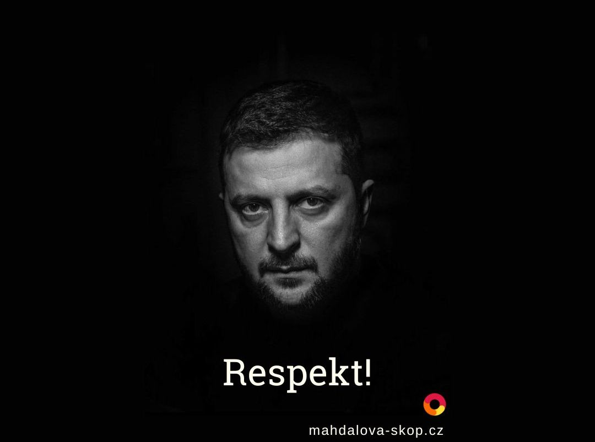

Role Spojených států coby garanta stability se změnila. Trumpova diplomacie nyní obviňuje oběť, oslabuje spojence a posiluje agresora.

Donald Trump tvrdí, že není ani proruský, ani proukrajinský. Zamlčuje ale základní fakt: Ukrajina je napadená země a Rusko je agresor. Když vůdce svobodného světa odmítá rozlišovat mezi útočníkem a obětí, přestává být garantem stability, a stává se naopak destabilizujícím faktorem.

Setkání v Oválné pracovně nebylo o hledání řešení, ale o ponižování napadeného státu. Trump a jeho viceprezident JD Vance přinutili Zelenského k obhajobě sebe sama, jako by Ukrajina byla v této válce viníkem. Šlo o demonstraci moci, nikoli o diplomatické vyjednávání. Trumpovi nejde o obranu Ukrajiny ani o její budoucnost, ve skutečnosti se distancuje i od morální odpovědnosti a zkouší pro sebe z války udělat obchodní příležitost.

Trumpova rétorika obviňování oběti má jasné důsledky. Ukrajina musí dokazovat svou „vděčnost“, zatímco Rusko dostává signál, že se vyplatí vést válku, dokud se Západ neunaví. Americká diplomacie, kdysi založená na principech mezinárodního práva a solidarity mezi spojenci, se mění v transakční vztah, kde hodnota partnerství závisí na okamžitém zisku.

Tento přístup nejen oslabuje důvěru evropských spojenců v USA, ale také posiluje putinovské Rusko. Ukazuje mu, že Západ je rozdělený a že stačí vyčkávat. A co je nejhorší, vytváří nebezpečný precedent: pokud se Amerika takto chová k napadené zemi dnes, jaké záruky bezpečnosti mohou očekávat její další spojenci zítra?

Putin toho už hodně ztratil a snaží se svůj status poraženého změnit na uznávaného partnera. Trump mu pomáhá, ať už vědomě nebo ze sebestřednosti. Pokud Spojené státy ustoupí, nejen že zradí svůj historický závazek chránit svobodu a demokracii, ale také ohrozí samotný světový řád, který po desetiletí pomáhaly budovat.

Ukrajina nepotřebuje ponižování a nátlak, ale férové podmínky a bezpečnostní záruky. Spojené státy stále mohou hrát klíčovou roli – ale pouze pokud pochopí, že skutečná síla nespočívá v obchodování s osudy národů, nýbrž v obraně hodnot, na nichž stojí svobodný svět.

My jsme s Ukrajinou.

Kateřina Mahdalová & Michal Škop

