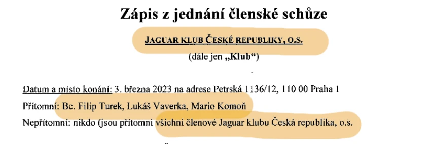
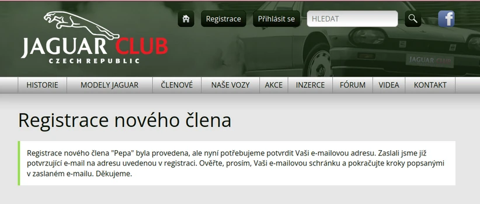
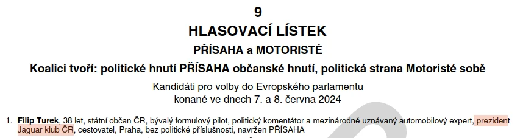
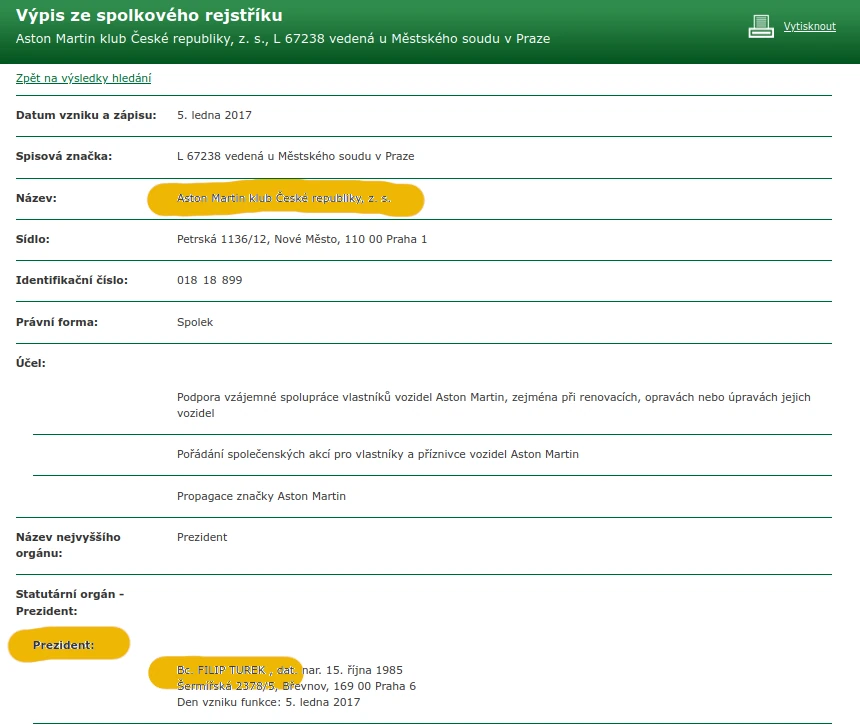

Pokračujeme v odhalování skutečného příběhu europoslance Filipa Turka (Motoristé/Patrioti). Po [prozkoumání jeho závodní kariéry](/clanek/analyza-2025-05-13-jak-europoslanec-turek-doopravdy-zavodil-ve-formuli) se nyní zaměřujeme na další oblast jeho veřejné prezentace.

Turek se prezentuje jako "prezident Jaguar klubu ČR" - tento titul se objevil i na jeho volebním lístku do Evropského parlamentu. Realita je však stejně překvapivá jako v případě jeho závodní kariéry.

## Tříčlenný spolek Jaguar klub ČR

_→ “Registrovaných [v Jaguar klubu ČR] je kolem tisíce členů.”  Filip Turek_

Ve Spolkovém rejstříku, kam spolky mají ze zákona povinnost pravidelně posílat základní informace o své činnosti, má spolek Jaguar klub ČR pouze 2 listiny. Jednou z nich je **zápis z jednání členské schůze v roce 2023**. Z něj se dozvídáme, že [spolek má ve skutečnosti pouze 3 členy, Filipa Turka a jeho dva kamarády](https://or.justice.cz/ias/ui/vypis-sl-detail?dokument=77607706&subjektId=756871&spis=342121).



Web spolku sice umožňuje registraci, ale je to **jen registrace na web**. Podobně jako se registrací třeba na Facebook nestáváte automaticky členem nebo majitelem Facebooku, ani tady se nestanete členem spolku. Při registraci můžete uvést jakékoliv údaje, takže aktuálně jsou registrovaní na webu třeba uživatelé s celými jmény Milan, Pavel nebo Tomáš. [Registrovat se může úplně kdokoliv](https://www.jaguarclub.com/cs/registrace/), stačí funkční emailová adresa.



Na webu spolku je aktuálně registrováno kolem 930 uživatelů, **naprostá většina z nich jsou ale jen ty spíše náhodné přihlášky** (na webu spolku jsou nazývány “proklamativní”). Jen 43 jsou jiní uživatelé webu, od “řádných členů” až po “VIP” a samozřejmě _prezidenta_ Filipa Turka s číslem 1.

Je ale fér říci, že spolek (či spíše skupina lidí kolem něj) nějakou činnost skutečně vykonává, obvykle jde o **společné projížďky auty** a **setkání**.

Podle webu jsou klíčovými lidmi skupiny kolem spolku vedle Filipa Turka také **Richard Chlad** (nazývaný “viceprezident”). Veřejně známý podnikatel, o němž se vžilo označení “český miliardář a bývalý automobilový závodník”, od 90. let působí primárně v hazardním průmyslu. 

Třetí figurou ve spolku pak je Turkův kamarád **Lukáš Vaverka**, jehož si Turek později přivedl [mezi své asistenty do Evropského parlamentu](https://www.europarl.europa.eu/meps/cs/256850/FILIP_TUREK/assistants#detailedcardmep). Ve struktuře Turkova europoslaneckého týmu se  Vaverka nachází vedle asistentů, v roli “poskytovatel služeb”.



```box
### Spolky - aneb jak se stát prezidentem nebo prezidentkou

K založení spolku stačí 3 osoby. Pojmenování vedení spolku je dosti volné. Obvykle jde o předsedu/kyni, ředitele/ku, ale pokud chcete, můžete být klidně prezidentem nebo prezidentkou.

Můžete být dokonce i náčelník nebo velký šéf, záleží, jak si funkci sami pojmenujete. Založení spolku je bezplatné.
```

## Utajený prezident
Zatímco svou funkci prezidenta tříčlenného Jaguar klubu Turek ve veřejném prostoru zmiňuje často, své další prezidentství tak hojně neuvádí. Zjistili jsme, že se jedná o [Aston Martin klub ČR](https://or.justice.cz/ias/ui/rejstrik-firma.vysledky?subjektId=959890&typ=UPLNY), který vznikl v roce 2017. Tento spolek má v rejstříku výlučně své stanovy - ale žádné daší povinné dokumenty zde vloženy nemá. 

Tomuto spolku pan nejpozději od roku 2023 už [nefunguje ani web](https://web.archive.org/web/20240413135708/https://www.astonmartins.cz/). Poslední záznam o funkčním webu je uložena v internetovém archívu [archive.org](https://web.archive.org/web/20210920072544/https://www.astonmartins.cz/cs/) k prosinci 2021, kdy zde byly publikované příspěvky Filipa Turka a Lukáše Vaverky.

Ve starší verzi webu se dočítáme, že klíčovými lidmi kolem tohoto spolku jsou nebo byli opět _prezident_ **Filip Turek**, **Lukáš Vaverka** a **Richard Chlad**.



_Citace výše pochází z knihy Filip Turek Hranatá legenda_

```box
Dále k tématu:

[Jak europoslanec Turek doopravdy závodil ve formuli](/clanek/analyza-2025-05-13-jak-europoslanec-turek-doopravdy-zavodil-ve-formuli)

[Europoslanci: Kdo hlasuje pro-rusky a kdo k Rusku kriticky](/clanek/europarlament-2024-12-23-kdo-hlasuje-pro-rusky)

[Europoslanci: Kdo hlasuje s kým, kdo je součást evropského mainstreamu a kdo je mimo](/clanek/europarlament-2024-12-19-kdo-hlasuje-s-kym)

[Europoslanci: Kdo z Česka a Slovenska chybí na hlasování](/clanek/europarlament-2024-12-17-kdo-z-ceska-a-slovenska-chybi-na-hlasovani)


```


