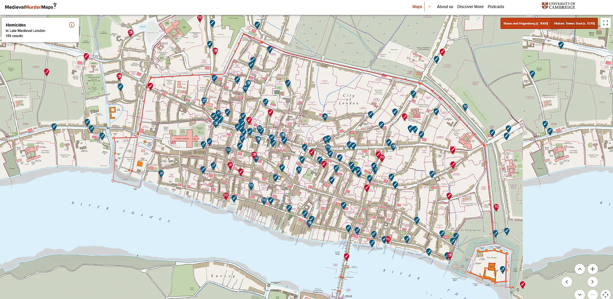

Historická data vědců z Cambridge nám pomáhají pochopit, jak byla vražda ukotvena v rytmu každodenního života. Zmapovali 355 vražd ve třech anglických městech 14. století. Výsledky překvapivě připomínají to, co víme o násilí v dnešních metropolích – a zároveň odhalují jeden zásadní rozdíl.

## Kde vás před sedmi sty lety nejspíš mohla potkat násilná smrt

Představte si, že procházíte úzkými uličkami středověkého Londýna kolem roku 1320. Je neděle večer, blíží se zákaz vycházení, z hospod se line hluk a smích. Právě v tuto chvíli – a na tomto místě – bylo nejpravděpodobnější, že se stanete svědkem vraždy. Nebo její obětí.

Tým kriminologů z cambridgeské univerzity pod vedením Manuela Eisnera zmapoval v rámci projektu Medieval Murder Map 355 případů zabití v Londýně, Yorku a Oxfordu 14. století. Jejich studie publikovaná v časopise Criminal Law Forum ukazuje, že vzorce středověkého násilí překvapivě připomínají to, co víme o zločinu v dnešních městech – vraždy tehdy i dnes často začínají triviálními hádkami, obvykle se dějí ve dnech volna a většinou večer. Zdrojem dat jsou koronerské záznamy – nejstarší dokumenty svého druhu na světě, které systematicky zaznamenávaly okolnosti násilných úmrtí včetně místa činu, zbraně, svědků i toho, zda byl pachatel dopaden.

## Westcheap a Thames Street: Dva světy londýnského násilí

Středověké vraždy se neděly náhodně rozptýlené po městě. Koncentrovaly se v několika konkrétních lokalitách – na trzích, hlavních třídách, u mostů a křižovatek. V Londýně, který měl tehdy 60–80 tisíc obyvatel a byl zdaleka největším anglickým městem, autoři identifikovali dva odlišné typy „horkých míst".

Oblast Westcheap byla srdcem obchodu a cechovního života, místem okázalých průvodů i veřejných trestů. Právě zde se odehrávaly konflikty mezi členy mocných cechů – zlatníky, sedláři, krejčími. V listopadu 1325 tu například došlo k plánované bitce mezi učni zlatníků a sedlářů přímo u Velkého kříže, nejvýznamnějšího monumentu v centru města. Volba místa nebyla náhodná – šlo o demonstraci síly na co nejviditelnějším místě.

Zcela jiný charakter mělo násilí na Thames Street podél břehu Temže. Zde se střetávali námořníci, přístavní dělníci a cizí kupci. Pachatelé i oběti patřili k nižším vrstvám, zbraněmi byly často jednoduché užitkové nože. V jednom případě se dva vlámští námořníci u přístaviště s vlnou navzájem pobodali kvůli sporu, jehož podstatu záznam neuvádí.

## Oxfordská anomálie: Proč univerzitní město vedlo v počtu mrtvých

Zatímco Londýn a York vykazovaly míru vražd zhruba 12–19 na 100 000 obyvatel, Oxford dosahoval 60–75 – čtyřikrát až pětkrát více. Pro srovnání: dnešní Anglie má míru kolem 1 na 100 000.

Důvodem byla univerzita. Přesněji řečeno studenti – mladí muži ve věku 14–21 let, daleko od domova a rodinné kontroly, vyzbrojení noži a meči, sdružení do znepřátelených „národů". Seveřané (ze Skotska a severní Anglie) a Jižané (z jižní Anglie, Walesu a Irska) žili v kolejích, které přijímaly jen příslušníky jedné skupiny. K tomu přidejte chronický konflikt mezi městem a univerzitou, která požívala právních privilegií chránících její členy před světským soudem.

V únoru 1303 šel student William de Roule z biskupství Durham v noci po School Street. Když míjel skupinu velšských studentů, rozpoutala se rvačka – živená animozitou mezi Seveřany a Jižany. William se pokusil pomoci přátelům a byl ubit k smrti. V létě 1319 vyšel student Luke de Horton v noci z koleje, aby se vymočil, a ocitl se uprostřed bitky mezi frakcemi. Zemřel na záměnu.

Ještě brutálnější byl případ Philippa Porta, kterého pět studentů zavraždilo u Východní brány – jeho mozek byl rozstříknut po dlažbě, obličej rozříznut až k zubům a pravá ruka useknuta a položena vedle těla. Podle poroty šlo o plánovanou pomstu zinscenovanou správcem jedné z kolejí.

## Neděle večer: Nejnebezpečnější čas v týdnu

Data z koronerských záznamů odhalují překvapivě moderní vzorce. Vraždy byly vzácné ráno a v poledne, začínaly narůstat kolem západu slunce a vrcholily večer kolem zákazu vycházení. Nejnebezpečnějším dnem byla neděle – den odpočinku, kdy se chodilo do kostela a pak do hospody.

Více než 90 % obětí i pachatelů tvořili muži. Nejčastějšími zbraněmi byly nože různých typů – od krátkých univerzálních čepelí zvaných „thwytel" přes bojové dýky až po meče. V Oxfordu se častěji než jinde objevovaly kuše, což podle autorů odráží vyšší status tamních studentů, z nichž mnozí pocházeli z rytířských rodin.

## Ela Fitzpayne: Žena, která si objednala vraždu kněze

Fascinující je případ kněze Johna Forda, zavražděného v roce 1337 na Westcheapu. Podle nově objevených dokumentů šlo o pomstu naplánovanou šlechtičnou Elou Fitzpayne – a tento případ otevírá okno do světa, kde i ženy mohly být „expertkami na násilí".

Ela Fitzpayne nebyla typická středověká dáma. V roce 1321 se spolu se svým manželem Robertem a knězem Johnem Fordem účastnila násilného přepadu benediktinského kláštera – vyrazili brány, poničili budovy a ukradli na 18 volů, 30 prasat a 200 ovcí. Ford byl zároveň jejím milencem a farářem ve vesnici na panství Fitzpaynů.

V roce 1332 canterburský arcibiskup veřejně odsoudil Elu za cizoložství – a jediným jmenovaným milencem byl právě Ford. Zatímco on unikl trestu, Ela měla podstoupit ponižující veřejné pokání: sedm let chodit bosá po salisburské katedrále s čtyřliberní voskovou svící. Odmítla. Uprchla a byla exkomunikována.

O pět let později, 3. května 1337, kráčel John Ford podvečer po Westcheapu. Přistoupil k němu kněz Hasculph Neville a zapředl „příjemnou konverzaci". Když se blížili ke katedrále sv. Pavla, zaútočili čtyři muži – mezi nimi Hugh Lovell, Elin bratr, který Fordovi třiceticentimetrovou dýkou prořízl hrdlo. Dva další útočníci, nedávní služebníci Fitzpaynů, ho bodli do břicha.

Porota čítala 33 mužů – jedna z největších, jaké záznamy z té doby uvádějí. Všechny vrahy identifikovali, znali motiv i objednavatelku. Přesto nebyl nikdo dopaden. Pouze jeden ze služebníků, Hugh Colne, byl zatčen – o pět let později, za jiný zločin.

„Ela nebyla jedinou ženou, která najímala muže, aby zabíjeli a pomáhali jí chránit její pověst," říká Eisner. „Vidíme násilný čin, který vychází ze světa, kde členové vyšších vrstev byli experty na násilí, ochotní a schopní zabíjet jako způsob udržení moci."

Historička Hannah Skoda z Oxfordu dodává: „Tato vražda nám poskytuje důkaz o velmi aktivní roli žen při řízení svých záležitostí a vztahů." Na podcastu Medieval Murders poznamenala Eisnerova dcera Nora: „Nezdá se to úplně spravedlivé – měli ten poměr spolu, a ona byla ta, kdo byl potrestán, zatímco John pokračoval v běžném životě. Chápu, jak se cítila ponížená."

Ela Fitzpayne nikdy nebyla souzena. Zůstala po boku manžela až do jeho smrti v roce 1354 a zdědila jeho pozemky. Eisner ji popisuje jako „mimořádnou postavu – ženu ze 14. století, která s divokou odhodlaností vzdorovala pravidlům své doby."

Veřejná poprava Forda před zraky davů připomíná podle Eisnera „politické vraždy, jaké dnes vidíme v Rusku nebo Mexiku – jde o připomínku toho, kdo má moc."

## Co nás to učí o dnešku

Projekt Medieval Murder Map není jen historickou kuriozitou. Eisner ho nazývá „vzdáleným zrcadlem" – a to zrcadlo odráží překvapivě známé vzorce.

**Co se nezměnilo:** Vraždy se tehdy i dnes koncentrují do specifických „horkých míst" – určitých ulic a křižovatek. Dějí se večer a o víkendech. Začínají často banálními hádkami. Londýnské záznamy obsahují případy, které začaly kvůli vyhození úhořích kůží na ulici nebo neopatrnému močení. A podíl žen mezi pachateli – zhruba čtvrtina – zůstává pozoruhodně stabilní napříč staletími.

**Co se změnilo zásadně:** V moderních městech jsou horká místa kriminality obvykle v chudých čtvrtích. Ve středověku to bylo naopak – nejnebezpečnější byla bohatá a prestižní centra. Chudoba nebyla hlavním faktorem; násilí přitahovalo místa, kde se setkávalo hodně lidí, kde se obchodovalo, pilo a kde bylo co ztratit – čest, reputaci, tvář.

Středověký Londýn měl míru vražd zhruba 15–20× vyšší než moderní britské město podobné velikosti. Ale Eisner upozorňuje, že přímé srovnání je ošidné: „Máme střelné zbraně, ale máme i záchranku. Je snazší zabít, ale i zachránit život." Více než 18 % středověkých obětí přežilo alespoň týden po útoku – a zemřelo až na infekce nebo vykrvácení, protože neexistovala chirurgie ani antibiotika.

Pokles vražd v moderní době tak nesouvisí jen s proměnou individuálního chování, jak naznačuje teorie civilizačního procesu sociologa Norberta Eliase. Svou roli sehrála i regulace veřejného prostoru – od licencování hospod přes zákazy nošení zbraní po vytvoření profesionální policie a záchranných služeb.

Interaktivní mapy všech tří měst jsou dostupné na webu [medievalmurdermap.co.uk](https://medievalmurdermap.co.uk), kde si lze proklikat jednotlivé případy včetně dobových detailů o zbraních, obětech i pachatelích.
