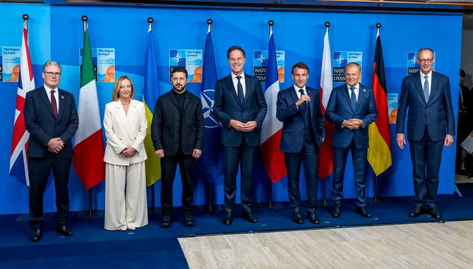
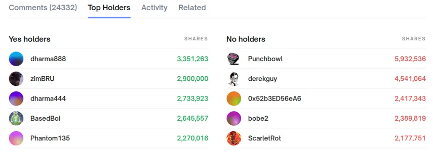
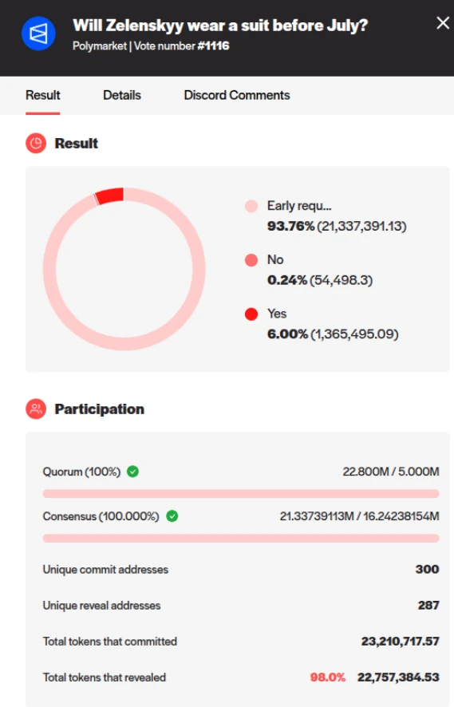
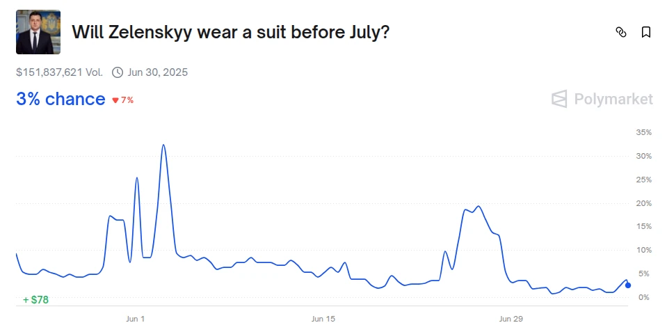

_Na první pohled banální otázka: měl ukrajinský prezident Volodymyr Zelenskyj na summitu NATO ve dnech 24.–25. června 2025 na sobě oblek, nebo neměl? Ve skutečnosti se kolem této otázky roztočila sázková spirála, na jejímž konci leží v přepočtu **více než tři miliardy korun**._



Konkrétně jde [o více než 150 milionů dolarů](https://polymarket.com/event/will-zelenskyy-wear-a-suit-before-july/will-zelenskyy-wear-a-suit-before-july?tid=1751881104407), které lidé po celém světě vsadili na tzv. predikčním trhu Polymarket. Tento web se profiluje jako nástroj pro odhadování pravděpodobnosti různých událostí – od sportovních výsledků přes ekonomické ukazatele až po vývoj politických kauz – a nikoli jako běžná sázková kancelář, přestože z pohledu většiny uživatelů plní velmi podobnou funkci. V našem případě Polymarket slouží jako jeden z podpůrných ukazatelů při odhadech aktuální [volební podpory politických stran](https://polymarket.com/event/czech-republic-parliamentary-election-winner?tid=1751880308639) pro projekt [Mandáty.cz](https://mandaty.cz/). A díky tomu jsme narazili i na tuto “Suitgate”.

## Co přesně měl Zelenskyj na sobě
Ukrajinský prezident vystoupil na summitu NATO v tmavém formálním oděvu, který se na první pohled mohl jevit jako civilní oblek. Otázkou však zůstává, zda šlo skutečně o klasický pánský oblek, jak jej definuje etiketa a konvenční společenské normy, nebo o jeho typický armádně střižený oděv – jen ve slavnostnější, civilněji vyhlížející variantě.

Právě tato jemná, ale podstatná nuance se stala [předmětem sázek na platformě Polymarket](https://polymarket.com/event/will-zelenskyy-wear-a-suit-before-july/will-zelenskyy-wear-a-suit-before-july). Původní znění sázky se týkalo obecně otázky, zda si Volodymyr Zelenskyj oblékne **do konce června 2025 oblek**. Zájem o tuto sázku byl zprvu spíše standardní, podobně jako u většiny jiných politických nebo společenských predikcí. Od chvíle, kdy Zelenskyj skutečně vystoupil na summitu v jiném než obvyklém vojenském oděvu, však začal zájem o tuto otázku strmě růst.

Kurzy mluvily jasně – v době psaní tohoto textu byl kurz na variantu **„ano, je to oblek“** 1 : 28, zatímco protikladná možnost **„ne, není to oblek“** byla favorizována kurzem 1 : 1.035. Na první pohled se tedy může zdát, že trh jednoznačně věří, že Zelenskyj neměl klasický oblek. Jenže právě v tom je klíčová záludnost celého případu – **kurzy zde neodrážejí faktický stav věci, nýbrž očekávání sázkařů ohledně toho, jak bude daný spor rozhodnut**. Nejde tedy o otázku reality, ale o předvídání toho, jaké rozhodnutí nakonec vzejde z decentralizovaného hlasování.

Jinými slovy – **i kdyby dnes prohlásila renomovaná módní autorita nebo samotný návrhář oděvu, že šlo o standardní oblek, nemusí to výsledek sázky vůbec ovlivnit**. Důležitá je výlučně interpretace komunity, která na platformě rozhoduje.

## Kdo rozhoduje, co je pravda
Na rozdíl od běžných sázkových kanceláří s bookmakery (např. Tipsport nebo Betano), kde výsledek určuje provozovatel a v případě sporu existuje možnost obrátit se na soud, existují i sázkové systémy, kde lidé sázejí mezi sebou – typickým příkladem je platforma Betfair, založená již v roce 2000. Systém Polymarketu jde však ještě dál: **výsledek není stanoven žádnou centrální autoritou**, ale ve sporných případech je **odhlasován** držiteli kryptoměny UMA (Universal Market Access).

Tato kryptoměna se používá mj. k tzv. decentralizovanému ověřování výsledků na základě důkazů, které sázkaři předkládají. Proces je tedy v teorii demokratický. V praxi je však situace složitější: **více než 90 % tokenů UMA drží přibližně deset subjektů**, což znamená, že tito „velcí hráči“ mohou fakticky přehlasovat zbytek komunity.

V případě **„Suitgate“** proběhlo první hlasování o variantě **„ano, Zelenskyj měl oblek“** těsně před koncem června. Hlasovalo necelých 300 držitelů UMA a v hlasování se použilo přibližně 20 % veškeré oběhu této kryptoměny. Výsledek? **„Ještě je brzy na odpověď.“** Jinými slovy, komunita se rozhodla rozhodnutí odložit. Nyní (stav k 7. červenci 2025) probíhá nové hlasování – tentokrát o variantě **„ne, Zelenskyj neměl oblek“**.

## O co se hraje
Protože jsou sázky na Polymarketu veřejné, víme, že jednotlivé vklady **dosahují částek až v řádu milionů dolarů** – a to na obou stranách. Sázkaři se přitom opírají o široké spektrum podkladů: od vyjádření návrháře oděvu přes mediální reporty až po pokusy o forenzní analýzu látky, střihu nebo počtu knoflíků.



```box
### Co je to Polymarket a proč záleží na tom, kdo rozhoduje

Polymarket se neoznačuje jako sázková kancelář, ale jako <strong>predikční trh</strong>. Cílem platformy je odhadovat pravděpodobnosti různých budoucích událostí na základě tzv. „kolektivní inteligence“. Pro běžného uživatele se však prakticky jedná o jinak strukturovanou formu sázení.

Na Polymarketu se obchoduje v kryptoměně <strong>USDC</strong>, která je vázaná v poměru 1:1 na americký dolar. Pro sázkaře to ale může představovat <strong>komplikaci navíc</strong> oproti klasickým platformám pracujícím např. s českou korunou.

Klíčovým rozdílem oproti běžné sázkové kanceláři je způsob určení výsledku. Kde klasický provozovatel vyhodnocuje výsledek sám a případné spory může řešit soudní cestou, na Polymarketu rozhoduje <strong>decentralizovaná komunita držitelů kryptoměny UMA</strong>. Tito uživatelé hlasují o tom, která ze sázkových variant odpovídá skutečnosti.

<strong>Formálně jde o decentralizaci. Ve skutečnosti ale koncentrace moci v rukou několika jednotlivců umožňuje jednostranné ovlivnění výsledku</strong>. Držitelé s velkým počtem tokenů UMA mají hlasovací převahu a mohou rozhodnout i proti názoru širší komunity.
```

## První hlasování: nerozhodné

První kolo hlasování o sázce bylo spuštěno **těsně před koncem června**. Týkalo se varianty „ano, Zelenskyj měl oblek“ a zapojilo se do něj **necelých 300 lidí**, kteří dohromady použili asi **20 % všech existujících tokenů UMA**.



Rozhodnutí tehdy znělo: **„Ještě je brzy na odpověď“**. Komunita se tedy rozhodla verdikt odložit. V současnosti (k 7. červenci 2025) [probíhá nové hlasování](https://vote.uma.xyz/) – tentokrát o opačné variantě: **„ne, Zelenskyj neměl oblek“**.

## Finální rozhodnutí? Možná už za pár hodin

Hlasovací lhůta uplyne krátce po půlnoci. Tehdy bychom se měli dozvědět, jak komunita držitelů UMA rozhodla, a tím pádem i to, **kdo získá milionové výhry a kdo odejde s prázdnou**.

