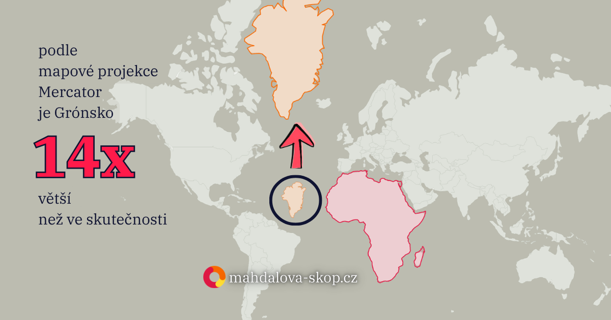
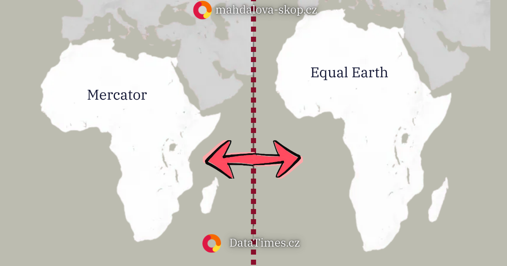

Vezměme si Grónsko a Afriku. Na mapě, kterou zná skoro každý ze školy, vypadají obě zhruba stejně velké. Ve skutečnosti se Grónsko vejde do Afriky asi čtrnáctkrát. Není to omyl kreslíře ani chyba tisku. Je to důsledek rozhodnutí, které vlámský kartograf udělal před více než čtyřmi sty lety.


_Grónsko podle Mercatorovy projekce a jeho skutečná velikost. Zdroj: DataTimes._

Kulatou Zemi totiž nelze převést na plochý papír, aniž by se něco pokřivilo. Buď se zkreslí velikosti, nebo tvary, nebo vzdálenosti. Kartografové tomu říkají projekce a za pět století jich vytvořili desítky.

## Mercator: mapa pro plavce

V roce 1569 představil Gerardus Mercator [mapu](https://cs.wikipedia.org/wiki/Mercatorovo_zobrazen%C3%AD), kterou sám nazval Nova et Aucta Orbis Terrae Descriptio ad Usum Navigantium – tedy nové a úplnější zobrazení světa „upravené pro potřeby plavby". Ten podtitul prozrazuje všechno. Mapa nebyla pro školu ani pro pověšení na zeď. Byla pro námořníka.

<SupportBanner float="left" />

Její kouzlo spočívalo v tom, že cesta vedená stále stejným směrem podle kompasu se na ní kreslí jako rovná čára. Kapitán si mohl přiložit pravítko a odečíst kurz. Nic lepšího do té doby neexistovalo.

Cena za to se ukázala, jakmile se mapa použila k zobrazení celé planety. Aby úhly a tvary seděly, musely se plochy směrem k pólům natahovat – čím dál od rovníku, tím víc. Na rovníku ještě přesně, u pólů do nekonečna. Proto je Grónsko velké jako Afrika. A proto vypadá Evropa mohutněji než Jižní Amerika, ač je ve skutečnosti sotva poloviční.

Nejlíp to pochopíte, když si to osaháte sami. Vyberte zemi a **táhněte ji po mapě**. Jak ji posunete k rovníku, zmenší se do své skutečné velikosti; jak ji potáhnete na sever, nafoukne se.

<TrueSizeGame />

Zkuste přetáhnout Grónsko dolů nad Afriku – „obří" ostrov z běžné mapy se scvrkne na velikost Alžírska. Přesně na tomhle principu stála oblíbená hra [The True Size Of…](https://thetruesize.com/), ze které jsme vyšli.

## Gall a Peters: spor o velikost

Skotský kartograf James Gall představil roku 1855 mapu, která velikosti zachovávala věrně. Svět si jí tehdy sotva všiml. O více než sto let později přišel s prakticky totožným zobrazením německý historik Arno Peters a v sedmdesátých letech z něj udělal věc veřejnou. Argumentoval politicky: nafouknutý sever podle něj křiví představu o tom, kdo je ve světě velký a kdo malý.

[Gallova i Petersova mapa](https://en.wikipedia.org/wiki/Gall%E2%80%93Peters_projection) plochy zachovávají poctivě. Zaplatily za to tvarem – kontinenty na nich visí protažené a stlačené. Kartografové mají k Petersovi výhrady dodnes. Že jde o citlivé téma i po půldruhém století, se ukázalo v roce 2017.

## Boston a nová projekce

Tehdy oznámily bostonské veřejné školy, že v učebnách [nahradí Mercatora](https://www.wbur.org/news/2017/03/16/world-maps-boston-public-schools) právě Gall–Petersem. Chtěly dětem ukázat Afriku a další části světa v jejich skutečné velikosti. Zpráva se rychle rozšířila a rozvířila starý spor.

Sledoval ho i americký kartograf Tom Patterson. Gall–Peterse s jeho protaženými tvary za dobré řešení nepovažoval, a tak začal hledat mapu, která zachová plochy, ale ponechá kontinentům rozpoznatelný tvar. Když žádnou vhodnou nenašel, vytvořil spolu s Bernhardem Jennym a Bojanem Šavričem novou. [Equal Earth](https://equal-earth.com/equal-earth-projection.html) představili v roce 2018. Plochy na ní sedí a celkově se natolik podobá běžným atlasovým mapám, že si laik rozdílu ani nevšimne. O to šlo.


_Stejný kontinent, dvě projekce: Mercator (vlevo) a Equal Earth (vpravo). Zdroj: DataTimes._

## Mollweide: svět v elipse

O nápravu Mercatorova zkreslení ploch se pokoušeli i dřív. Německý matematik a astronom Karl Brandan Mollweide představil roku 1805 [zobrazení](https://en.wikipedia.org/wiki/Mollweide_projection), v němž se celý svět vejde do elipsy a plochy si drží správné vzájemné poměry. Pro mapy ukazující rozšíření nějakého jevu po celé planetě je to vlastnost k nezaplacení. Blíž k okrajům oválu se ovšem obrysy zemí rozplácnou. Za přesnost ploch se platí tvarem, znovu.

## Robinson: mapa pro oko

V šedesátých letech chtěl americký vydavatel map Rand McNally novou mapu světa pro své atlasy a obrátil se na kartografa Arthura H. Robinsona. Ten zvolil neobvyklý postup. Nejprve hledal podobu, která bude čitelná a bude působit vyváženě, a teprve pak její křivky převedl do výpočetních pravidel. Napřed oko, potom matematika.

[Robinsonova mapa](https://en.wikipedia.org/wiki/Robinson_projection) proto nezachovává dokonale nic – ani plochy, ani tvary, ani úhly. Přesto zdomácněla. National Geographic ji používal od roku 1988 a pro celou jednu generaci se stala prostě „tou normální mapou světa".

## Winkel Tripel: tři zkreslení najednou

Německý kartograf Oswald Winkel představil [svou projekci](https://en.wikipedia.org/wiki/Winkel_tripel_projection) už roku 1921. Slovo Tripel, německy trojitý, odkazuje k jeho snaze omezit naráz tři druhy zkreslení, s nimiž se mapa světa potýká: zkreslení ploch, vzdáleností a úhlů. Žádné z nich zcela neodstranil, usiloval o použitelnou rovnováhu. Na mapě to poznat lze – póly nejsou body, ale zaoblené čáry, a poledníky se od středu jemně vyklánějí.

Svého publika se dočkal až o víc než sedmdesát let později. V roce 1998 po něm sáhl National Geographic a nahradil jím Robinsona; podle Společnosti krotí zkreslení u pólů lépe. Z pozapomenuté projekce se rázem stala mapa, na které vyrostla další generace.

Dokonalá mapa světa neexistuje a existovat nemůže. Každá z těch, které tu byly řeč, něco zachovává a za něco platí. Otázka proto nezní, která je správná, ale k čemu má sloužit. Mercator kreslil pro plavce. Peters pro politický spor. Patterson pro učebnu. A Grónsko zůstává čtrnáctkrát menší než Afrika, ať už na mapě vypadá jakkoli.

```box
## Více k tématu

Proč se mapy mění, jak o jejich podobě hlasuje OSN a kde v tom stojí Česko i USA, rozebíráme v [hlavním článku o proměně map světa](/clanek/explainer-2026-09-05-mapy-sveta-osn-afrika).
```

<RelatedArticles slugs={["explainer-2026-09-05-mapy-sveta-osn-afrika", "kontext-2025-06-06-mapa-vrazd-ve-stredoveku-v-anglii", "volby-rakousko-2024-11-27-kartogramy"]} heading="🔻🔻🔻" />
