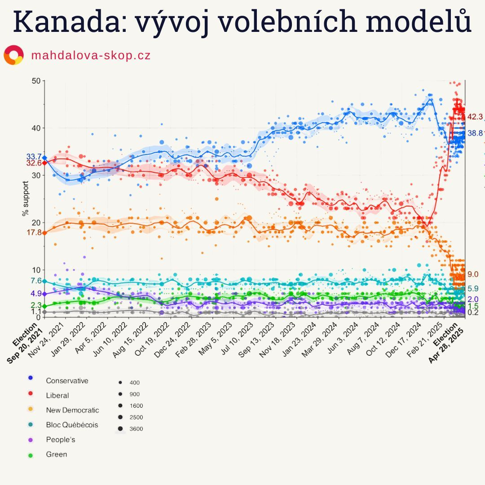

Americký prezident se pustil do sousední Kanady: hrozil cly, anexí a mluvil o zemi jako o „51. státě USA“. To, co mělo být jen show pro domácí publikum, spustilo v Kanadě politické zemětřesení. Naštvaní voliči se mobilizovali – a právě liberálové jim nabídli srozumitelnou obranu.

- Liberálové vyhráli se 145 mandáty.  
- Trumpova rétorika mobilizovala Kanaďany – ale proti němu.  
- Konzervativci skončili s 125 mandáty a jejich lídr propadl i doma.  
- Mark Carney proměnil volební náladu v obranný reflex.  
- Trudeau se sice stáhl, ale pomohl zlomit vývoj.

---

## Trudeau padl, Carney vsadil na suverenitu

Justin Trudeau to vycítil. Věděl, že je pro mnohé voliče nepřekonatelnou překážkou návratu důvěry. Rozhodl se odstoupit. A tím otevřel dveře Marku Carneyovi, bývalému guvernérovi centrálních bank v Kanadě i Británii.

Carney neztrácel čas. Hned po nástupu zrušil nepopulární uhlíkovou daň – symbol zdražování – a dal jasně najevo, že to s restartem myslí vážně.  
Každodenně pak připomínal, že **Kanada má být hrdá na to, čím se liší od USA**: lepší zdravotnictví, školství, nižší kriminalita. V kampani stavěl na klidu, důvěře a jasném poselství: *„Naše země není na prodej.“*

---

## Poilievre, kanadský Trump, ztratil dech

Pierre Poilievre, lídr Konzervativců, se ještě v lednu těšil na premiérské křeslo. Voliče oslovoval jako „muž z lidu“, sliboval daňové škrty a tvrdý postoj vůči „elitám“.  
Ale jeho přezdívka *„kanadský Trump“* se mu nakonec stala osudnou.

Trumpova rétorika (např. výrok *„Kanada se má stát naším ctěným 51. státem“*) proměnila volby v hlasování o národní hrdosti. Poilievre sice na poslední chvíli tweetoval:

> „Kanada bude vždy hrdá a nezávislá a **NIKDY** nebude 51. státem,“

ale nestačilo to. V očích voličů nepůsobil jako někdo, kdo se umí Trumpovi postavit – spíš jako jeho stín.

---

## Polymarket: volební drama v přímém přenosu

Volební noc začala překvapivě. První okrsky dávaly náskok Konzervativcům – a na sázkových trzích stoupla pravděpodobnost Poilievreho vítězství až na 65 %.

Na Polymarketu se spekulanti začali chytat za hlavu. Jenže jak přicházely výsledky z měst a liberálních bašt, Carney začal stoupat. Nálada se obrátila. Polymarketová křivka se prudce zlomila – a Konzervativci padli.

Nakonec Liberálové získali **145 křesel ze 343**, Konzervativci jen **125**. Oba hlavní opoziční lídři – Poilievre i Singh – navíc **neobhájili vlastní obvody**.

---

## Kanada volila proti Trumpovi

Z průzkumu mezi předčasnými voliči vyplývá, že rozhodnutí nejvíc ovlivnily:

- **inflace a náklady na život (47 %)**
- **vztahy s USA a cla (35 %)**
- **ekonomika (33 %)**

U voličů Liberálů byla **americká hrozba klíčovým mobilizačním faktorem**.

> „Vždycky jsme stáli při vás,“ vzkázal Trudeau Bílému domu.  
> „Pomáhali jsme vám, byli jsme vaši sousedé, které vám svět záviděl. A teď nás trestáte.“

Podle průzkumů se po Trumpově návratu do úřadu zcela změnilo i vnímání USA: zatímco loni považovaly dvě třetiny Kanaďanů Američany za přátele, teď už jen čtvrtina.

---

## Zásluhu má i ten, kdo odešel

Vítěz voleb Mark Carney byl v kampani disciplinovaný, přesvědčivý, ale nebýt Trudeaua, jeho cesta by nevznikla. Trudeau pochopil, kdy odejít.  
**Carney zas pochopil, jak národ sjednotit – i proti tak nečekanému soupeři, jakým byl americký prezident.**

Ve svém vítězném projevu řekl:

> „Trump se nás snaží zlomit, aby si nás mohl přivlastnit.  
> To se nikdy nestane.  
> Kanada patří Kanaďanům.“

---

```box
<strong>Jak volilo Německo? [Německé volby: Ostblok volil radikálně? Ne tak docela](https://www.mahdalova-skop.cz/clanek/volby-nemecko-2025-02-27-vysledky)</strong>

Dále jsme psali o rozhovoru Elona Maska se šéfkou krajně pravicové strany AfD: [Glosa: Hilter nebyl komunista](https://www.mahdalova-skop.cz/clanek/komentar-2025-01-09-hitler-nebyl-komunista)

Světoznámý spisovatel a filosof Umberto Eco (1932-2016), který jako chlapec vyrůstal v Mussoliniho Itálii, nám zanechal cenný nástroj - definoval charakteristické znaky fašismu: [Znaky fašismu podle Umberta Eca](https://www.mahdalova-skop.cz/clanek/explainer-2025-01-06-znaky-fasismu-podle-eca)

```

```box

[zdroj dat: celostátní průzkumy veřejného mínění provedené od kanadských federálních voleb v roce 2021 do voleb 2025](https://en.wikipedia.org/wiki/Opinion_polling_for_the_2025_Canadian_federal_election)
