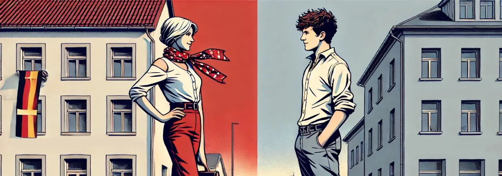

Nejmladší "tiktoková" generace v německých volbách volila shodně s Tiktokem. Tito nejmladší prvovoliči v Německu podpořili ve velkém strany <span style={{ backgroundColor: '#be3075', color: 'white' }}>Die Linke</span>  (Levice) a  <span style={{ backgroundColor: '#00a2de', color: 'white' }}>AfD</span>  (Alternativa pro Německo). Dvě [nejpopulárnější německé strany na Tiktoku](https://www.br.de/nachrichten/netzwelt/tiktok-wahlkampf-zur-bundestagswahl-linke-und-afd-punkten-politische-raender-gewinnen-die-jugend,Udj4ei2).

Pro srovnání - v předchozích volbách v roce 2021 nejmladší voliči podpořili hlavně <span style={{ backgroundColor: '#409a3c', color: 'white' }}> Zelené</span> a pro-businessovou <span style={{ backgroundColor: '#eedc00' }}> FDP </span>. A zatímco  <span style={{ backgroundColor: '#409a3c', color: 'white' }}> Zelení </span>  zůstali celkově ”skoro na svém”, <span style={{ backgroundColor: '#eedc00' }}> FDP </span> se nyní do parlamentu vůbec nedostala.

Ti **nejstarší voliči** volili výrazně jinak - ve velkém podpořili dvě hlavní tradiční strany, křesťansko-demokratickou  <span style={{ backgroundColor: '#151518', color: 'white' }}>CDU/CSU</span>  a sociálně-demokratickou <span style={{ backgroundColor: '#e3000f', color: 'white' }}>SPD</span> , u kterých se také očekává, že vytvoří vládní koalici.

<iframe src='https://flo.uri.sh/visualisation/21833436/embed' title='Interactive or visual content' className='flourish-embed-iframe' frameBorder='0' scrolling='no' width='100%' height='400px'></iframe>

## Ženy solidárně, muži národovecky
V nejmladší generaci ale došlo k velkému genderovému rozdílu. **Ženy** volili z **více jak třetiny** <span style={{ backgroundColor: '#be3075', color: 'white' }}>Die Linke</span> , ale u mladých mužů to bylo “jenom” 15 %. 

Naopak **více jak čtvrtina mladých mužů** podpořila <span style={{ backgroundColor: '#00a2de', color: 'white' }}>AfD</span>, ale u žen to bylo “jenom” 14 %. V žádné jiné generaci takto propastný rozdíl mezi muži a ženami nebyl. 

<iframe src='https://flo.uri.sh/visualisation/21836311/embed' title='Interactive or visual content' className='flourish-embed-iframe' frameBorder='0' scrolling='no' width='100%' height='400px'></iframe>

V ostatních generacích [volili muži a ženy výrazně shodněji](https://www.tagesschau.de/wahl/archiv/2025-02-23-BT-DE/).

## Východní Německo
Obě strany populární mezi prvovoliči uspěly nejvíce ve spolkových zemích bývalého Východního Německa. Ale i tam se jejich geografické rozdělení liší.

Kartogramy ukazují, že zatímco  <span style={{ backgroundColor: '#00a2de', color: 'white' }}>AfD</span>  získávala hlasy prakticky všude ale mimo největší města,  <span style={{ backgroundColor: '#be3075', color: 'white' }}>Die Linke</span>  je sbírala naopak nejvíce ve (východním) Berlíně a dalších velkých východoněmeckých městech jako Lipsko, Drážďany nebo Rostock.

<iframe src='https://flo.uri.sh/visualisation/21850973/embed' title='Interactive or visual content' className='flourish-embed-iframe' frameBorder='0' scrolling='no' width='100%' height='700px'></iframe>

<iframe src='https://flo.uri.sh/visualisation/21855441/embed' title='Interactive or visual content' className='flourish-embed-iframe' frameBorder='0' scrolling='no' width='100%' height='700px'></iframe>

```box
<strong>Jak volilo Německo? [Německé volby: Ostblok volil radikálně? Ne tak docela](https://www.mahdalova-skop.cz/clanek/volby-nemecko-2025-02-27-vysledky)</strong>

Dále jsme psali o rozhovoru Elona Maska se šéfkou krajně pravicové strany AfD: [Glosa: Hilter nebyl komunista](https://www.mahdalova-skop.cz/clanek/komentar-2025-01-09-hitler-nebyl-komunista)

Světoznámý spisovatel a filosof Umberto Eco (1932-2016), který jako chlapec vyrůstal v Mussoliniho Itálii, nám zanechal cenný nástroj - definoval charakteristické znaky fašismu: [Znaky fašismu podle Umberta Eca](https://www.mahdalova-skop.cz/clanek/explainer-2025-01-06-znaky-fasismu-podle-eca)

```

```box
### 🇩🇪 Německé strany

<span style="background-color: #151518; color: white;">CDU/CSU</span> - konzervativní blok křesťanských demokratů, tradičně hlavní síla německé pravice

<span style="background-color: #00a2de; color: white;">AfD</span> – protestní pravicově populistická strana, pro-putinovská, ostře kritická k migraci a EU

<span style="background-color: #e3000f; color: white;">SPD</span>  – sociální demokraté, historicky silná levice, dnes spíše umírněné středolevé uskupení

<span style="background-color: #409a3c; color: white;"> Zelení </span>  – ekologické hnutí, v počátcích protestní uskupení, dnes etablovaná středolevá strana

 <span style="background-color: #be3075; color: white;">Die Linke</span>  – demokratická levice, částečný nástupce východoněmecké PDS, dnes prosazuje sociální spravedlnost

Mimo parlament:

<span style="background-color: #792351; color: white;">Aliance Sahry Wagenknecht (BSW)</span>  – nová levicově populistická strana, vymezuje se proti EU,  globalizaci, migraci a neoliberální ekonomice či politice Zelených

<span style="background-color: #eedc00; color: black;">FDP</span>  – liberálové, prosazují volný trh, slabší stát a digitální modernizaci
```

