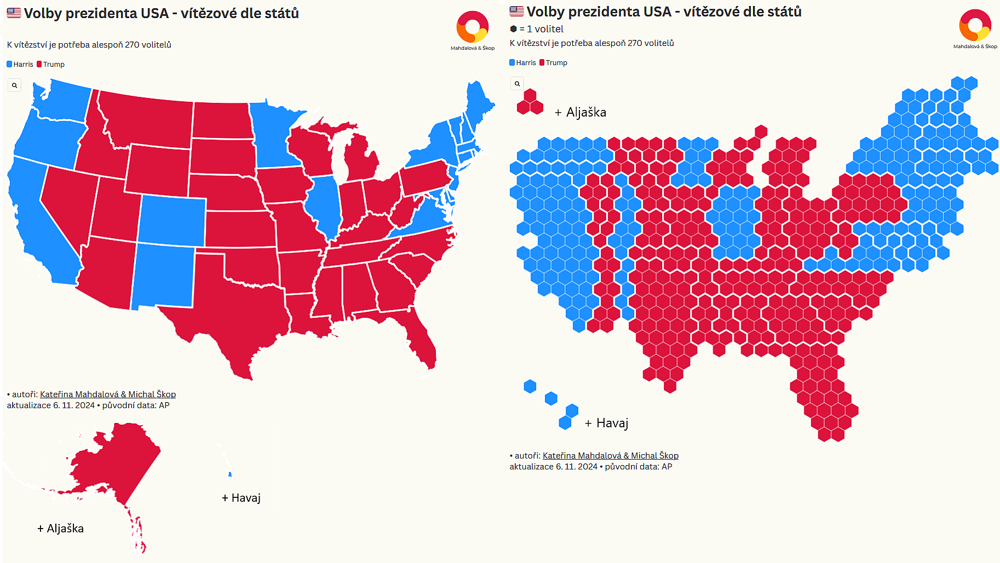

V tomto konkrétním kartogramu jsou zpracované výsledky podzimních rakouských voleb a mapa je nyní umístěna [v rakouském národním katalogu (klikněte na odkaz)](https://www.data.gv.at/katalog/application/6897edfa-2c70-4d7f-9d5a-b7f61b7e87f1#views)
Obecně je kartogram typ mapy, ve které jsou zeměpisné oblasti upraveny tak, aby znázorňovaly určitou veličinu, nikoliv jejich skutečnou rozlohu.

Každý šestiúhelník zde představuje 10 tisíc obyvatel, přičemž mapa je rozdělena na okresy. To znamená, že velikost a počet šestiúhelníků v každém okrese znázorňuje hustotu zalidnění, díky čemuž je rozložení obyvatelstva v regionech rozpoznatelné na první pohled, spíše než aby se soustředilo na geografický prostor.

Stejným způsobem jsme vizualizovali výsledky voleb ve Spojených státech. Ano, to je ten pověstný AZ kvíz, jak někteří z vás zmiňovali 😄 Screenshot zachycuje obě mapy USA, klasickou podle geografické rozlohy a kartogram. Je na nich hodně vidět například to, kde se berou vysoké počty hlasů v lidnatých, ale méně rozlehlých oblastech, jako jsou západní a východní pobřeží.

<RelatedArticles slugs={["volby-nemecko-2025-02-21-jak-se-voli", "volby-nemecko-2025-02-27-vysledky", "kontext-2025-07-01-profil-karin-kneissl"]} heading="Psali jsme" />
